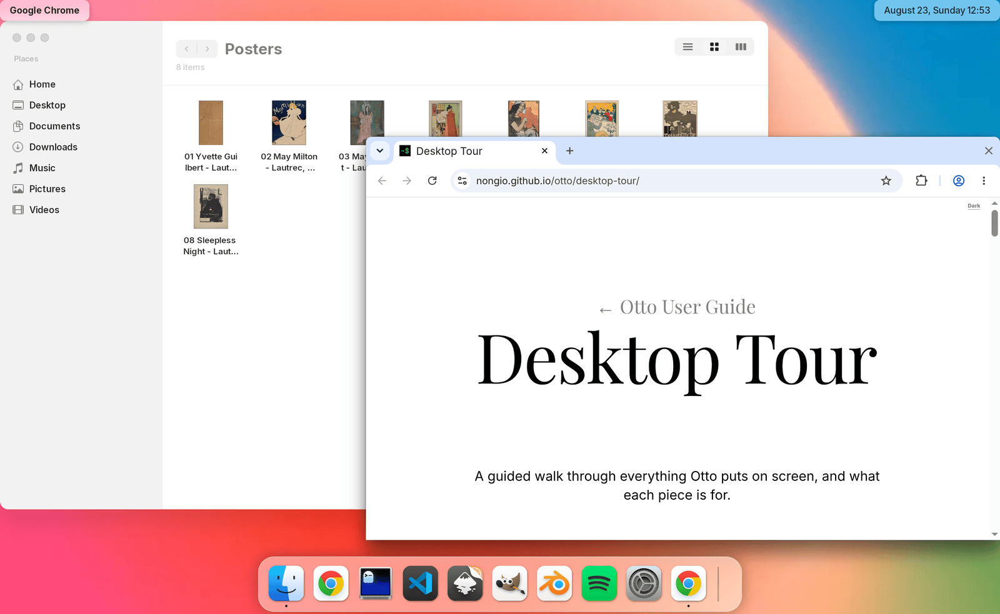
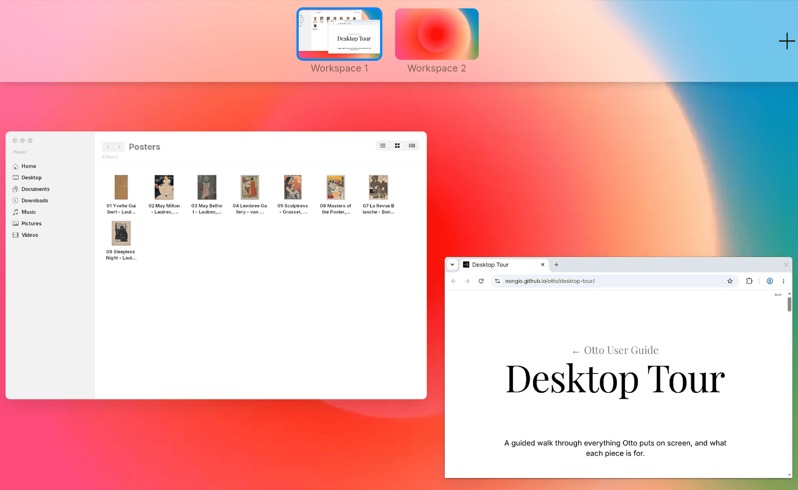
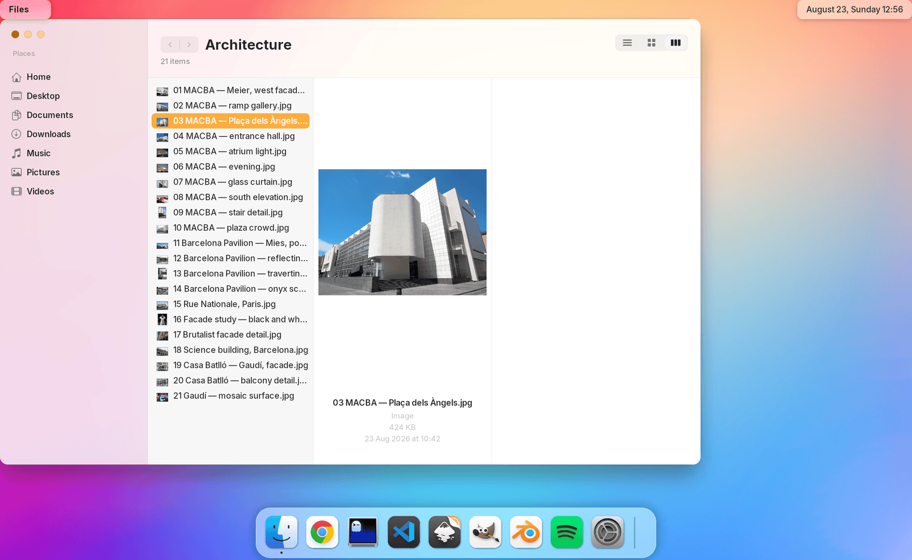
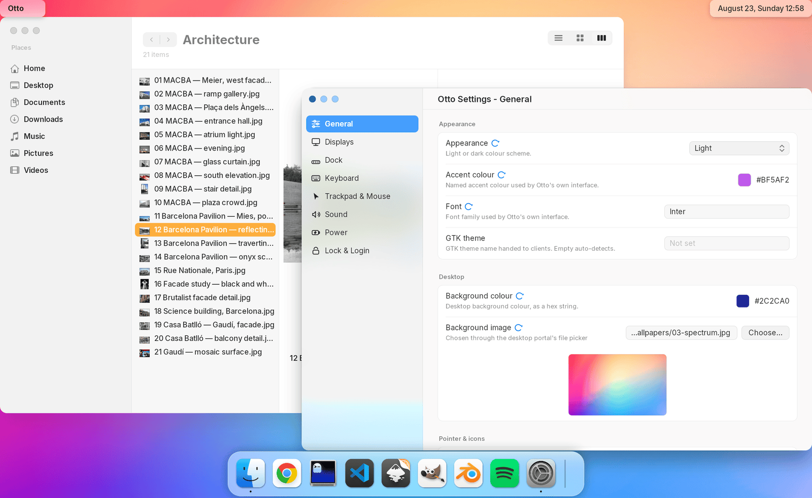
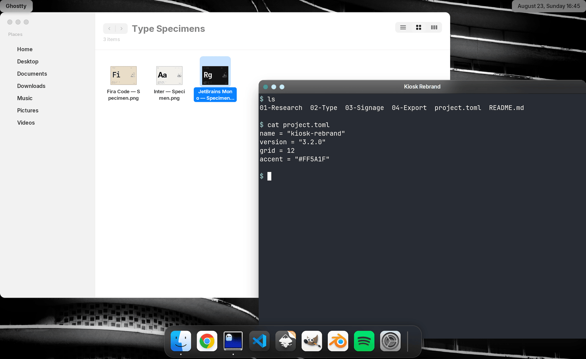

# Otto

**A Wayland desktop that feels like someone cared.** Smooth animations, thoughtful gestures, and the kind of details you notice only when they're missing — inspired by familiar macOS interactions, built from scratch in Rust.

Otto is a Wayland compositor and stacking window manager built on [LayersEngine](https://github.com/nongio/layers), rendered with Skia, with parts of the desktop handed straight to hardware display planes.

You can try it inside your current session in about a minute — [jump to Try it](#try-it).

**Documentation:** [User Guide](https://nongio.github.io/otto/) · [Developer Guide](https://nongio.github.io/otto/developer/)

> **Testing phase.** Many features are ready for daily use, but Otto is not finished and not yet fully stable. Playing with it, breaking it and telling us about it is genuinely the most useful thing you can do right now.
> Feedback and questions: [Discord](https://discord.gg/AdXkrYKuz) or Matrix [`#otto-compositor:matrix.org`](https://matrix.to/#/#otto-compositor:matrix.org).

## See it



*Wallpaper, top bar, Dock, Files browsing poster thumbnails, the user guide in a browser window.*



*Exposé, with the workspace strip on top — the window previews are live, not screenshots.*



*`otto-files` in column view, previewing the selected image.*



*`otto-settings` editing the running compositor's configuration over D-Bus.*



*A dark Dock and top bar over a monochrome wallpaper.*

## Try it

**Zero risk:** Otto runs as a window inside the desktop you're using right now.

```sh
git clone https://github.com/nongio/otto
cd otto
cargo run --release        # opens Otto in a window (winit backend)
```

Then open something inside it (`WAYLAND_DISPLAY=wayland-1 <your app>`), minimize a window to the Dock, hit `PageUp` for Exposé, `Ctrl+Tab` for the app switcher.

**For real:** install a package and pick "Otto" in your login manager.

```sh
sudo dpkg -i otto_*.deb && sudo apt-get install -f   # Debian / Ubuntu
sudo dnf install otto-*.rpm                          # Fedora / RHEL
curl -O https://raw.githubusercontent.com/nongio/otto/main/PKGBUILD && makepkg -si   # Arch
```

Packages come from the [GitHub Releases](https://github.com/nongio/otto/releases) page. See [Installation](#installation) for the details and post-install notes, and the [Getting Started guide](https://nongio.github.io/otto/getting-started/) for a walkthrough.

## What you get

- **A Dock that is a real task manager** — pinned apps, running apps and minimized windows in one strip. Icons magnify on approach, bounce while an app is launching, auto-hide when you want the space back, and the whole thing resizes by dragging its handle.
- **Workspaces that animate** — multiple workspaces per monitor, each monitor independent, drag windows between them, configurable backgrounds.
- **Exposé and an app switcher** — `PageUp` (or a three-finger swipe up) spreads every window out with live previews; `Ctrl+Tab` walks apps, cycles windows within an app, and can close them. Both appear on the monitor under your pointer.
- **Window management that stays out of the way** — animated fullscreen/maximize, snap to halves, minimize to the Dock, and new windows placed where they overlap the least. Otto draws the title bar for clients that want a server-side one, on both `xdg-decoration` and KDE's `org_kde_kwin_server_decoration`, so the controls keep working while an application is busy.
- **A top bar and a dynamic island** — clock, tray and application menus over DBusMenu; notifications, ongoing activities and permission dialogs in a floating panel; compositor-drawn volume and brightness indicators.
- **Multi-monitor that holds up** — per-output rendering, hotplug, arrangement and modes from the config, virtual outputs created on demand.
- **Lock, login and power** — `ext-session-lock-v1` locking with a PAM-backed locker, lock on hotkey / power button / lid close / idle timeout (respecting `idle-inhibit`), a greetd login screen with password and fingerprint, and Otto-owned lid-suspend with clamshell awareness.
- **Screen sharing and remote desktop** — XDG Desktop Portal backend over PipeWire, sharing a whole output or a single window, with AirPlay receivers as a target; `otto-rdp` serves a virtual output over RDP with TLS and hardware H.264 where available.
- **X11 apps, including fullscreen games** — keyboard focus for globally-active clients, output scale via XSETTINGS, direct scanout.
- **Applications of its own** — `otto-files` browses the filesystem and doubles as the desktop's file picker, with thumbnails, drag and drop and a quick-view panel; `otto-settings` edits the configuration live over D-Bus, so you don't have to hand-write TOML (you still can; the compositor picks up file edits); `otto-launcher` starts apps and switches windows from the keyboard. All are first versions — useful day to day, still filling in.
- **Rendering built for this** — a Skia pipeline with KMS multi-plane scanout (Dock, app switcher, popups and topmost windows on their own hardware planes) and cross-plane backdrop blur.
- **Input and theming** — natural and two-finger scrolling, keyboard remapping, fully configurable shortcuts, dark/light themes, accent colors, night shift through hardware gamma tables.

> **Note on KMS scanout:** on the tty-udev backend, Otto puts parts of the desktop on their own hardware planes instead of compositing everything into one buffer, keeping the number of overlapping planes small to limit GPU work. This has mostly been tested on Intel GPUs. Other drivers are expected to fall back to full composition when the atomic test rejects a plane configuration, but that path is untested — if you see missing, misplaced or flickering elements on AMD or NVIDIA, this is the first thing to suspect, and a report is welcome. See [docs/developer/drm_plane.md](./docs/developer/drm_plane.md).

### Not there yet

- **Screen capture:** a screenshot UI for picking a region or a window interactively, and per-window capture through `wlr-screencopy`. Whole-output and region capture already work with `grim`, the desktop portal answers screenshot requests from applications, and per-window capture *is* available through the screen-sharing portal.
- **Multi-monitor:** display mirroring.
- **Dock:** favorite locations; moving Dock code out of the compositor core.
- **Input:** scroll acceleration.

### Experimentation

- **Scene graph protocol:** a WIP protocol ([otto-surface-style-unstable-v1](protocols/otto-surface-style-unstable-v1.xml)) exposing the scene graph and its animations to clients — size, position, corner radius, blur and shadow driven by compositor-side springs, a Core Animation-like model. The top bar and the dynamic island are built on it.

## Supported Wayland protocols

<details>
<summary>Otto implements a comprehensive set of protocols — click to expand</summary>

- Core: `wl_compositor`, `wl_subcompositor`, `wl_shm`, `wl_seat`, `wl_data_device_manager`
- Shells: `xdg_wm_base` (XDG shell), `xdg_decoration_manager_v1`, `org_kde_kwin_server_decoration`, `wlr_layer_shell_v1` (Layer shell 1.0), `xwayland_shell_v1`
- Output management: `wl_output`, `xdg_output`, `wp_presentation`, `wp_fractional_scale_v1`, `wp_viewporter`
- Rendering and DRM: `zwp_linux_dmabuf_v1`, `wp_linux_drm_syncobj_v1` (explicit sync), `wp_drm_lease_device_v1`
- Input: pointer gestures, relative pointer, pointer constraints, tablet, `wp_cursor_shape_v1`, keyboard shortcuts inhibit, text input, input method, virtual keyboard, `zwlr_virtual_pointer_v1`, XWayland keyboard grab
- Selection: primary selection, data control (wlr-data-control)
- Session: `ext_session_lock_v1`, `zwp_idle_inhibit_manager_v1`, `xdg_activation_v1`, security context
- Window listing: `ext_foreign_toplevel_list_v1`, `zwlr_foreign_toplevel_management_v1`
- Capture: `zwlr_screencopy_v1`
- XDG foreign: cross-client surface identification
- Display control: `zwlr_gamma_control_v1` (color temperature / night shift with hardware gamma tables)
- Otto extensions: [`otto-surface-style-unstable-v1`](protocols/otto-surface-style-unstable-v1.xml), [`otto-dock-v1`](protocols/otto-dock-v1.xml)

</details>

For where each one is implemented and how to trace it through the code, see [docs/developer/wayland.md](./docs/developer/wayland.md).

## Installation

Pre-built packages are on the [GitHub Releases](https://github.com/nongio/otto/releases) page.

#### Debian/Ubuntu (`.deb`)

```bash
# Download the .deb package from releases, then:
sudo dpkg -i otto_*.deb
sudo apt-get install -f  # Install dependencies if needed
```

#### Fedora/RHEL (`.rpm`)

```bash
# Download the .rpm package from releases, then:
sudo dnf install otto-*.rpm
# or
sudo rpm -i otto-*.rpm
```

#### Arch Linux

```bash
# Download PKGBUILD and let makepkg fetch the tarball automatically:
curl -O https://raw.githubusercontent.com/nongio/otto/main/PKGBUILD
makepkg -si
```

If you already downloaded the tarball from GitHub Releases, put the PKGBUILD in the same directory — `makepkg` will use it without re-downloading:

```bash
cd ~/Downloads  # wherever your otto-*-x86_64.tar.gz is
curl -O https://raw.githubusercontent.com/nongio/otto/main/PKGBUILD
makepkg -si
```

### After installation

Otto appears in your login manager (GDM, SDDM, LightDM, …) as "Otto" in the session menu. Select it and log in.

- Screen sharing requires `xdg-desktop-portal` on your system.
- Using Otto as the login screen (`otto --login` with `otto-greeter`) requires `greetd`. On Debian/Ubuntu, copy the shipped `otto-lock.pam` example to `/etc/pam.d/otto-lock` before using the screen locker — the Arch and Fedora packages install it for you.
- Otto handles the lid switch and the power button itself. Set `HandleLidSwitch=ignore` and `HandlePowerKey=ignore` in `logind.conf` for those to work.

## Building Otto

### Prerequisites

Install these (package names vary by distribution):

- `libwayland`
- `libxkbcommon`
- `libudev`
- `libinput`
- `libgbm`
- [`libseat`](https://git.sr.ht/~kennylevinsen/seatd)

Add `xwayland` if you want to run X11 applications inside Otto. Minimum supported Rust is **1.87.0** for the compositor; building the whole workspace needs **1.96.0** (`otto-rdp` pins it through GStreamer).

### Build and run

```bash
git clone https://github.com/nongio/otto
cd otto

# Run Otto (auto-detects backend)
cargo run --release

# Development features (scene debugger, profiler)
cargo run --features "dev"
```

Otto picks the backend for your environment:

- inside a Wayland session it uses `--winit` (runs as a window)
- in a TTY it uses `--tty-udev` (bare metal display)

**Force a backend** by passing it as an argument:

- `--tty-udev`: start Otto in a tty with `udev` support — the "traditional" launch of a Wayland compositor. May require root if your system has no `logind`.
- `--winit`: start Otto as a [Winit](https://github.com/tomaka/winit) application, inside another X11 or Wayland session. Best for development.
- `--x11`: start Otto as an X11 client. Quite basic and not really maintained.

## Configuration

Otto reads TOML configuration files, in this order (later files override earlier ones):

1. **System**: `/etc/otto/config.toml` (not shipped; copy it from
   `/etc/otto/config.example.toml`, which the packages do install)
2. **User**: `$XDG_CONFIG_HOME/otto/config.toml` (defaults to `~/.config/otto/config.toml`)
3. **Local override**: `./otto_config.toml` (current directory, for development)
4. **Backend-specific**: `./otto_config.{backend}.toml` (highest priority)

`otto_config.example.toml` is a complete, commented example:

```bash
mkdir -p ~/.config/otto
cp otto_config.example.toml ~/.config/otto/config.toml
$EDITOR ~/.config/otto/config.toml
```

Or skip the editor and use the `otto-settings` app, which changes settings live and writes them back to the same file.

### Backend-specific configuration

Files named `otto_config.{backend}.toml` in the current directory — `otto_config.winit.toml`, `otto_config.udev.toml` — override everything else. Handy when, say, you want a different `screen_scale` in a window than on bare metal.

### Keyboard shortcuts

Every hotkey is configurable in the `[keyboard_shortcuts]` section:

```toml
[keyboard_shortcuts]
"Ctrl+Esc" = "Quit"
"Ctrl+Return" = { run = { cmd = "terminator", args = [] } }
"Logo+Space" = { open_default = "file_manager" }
"Logo+B" = { open_default = "browser" }
"Ctrl+1" = { builtin = "Workspace", index = 0 }
"Ctrl+Tab" = "ApplicationSwitchNext"
"Prior" = "ExposeShowAll"
```

For everything else — window management, workspaces, gestures, the Dock and top bar, screen sharing, remote desktop, locking and login — see the [configuration reference](https://nongio.github.io/otto/configuration/) and the [User Guide](https://nongio.github.io/otto/).

## Development

Otto is the compositor plus a set of components, each under `components/` and buildable on its own with `cargo build -p <name>`:

| Component | Description |
|-----------|-------------|
| `otto` | Main compositor binary |
| `otto-bar` | Top bar: clock, tray and application menus |
| `otto-islands` | Dynamic island: notifications, activities and dialogs |
| `otto-lock` | PAM-backed screen locker (`ext-session-lock-v1`) |
| `otto-greeter` | Login screen client speaking greetd's IPC |
| `otto-auth-ui` | Authentication panel shared by the locker and the greeter |
| `otto-settings` | Settings app, driving the compositor over D-Bus |
| `otto-files` | File manager, and the desktop's file picker |
| `otto-quickview` | Sandboxed preview decoder behind Files' quick view |
| `otto-launcher` | Keyboard-driven launcher — type to filter apps and windows |
| `otto-rdp` | RDP bridge serving a virtual output to a remote client |
| `otto-kit` | UI toolkit the Otto clients are built on |
| `xdg-desktop-portal-otto` | XDG Desktop Portal backend: screen sharing, file picker, screenshots, settings, permission dialogs |
| `apps-manager` | Debug tool for `ext_foreign_toplevel_list_v1` |

To exercise a component against a running compositor:

```bash
cargo run --release -- --winit &
WAYLAND_DISPLAY=wayland-1 cargo run -p otto-launcher
```

The [Developer Guide](https://nongio.github.io/otto/developer/) covers architecture, the rendering pipeline, the render loop, the scene graph, layers, DRM planes, screen sharing and more. The same pages live in [docs/developer/](./docs/developer/README.md).

### Profiling

Otto can profile itself with [puffin](https://github.com/EmbarkStudios/puffin), through the `profile` feature (also enabled by `dev`):

1. **Run the compositor** with profiling on — the puffin HTTP server starts on port 8585:
   ```bash
   cargo run --features "profile" -- --winit
   ```
2. **Install `puffin_viewer`**:
   ```bash
   cargo install puffin_viewer
   ```
3. **Connect** it to `127.0.0.1:8585`.

You get frame timing, render performance and other metrics for finding bottlenecks.

**Note:** your `puffin_viewer` version must match the puffin version Otto uses (0.19.x needs puffin_viewer 0.22.0 or later).

## Contributing

Otto and LayersEngine are both open to contributions — test the compositor, report bugs, implement features, bring ideas. Questions and bug reports go to the [issue tracker](https://github.com/nongio/otto/issues), the [Discord server](https://discord.gg/AdXkrYKuz) or the [Matrix room](https://matrix.to/#/#otto-compositor:matrix.org).

The repository ships [AGENTS.md](AGENTS.md), automated code review instructions and developer documentation, for human contributors and coding agents alike.

## License

MIT. See [LICENSE](LICENSE).

### Credits

- Icons used: [Fluent Icon Theme](https://github.com/vinceliuice/Fluent-icon-theme)
- Font used: [Inter Font](https://rsms.me/inter/)
- Background used: Zach Lieberman Soft Circle Study #6 2024 [zach.li](http://zach.li/)
