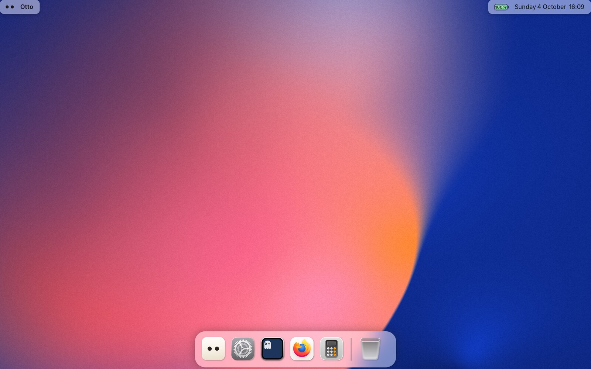
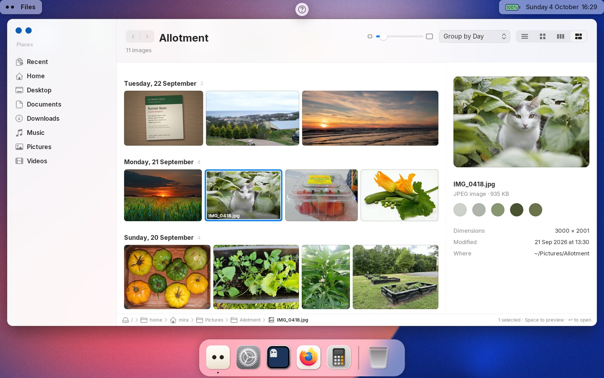
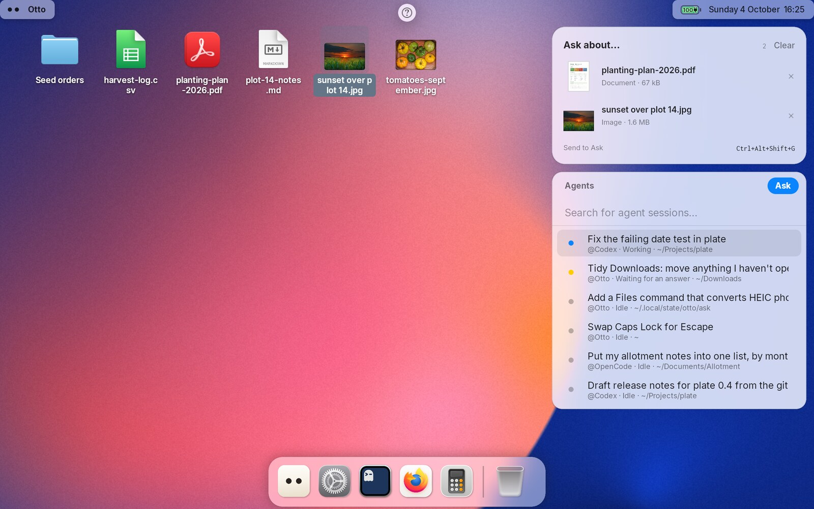
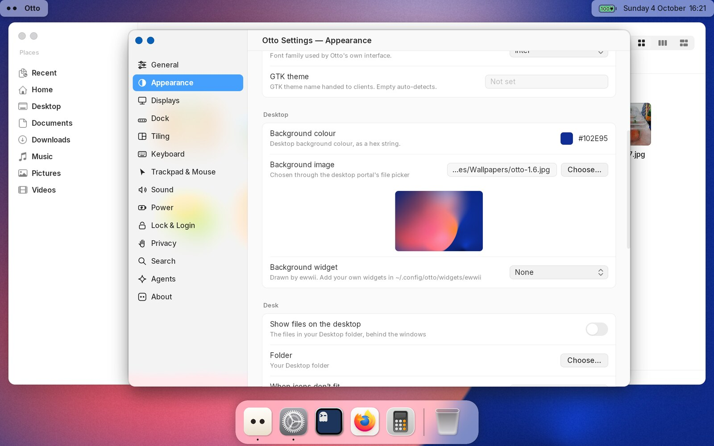

# Otto

[](https://github.com/nongio/otto/actions/workflows/ci.yml)
[](https://matrix.to/#/#otto-compositor:matrix.org)
[](https://discord.gg/Mp7cBfaACD)

**A Wayland desktop that is a pleasure to use.**

Otto is a Wayland compositor and stacking window manager, with the apps that make it a desktop: top bar, Dock, file manager, settings, launcher, lock screen and login greeter. It is written in Rust on [Smithay](https://github.com/Smithay/smithay), with a Skia renderer and the [lay-rs](https://github.com/nongio/layers) scene graph.

**Documentation:** [User Guide](https://nongio.github.io/otto/) · [Developer Guide](https://nongio.github.io/otto/developer/)

Questions and feedback: [Discord](https://discord.gg/Mp7cBfaACD) or Matrix [`#otto-compositor:matrix.org`](https://matrix.to/#/#otto-compositor:matrix.org).

## See it



*A fresh install, set up before you touch anything.*



*[Files](https://nongio.github.io/otto/files/), with pictures laid out by day.*



*The [side canvas](https://nongio.github.io/otto/side-canvas/), swiped in from the right edge, and files on the desk.*



*[Settings](https://nongio.github.io/otto/settings/) › Appearance. More looks in [Customization](https://nongio.github.io/otto/customization/).*

## Try it

Packages need Ubuntu 24.04+, Debian 13+, Fedora 41+ or Arch.

```sh
# Debian / Ubuntu
curl -fLO https://github.com/nongio/otto/releases/latest/download/otto-amd64.deb
sudo apt install ./otto-amd64.deb

# Fedora / RHEL
sudo dnf install https://github.com/nongio/otto/releases/latest/download/otto-x86_64.rpm

# Arch
curl -fsSLO https://raw.githubusercontent.com/nongio/otto/main/PKGBUILD && makepkg -si
```

Log out and pick **Otto** in your login manager's session menu. To look first, `otto --winit` runs it in a window inside your current Wayland session.

[Getting Started](https://nongio.github.io/otto/getting-started/) covers nightly builds, building from source, optional dependencies and the first-run checklist (screen sharing, the lock screen's PAM file, lid and power button).

## What you get

- **[Dock](https://nongio.github.io/otto/dock/)**: pinned apps, running apps and minimized windows in one strip, on any edge.
- **[Workspaces](https://nongio.github.io/otto/workspaces/)**: several per monitor, each monitor independent.
- **[Exposé and app switcher](https://nongio.github.io/otto/expose-and-switcher/)**: every window spread out with live previews; `Ctrl+Tab` across apps and their windows.
- **[Window management](https://nongio.github.io/otto/window-management/)**: snapping, minimize to the Dock, low-overlap placement, server-side title bars.
- **[Tiling](https://nongio.github.io/otto/tiling/)**: any workspace can switch between stacking and tiling; `otto-msg` speaks i3's command language.
- **[Top bar](https://nongio.github.io/otto/topbar/) and [dynamic island](https://nongio.github.io/otto/dynamic-island/)**: clock, tray and app menus; notifications, activities and permission dialogs.
- **[Multiple monitors](https://nongio.github.io/otto/display/)**: hotplug, per-output scale, and [virtual outputs](https://nongio.github.io/otto/display/#virtual-outputs) with no screen behind them.
- **[Lock screen](https://nongio.github.io/otto/lock-screen/) and [login greeter](https://nongio.github.io/otto/login-greeter/)**: PAM, fingerprint, idle and lid locking.
- **[Screen sharing](https://nongio.github.io/otto/screen-sharing/)**: an XDG Desktop Portal backend over PipeWire, for an output or a single window.
- **[Remote desktop](https://nongio.github.io/otto/remote-desktop/)**: `otto-rdp` serves an output to any RDP client.
- **[Files](https://nongio.github.io/otto/files/)**: file manager with Peek previews, a command palette and your own scripts as commands; also the desktop's file picker.
- **[Settings](https://nongio.github.io/otto/settings/)**: changes the running desktop live and writes the same config file you can edit by hand.
- **[Launcher](https://nongio.github.io/otto/launcher/)** and **[emoji picker](https://nongio.github.io/otto/emoji/)**.
- **X11 apps**, fullscreen games included, through XWayland.
- **Rendering**: Skia, with parts of the desktop on their own hardware display planes and blur across them. See [DRM planes](https://nongio.github.io/otto/developer/drm_plane/).
- **[Accessibility](https://nongio.github.io/otto/accessibility/)**: the desktop's own surfaces expose an AT-SPI tree.
- **Translated** into 11 languages.

Plane scanout is mostly tested on Intel GPUs. If elements go missing or flicker on AMD or NVIDIA, see [Troubleshooting](https://nongio.github.io/otto/troubleshooting/).

### Not there yet

- An interactive screenshot UI, and per-window `wlr-screencopy`
- Display mirroring
- Scroll acceleration

### Supported protocols

The full list is in [Wayland protocols](./docs/developer/wayland.md#supported-protocols). Otto adds two of its own: [`otto-surface-style-unstable-v1`](protocols/otto-surface-style-unstable-v1.xml) (experimental: clients drive layer geometry, blur and shadow with compositor-side springs; the top bar and dynamic island use it) and [`otto-dock-v1`](protocols/otto-dock-v1.xml).

## Configuration

Otto reads `/etc/otto/config.toml`, then `~/.config/otto/config.toml`. Edit either, or use the Settings app. [`otto_config.example.toml`](otto_config.example.toml) lists every option; the [Configuration guide](https://nongio.github.io/otto/configuration/) explains them.

## Development

```sh
git clone https://github.com/nongio/otto
cd otto
cargo build --release --workspace --exclude otto-rdp
cp otto_config.example.toml otto_config.toml
PATH="$PWD/target/release:$PATH" target/release/otto --winit
```

Otto is the compositor plus a set of separate programs it starts by name: `otto-bar`, `otto-islands`, `otto-files`, `otto-settings` and others. A plain `cargo build` only builds `otto`, and nothing from `target/release` is on your `PATH`, so the top bar, notifications and Settings would not start. The lines above build every program, put the build directory first on `PATH` for this one run, and copy the example config into the checkout, where Otto reads it as a local override (it is gitignored). That example config is what tells Otto to autostart the top bar and dynamic island. `--winit` opens Otto as a window in your current session. `otto-rdp` is left out because it needs the GStreamer development libraries.

Build prerequisites, backends, feature flags and the component crates are in [Project Structure](./docs/developer/project-structure.md). The [Developer Guide](https://nongio.github.io/otto/developer/) covers the architecture, rendering and the rest; the same pages live in [docs/developer/](./docs/developer/README.md).

## Contributing

Bug reports, testing on your hardware, features and ideas are all welcome: the [issue tracker](https://github.com/nongio/otto/issues), [Discord](https://discord.gg/Mp7cBfaACD) or [Matrix](https://matrix.to/#/#otto-compositor:matrix.org). [AGENTS.md](AGENTS.md) and the developer docs are written for human contributors and coding agents alike.

## License

MIT. See [LICENSE](LICENSE). The packages also ship the [MacTahoe icon theme](https://github.com/vinceliuice/MacTahoe-icon-theme), installed as `Otto-MacTahoe`, which keeps its own licence, GPL-3.0.

### Credits

- Icons and cursors: [MacTahoe](https://github.com/vinceliuice/MacTahoe-icon-theme) by Vince Liuice (GPL-3.0)
- Font: [Inter](https://rsms.me/inter/) by Rasmus Andersson (SIL Open Font License 1.1)
- Wallpaper: Otto's own, under Otto's licence
- Screenshots use the [Fluent icon theme](https://github.com/vinceliuice/Fluent-icon-theme); see [Credits](https://nongio.github.io/otto/credits/) for everything else in them
