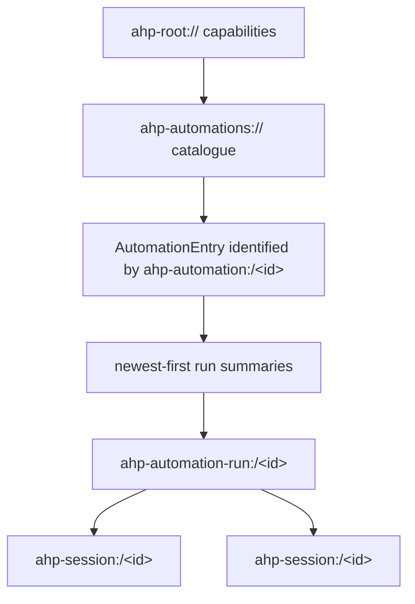
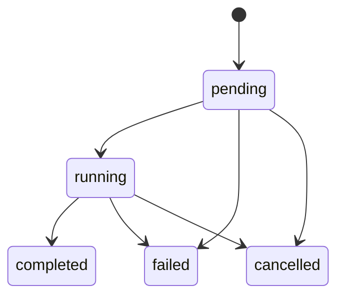

# Automations

Automations are durable, host-owned definitions that create fresh agent
sessions manually or in response to recurring schedules and external events.
They let multiple AHP clients share one catalogue, scheduler, execution claim,
and run history instead of each client maintaining a local copy.

## Key design points

- **The host is the single writable authority.** It persists definitions,
  evaluates triggers, claims occurrences, creates runs, and records history.
- **Definitions and executions have separate channels.** The
  `ahp-automations://` catalogue channel owns every reusable definition; each
  `ahp-automation-run:` channel owns one task-level execution.
- **Sessions remain ordinary AHP sessions.** A run may link one or more
  `ahp-session:` channels, which remain authoritative for transcripts, tool
  calls, confirmations, changesets, and per-session lifecycle.
- **Automatic execution never belongs to the client.** A client may render,
  edit, run, and cancel automations, but it does not run a fallback scheduler
  after an uncertain host response.
- **Capabilities and per-automation operations are distinct.** Initialize
  capabilities say what a host implementation supports. An automation's
  `operations` say which definition controls are allowed for that catalogue
  entry.

## Negotiating support

A host advertises automation support in `InitializeResult.automations`:

```typescript
AutomationCapabilities {
  create?: {}
  schedules?: {
    minIntervalMinutes?: number
  }
  runCancellation?: {}
  runHistoryLimit?: number
}
```

If `automations` is absent, the client treats the authority as having no
automation catalogue.

An empty `automations` object advertises the baseline catalogue. Additional
fields describe optional features and restrictions; clients use each
automation's `operations` to determine which definition actions are currently
allowed.

`create` and `runCancellation` are presence capabilities: an empty object means
the feature is supported, and absence means it is not. The object shape leaves
room for future feature-specific options without changing capability detection.

## Resource model



The resource layers answer different questions:

| Resource | Owns |
| --- | --- |
| `ahp-root://` | Automation capability negotiation |
| `ahp-automations://` | Full states for every visible automation |
| `ahp-automation:/<id>` | Stable command and relationship identifier for one catalogue entry; it is not independently subscribable |
| `ahp-automation-run:` | Execution provenance, lifecycle, linked sessions, and cancellation |
| `ahp-session:` / `ahp-chat:` | Conversation, tools, confirmations, input requests, changesets, and session-specific state |

## Catalogue and subscriptions

When `InitializeResult.automations` is present, clients subscribe to
`ahp-automations://`. The snapshot contains the complete catalogue:

```typescript
AutomationState {
  entries: AutomationEntry[]
}
```

The host keeps the catalogue synchronized with full-entry actions:

| Action | Meaning |
| --- | --- |
| `automation/createRequested` | Ask the host to persist a complete definition at a client-chosen resource. |
| `automation/updateRequested` | Ask the host to apply a definition patch in action order. |
| `automation/set` | Add or replace one complete `AutomationEntry`, keyed by `resource`. |
| `automation/removed` | Permanently delete the entry identified by `resource`; clients may dispatch this while `remove` is advertised. |

These are ordinary ordered AHP actions. After reconnect, the host either replays
missed catalogue actions or returns a fresh snapshot; clients do not issue a
special list command. The `ahp-automation:/<id>` value on each entry identifies
the target of mutation commands and relationships but is not a separate
subscription.

## Definitions

An `AutomationDefinition` is the durable, editable part of an automation:

```typescript
AutomationDefinition {
  title: string
  message: Message
  session: AutomationSessionTemplate
  enabled: boolean
  triggers: AutomationTrigger[]
  _meta?: Record<string, unknown>
}
```

`message` is the initial message sent to every newly created run session. Its
origin must be `automation`, allowing clients to distinguish the generated turn
from direct user input. The definition does not carry credentials,
confirmation decisions, or durable permission grants.

### Session template

The session template selects the context used to create a fresh session for
each run:

```typescript
AutomationSessionTemplate {
  provider?: string
  model?: ModelSelection
  agent?: AgentSelection
  workingDirectories?: URI[]
  config?: Record<string, unknown>
}
```

Omitting `provider` uses the host's default provider. Omitting
`workingDirectories` creates a workspace-less session. The host revalidates
the provider, model, agent, directories, and configuration every time a run
starts because availability and policy may have changed since the definition
was saved.

After a run creates a session, that session's `SessionState.workingDirectories`
is authoritative for the directories it actually uses. This keeps per-run
workspace preparation out of the durable automation definition and catalogue.

### Enabled state

`enabled` controls automatic triggers only. A disabled automation can still be
started manually when its state advertises the `run` operation. This allows a
user to pause scheduling without losing the definition or its ability to run
on demand.

## Triggers

An empty `triggers` list means manual-only. Automatic triggers are either
portable schedules or host-defined events.

Each trigger has an `id` that is unique and stable within its definition. Runs
created automatically record that id in `AutomationTriggeredRunOrigin`, so
clients can explain why the run exists even if they do not understand the
trigger's configuration.

### Scheduled triggers

A scheduled trigger contains a five-field AHP cron expression and an IANA time
zone:

```typescript
AutomationScheduleTrigger {
  id: string
  kind: 'schedule'
  schedule: {
    expression: string
    timeZone: string
  }
  misfirePolicy?: 'skip' | 'runOnce'
}
```

The expression has exactly five whitespace-separated fields:

```text
minute hour day-of-month month day-of-week
```

| Field | Allowed values |
| --- | --- |
| minute | `0`–`59` |
| hour | `0`–`23` |
| day of month | `1`–`31` |
| month | `1`–`12` or the case-insensitive names `JAN`–`DEC` |
| day of week | `0`–`7` or the case-insensitive names `SUN`–`SAT`; both `0` and `7` mean Sunday |

Each field supports:

- `*` for every value;
- one value, such as `9` or `MON`;
- an inclusive range, such as `1-5` or `MON-FRI`;
- a comma-separated list of values or ranges, such as `1,3,8-10`; and
- a positive step on `*` or a range, such as `*/15` or `1-30/2`.

AHP does not support a seconds field, a year field, macros such as `@daily`, or
Quartz extensions such as `?`, `L`, `W`, and `#`.

Minute, hour, and month must all match. If both day-of-month and day-of-week
are restricted (not `*`), the occurrence matches when **either** day field
matches, following Unix cron behavior.

Examples:

| Desired schedule | Expression |
| --- | --- |
| Every hour | `0 * * * *` |
| Every day at 09:30 | `30 9 * * *` |
| Every weekday at 09:30 | `30 9 * * MON-FRI` |
| Midnight on the 1st and 15th | `0 0 1,15 * *` |
| Every 15 minutes | `*/15 * * * *` |

The host evaluates the fields against local calendar time in `timeZone`. A
nonexistent local minute during a daylight-saving transition produces no
occurrence; a repeated local minute represents each matching instant. Clients
that preview schedules apply these same portable evaluation rules. The host's
`nextRunAt` projection is authoritative after the automation is persisted.

When `AutomationCapabilities.schedules.minIntervalMinutes` is present, the
host rejects schedules that can produce consecutive occurrences more
frequently than that limit. Without it, the cron format's one-minute resolution
is the only interval restriction.

### Misfires

A misfire is a scheduled occurrence that happens while automatic execution is
unavailable, for example while the host's scheduler is stopped:

| Policy | Behavior |
| --- | --- |
| `skip` | Discard missed occurrences and wait for the next future occurrence. |
| `runOnce` | Start at most one catch-up run when execution becomes available, regardless of how many occurrences were missed. |

Omitting `misfirePolicy` is equivalent to `runOnce`. A catch-up run records
`origin.catchUp: true` and the original `scheduledFor` timestamp.

### Event triggers

Event triggers are defined by the host rather than standardized by AHP. A
GitHub-aware host service might expose events such as pull-request creation;
another host may expose no event triggers.

While creating or editing a trigger, clients discover the currently available
event types with `listAutomationTriggerDefinitions`, passing the prospective
provider, working directories, and resolved session configuration. The host
returns:

```typescript
AutomationTriggerDefinition {
  type: string
  title: string
  description?: string
  events: {
    id: string
    title: string
    description?: string
  }[]
  configSchema?: ConfigSchema
}
```

The durable trigger stores the selected type and its human-readable metadata,
the selected event descriptors, and schema-defined configuration:

```typescript
AutomationEventTrigger {
  id: string
  kind: 'event'
  type: string
  title: string
  description?: string
  events: {
    id: string
    title: string
    description?: string
  }[]
  config?: Record<string, unknown>
}
```

Routine catalogue rendering does not repeat that potentially expensive
contextual discovery because the trigger is self-contained. The `type` and
event `id` values carry its semantics. The titles and descriptions are
last-known display metadata and do not prove that the trigger or event is
currently available.

When accepting a create request, a trigger replacement, or a session-context
change, the host validates affected semantic ids and configuration against
current discovery, normalizes the titles and descriptions, and publishes the
authoritative definition through `automation/set`. An unrelated update
preserves the saved trigger as a whole, including its labels.

Clients call `listAutomationTriggerDefinitions` when editing and use that
current result for availability, selectable events, configuration schema,
validation, and current editing labels. If an existing trigger later disappears
from discovery, its saved descriptors still keep the catalogue readable.

Unknown configuration entries must survive client edits. Event provenance
recorded on a run must contain no secrets; it is descriptive context, not a
payload clients should replay.

## Creating, updating, and removing

| Action | Purpose |
| --- | --- |
| `automation/createRequested` | Persist a complete definition at a client-chosen `ahp-automation:/<id>` resource. |
| `automation/updateRequested` | Replace selected editable fields in action order. |
| `automation/removed` | Permanently remove a definition when removal is currently allowed. |

Create and update requests are side-effect-only. They leave catalogue state
unchanged until the host validates and persists the mutation, then publishes
the authoritative full state through `automation/set`.

```typescript
{
  channel: 'ahp-automations://'
  clientSeq: 7
  action: {
    type: 'automation/updateRequested'
    resource: 'ahp-automation:/triage'
    changes: {
      enabled: false
    }
  }
}
```

The host evaluates the patch against its current authoritative definition in
action order. Omitted fields remain unchanged, so concurrent patches to
different fields compose. Supplied arrays and objects replace their fields in
full rather than merging recursively. When accepted actions replace the same
field, the later action in server order wins. The host rejects actions that are
unauthorized, no longer permitted, or invalid for the current definition.

To permanently remove an automation, a client dispatches
`automation/removed` on `ahp-automations://`:

```typescript
{
  channel: 'ahp-automations://'
  clientSeq: 8
  action: {
    type: 'automation/removed'
    resource: 'ahp-automation:/triage'
  }
}
```

The client checks that the automation advertises `remove` and may remove it
optimistically. The host revalidates permission and current operation
availability. If the host rejects the action, `ActionEnvelope.rejectionReason`
causes the originating client to restore its prediction; accepted removals are
permanent and ordered for every catalogue subscriber. Removing an unknown
resource is a no-op.

## Runs

`runAutomation` starts a manual run and returns its
`ahp-automation-run:` URI as `resource`:

```typescript
{
  channel: 'ahp-automations://'
  automation: 'ahp-automation:/triage'
  requestId: 'client-generated-idempotency-key'
}

// result
{
  resource: 'ahp-automation-run:/run-123'
}
```

`requestId` is durable. Retrying with the same automation and request id
returns the existing run URI, including after reconnect or an uncertain
response. The host persists the run record before creating sessions or sending
the first message.

### Run lifecycle



`completed`, `failed`, and `cancelled` are terminal. `failed.startedAt` and
`cancelled.startedAt` are optional because validation, workspace preparation,
or cancellation may finish before execution begins.

The run remains `running` while a linked session awaits user input,
confirmation, authentication, or client-side tool execution. Linked
`SessionSummary.status` values provide lightweight attention state, and
`SessionState.inputNeeded` contains the actionable requests. The run channel
does not duplicate that interaction state.

### Linked sessions

A run's `sessions` list may contain one local attempt, several retries, or
parallel workers. `primarySession` tells clients which one to open first.

Every automation-created session records:

```typescript
origin: {
  kind: 'automation'
  automation: URI
  run: URI
}
```

This provenance survives persistence and allows navigation in both directions.
The run channel does not duplicate session transcript or tool state.

### Cancellation

Cancellation is available when
`InitializeResult.automations.runCancellation` is present and the run lifecycle
is `pending` or `running`. Terminal runs cannot be cancelled.

The client dispatches `automationRun/cancelRequested`. This action is
side-effect-only and does not optimistically change lifecycle. The host
revalidates that the run is still non-terminal, then later emits
`automationRun/lifecycleChanged` with the authoritative result. The run may
become `cancelled`, or it may complete or fail before cancellation takes effect.

## Run history and retention

`AutomationEntry.runs` is a newest-first, bounded window of
`AutomationRunSummary` values. If `runsNextCursor` is present, the client calls
`fetchAutomationRuns`; the host then publishes the updated full state through
`automation/set` so every catalogue subscriber applies the same reducer update.

`AutomationCapabilities.runHistoryLimit` advertises the maximum number of
terminal summaries retained per automation. Active runs do not count toward
that limit. Once the host prunes a run, clients must not assume its
automation-run channel remains subscribable.

## Multiple clients and reconciliation

Several clients may subscribe to the same `ahp-automations://` catalogue:

- the host sequences every catalogue and run action;
- ordered patches preserve disjoint changes and deterministically resolve
  overlapping writes;
- manual `requestId` values prevent duplicate runs after retry;
- one trigger occurrence is atomically associated with at most one run;
- `automation/set` and `automation/removed` keep live clients updated; and
- reconnecting clients receive replayed actions or a fresh catalogue snapshot
  instead of re-listing or replaying local scheduling decisions.

The core invariant is:

> Once an automation belongs to an AHP authority, clients never schedule or
> execute a fallback copy.

This is what prevents duplicate runs across windows, devices, and
applications.

## Security

- Definitions contain no credentials or reusable confirmation decisions.
- The host revalidates provider, model, agent, workspace, and session
  configuration when each run starts.
- State-level operations are authoritative; clients do not infer permission
  from capabilities.
- Event provenance and `_meta` values must not contain secrets.
- Linked session channels use the ordinary AHP confirmation, authentication,
  and client-execution mechanisms.
