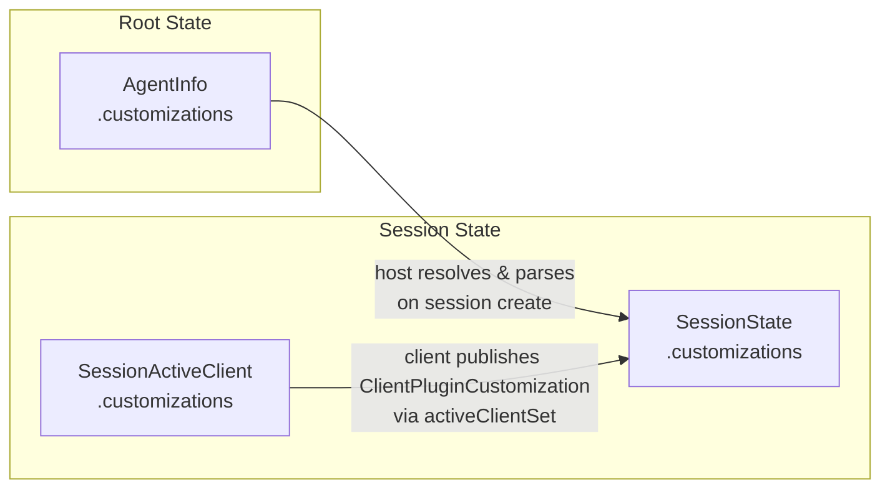
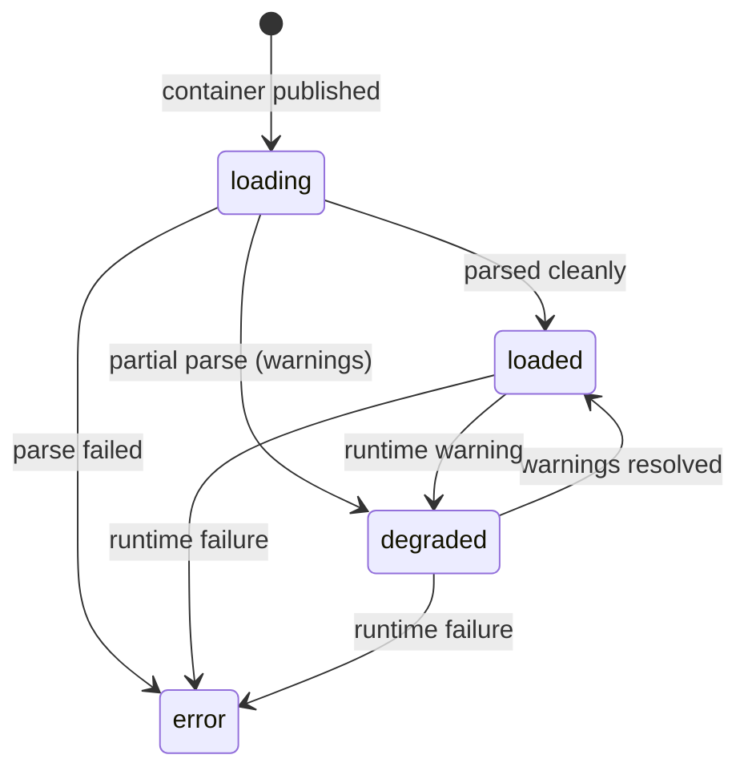
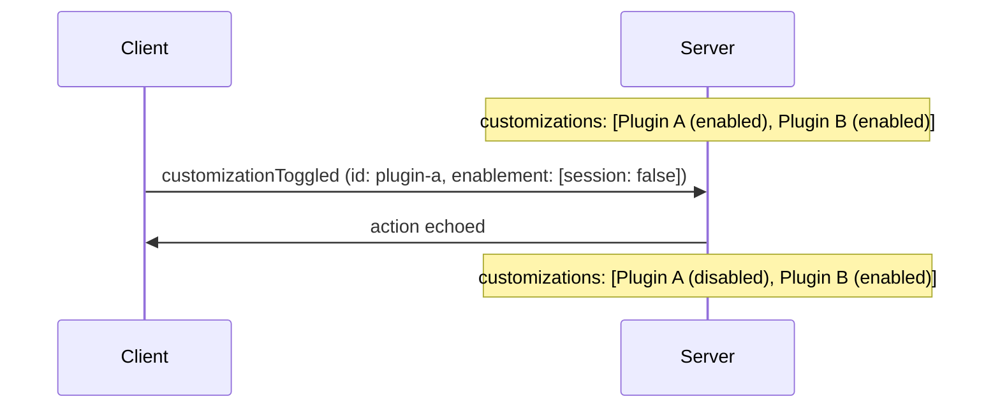
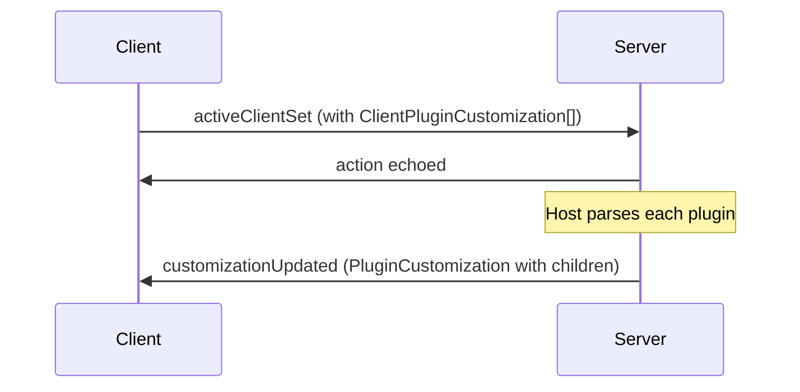
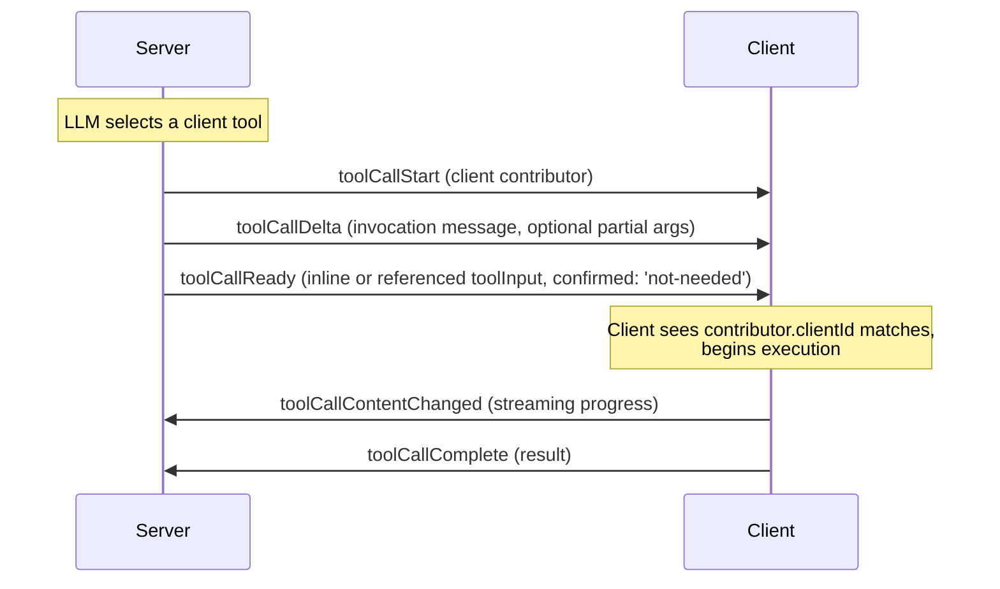
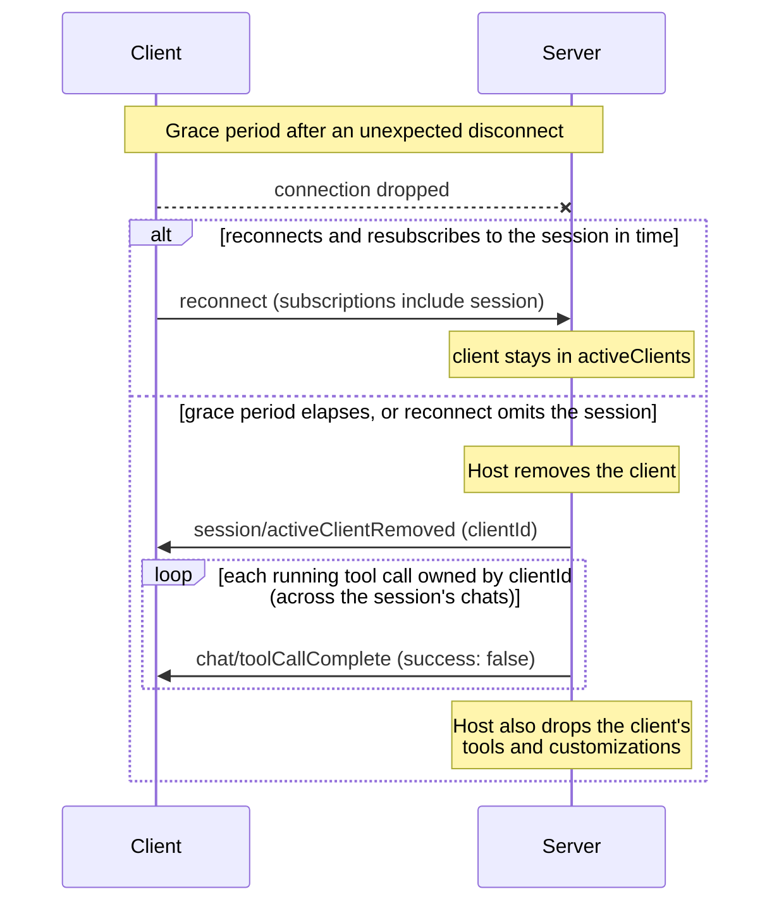
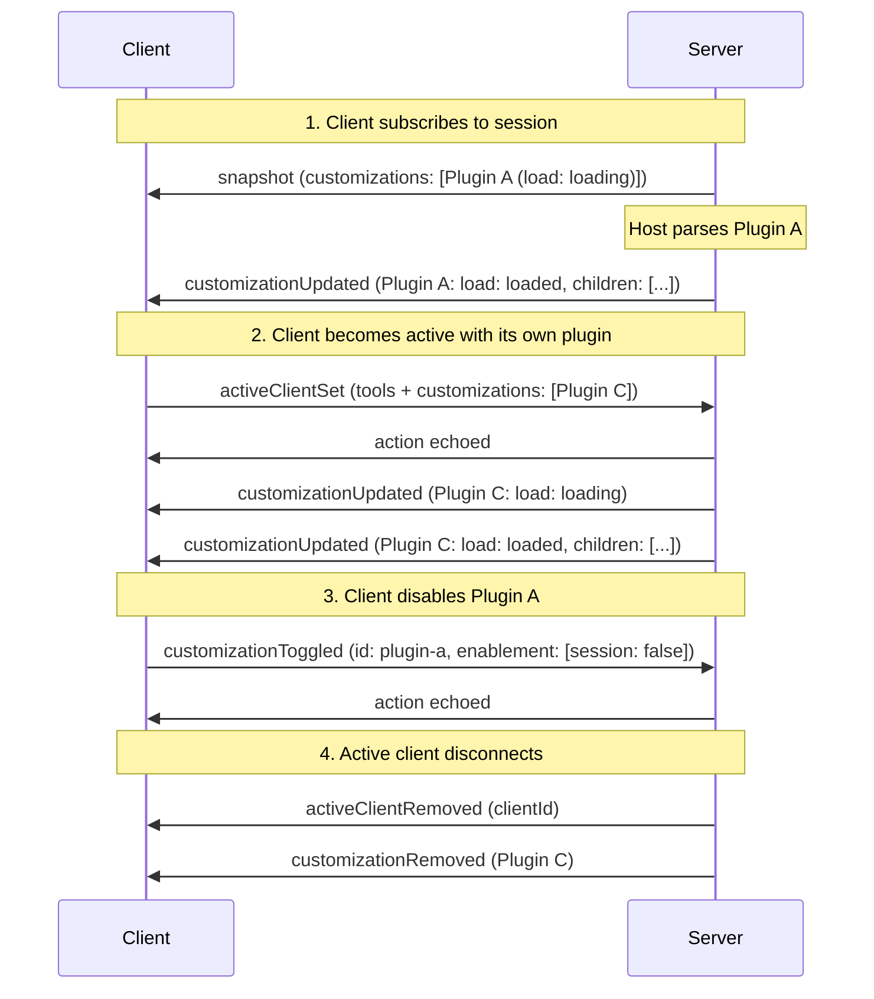

# Customizations

Customizations extend agent sessions with additional capabilities — agents, skills, prompts, rules, hooks, and MCP servers. AHP organises them as a discriminated union with a fixed set of types and a shallow tree:

- **Top-level entries are typically containers**: a `PluginCustomization` (an [Open Plugins](https://open-plugins.com/) package) or a `DirectoryCustomization` (a directory the host watches on disk). The host MAY also surface a bare `McpServerCustomization` at the top level (for example, a globally-configured MCP server that isn't bundled in a plugin).
- **Other children live inside a container**: `AgentCustomization`, `SkillCustomization`, `PromptCustomization`, `RuleCustomization`, `HookCustomization`, `McpServerCustomization`. MCP servers can therefore appear in either position.

The agent host is authoritative on the effective tree and its enablement. Clients publish plugins, the host expands them into children, and the host owns disk-backed directories and bare top-level MCP servers.

For MCP-specific behaviour (server lifecycle, authentication, App support), see [MCP Servers](/guide/mcp).

## Sources

Customizations enter a session from two places:

1. **Server-provided** — The agent host declares containers on each agent via `AgentInfo.customizations`. When a session is created, the host resolves the containers, parses their contents, and exposes the result in `SessionState.customizations`.
2. **Client-provided** — An active client contributes `ClientPluginCustomization` entries via `SessionActiveClient.customizations` (a `PluginCustomization` with an optional `nonce`). The host MAY parse the published plugin and surface it (with its children) in the session's top-level list.



Clients publish in Open Plugins shape only. They MAY synthesize a virtual plugin in memory if their real source is on disk; mapping a workspace location to a physical directory is the host's job, not the client's.

## Identity

Every customization carries an `id` and a `uri`. They are different concepts:

- **`id`** is a session-unique opaque token. It identifies the entry to every customization action — toggles, updates, and removals. It is minted by whoever publishes the customization (typically the host).
- **`uri`** is the descriptive source URI. For plugins it's the package URL, for directories it's the directory path, and for file-backed children it's the file URI. For inline declarations (e.g. an MCP server declared inside a `plugins.json` manifest) `uri` points at the containing file and the optional **`range`** narrows it to the declaration's span within that file.

Use `id` for protocol operations. Use `uri` for persistent references (e.g. `AgentSelection.uri`, which must survive across sessions).

## Provider metadata

Every customization — container or child — also carries an optional `_meta` object: a provider-specific escape hatch that mirrors the MCP `_meta` convention. It is opaque to the protocol, so a minimal client can ignore it entirely; producers and consumers that populate it agree on its contents out-of-band. Prefer a first-class field whenever data has a natural typed home (e.g. an agent's `model`), and reserve `_meta` for genuinely provider-specific data with no dedicated AHP field.

## Containers

Container customizations carry a host-reported `load` state and a `children` array.

```typescript
PluginCustomization {
  type: 'plugin'
  id: string                     // session-unique handle
  uri: URI                       // plugin URL or marketplace id
  name: string
  icons?: Icon[]
  enablement?: CustomizationEnablement[] // explicit scoped decisions
  clientId?: string              // set when published by a client
  load?: CustomizationLoadState  // host-reported parse/load state
  children?: ChildCustomization[]
}

DirectoryCustomization {
  type: 'directory'
  id: string
  uri: URI                       // directory URI
  name: string
  icons?: Icon[]
  enabled: boolean
  clientId?: string
  load?: CustomizationLoadState
  children?: ChildCustomization[]
  contents: ChildCustomizationType  // which child kind lives here
  writable: boolean                 // clients may write into it (via resourceWrite)
}
```

`children` is **absent** when the host has not parsed the container yet, and **empty** when it parsed it and found nothing.

### Load state

`load` is a discriminated union:



| Kind | Meaning |
|---|---|
| `loading` | Host is loading / parsing the container (initial state) |
| `loaded` | Host has fully resolved the container |
| `degraded` | Container partially loaded; `message` describes the warning |
| `error` | Container failed to load; `message` carries the error |

## Children

Every child carries the same base fields (`id`, `uri`, `name`, optional `icons`). The five leaf children carry an optional `enabled` flag (absent means enabled), while `McpServerCustomization` carries explicit scoped `enablement` decisions. Children are leaf nodes — no further nesting — and their parent is implied by which container holds them in its `children` array. A child's `enabled` is independent of its container's. Children have no `clientId`: client provenance lives on the container since clients can only contribute containers, not individual children.

Each child type carries optional metadata sourced from its [Open Plugins](https://open-plugins.com/plugin-builders/specification.md) component definition (typically the file's YAML frontmatter):

```typescript
AgentCustomization        { type: 'agent';       description?, model?, tools?, disableModelInvocation?, disableUserInvocation? }
SkillCustomization        { type: 'skill';       description?, disableModelInvocation?, disableUserInvocation? }
PromptCustomization       { type: 'prompt';      description? }
RuleCustomization         { type: 'rule';        description?, alwaysApply?, globs? }    // covers "instruction" formats too
HookCustomization         { type: 'hook';        event?, matcher? }
McpServerCustomization    { type: 'mcpServer';   enablement?, state, channel?, mcpApp? }   // see /guide/mcp
```

Agents and skills carry a symmetric invocation matrix. `disableModelInvocation` removes the entry from the agent's automatic choices — a custom agent it won't auto-delegate to, or a skill it won't auto-invoke — while leaving it available for the user to pick. `disableUserInvocation` does the reverse: the entry stays available for the agent to invoke but is hidden from user-facing pickers and slash-commands. Both are absent/`false` by default (invocable by either party), and they are independent, so an entry can be agent-only, user-only, both, or neither.

The protocol intentionally omits host-internal execution details (a hook's command/script, an MCP server's `command`/`args`/`env`, etc.). Those stay on the agent host; clients see only what's needed for display, search, and selection. MCP tools and their descriptions surface through the standard tool channels once the server is running. The MCP-specific runtime fields (`state`, `channel`, `mcpApp`) are covered in [MCP Servers](/guide/mcp).

Consumers filter by `type` to find the children they care about — for example, the agent picker reads every `AgentCustomization` under any container:

```typescript
state.customizations
  ?.flatMap(c => c.children ?? [])
  .filter(c => c.type === CustomizationType.Agent)
```

## Enablement

Plugins and MCP servers may carry an `enablement` array of explicit decisions:

```typescript
CustomizationEnablement =
  | { kind: 'global'; enabled: boolean }
  | { kind: 'workspace'; uri: URI; enabled: boolean }
  | { kind: 'session'; enabled: boolean }
```

Producers MUST publish the entries in descending specificity: session,
workspace, then global. The host emits at most one workspace decision, for the
session's primary working directory. Consumers MAY use `enablement[0]` as the
decisive decision, with `enablement?.[0]?.enabled ?? true` as the effective
value. An absent or empty array has no explicit decision and means enabled by
default.

For MCP servers, enablement flows both ways. A client publishing a server
includes its global decision (even when enabled), and the host publishes the
fully resolved decisions across all scopes. Client-published plugins can supply
global decisions for their discovered children through
`ClientPluginCustomization.childEnablement`, keyed by child name.

`DirectoryCustomization` and the five leaf child kinds retain their plain
`enabled` fields. A plugin's effective value is derived from its `enablement`;
a plugin child is effectively enabled when that derived value and
`(child.enabled ?? true)` are both true. A directory child instead uses
`directory.enabled && (child.enabled ?? true)`.

## Toggling

Any client can request an enablement update with
`session/customizationToggled`. It carries the complete set of explicit
decisions for the entry:

```typescript
{
  type: 'session/customizationToggled'
  id: string         // any customization id
  enablement: CustomizationEnablement[]
}
```

The action replaces the entry's array wholesale rather than merging a single
scope. A caller changing one scope must include every decision it intends to
preserve. The reducer matches `id` against every top-level customization first
— plugins, directories, and bare top-level MCP servers — then against the
children inside every container. For plugins and MCP servers it replaces the
matched entry's `enablement`; for directories and leaf children it updates the
plain `enabled` value from the first decision. An empty array clears explicit
provenance from plugins and MCP servers and restores the default enabled value
for directories and leaf children. The action is a no-op if no customization
has that id.



## Server-Side Updates

The host reports container changes via two actions:

- **`session/customizationsChanged`** — full replacement of the top-level list. Use when the entire effective set changes.
- **`session/customizationUpdated`** — upsert one top-level container by `customization.id`. If found, the entry is replaced entirely (including its `children` array); if not, it's appended.

Children are always updated as part of their container. To reflect a per-child change (e.g. a single skill finishing parse), the host re-dispatches `customizationUpdated` with the same container and the updated `children` array. There is no field-level merge and no per-child action.

For removals:

- **`session/customizationRemoved { id }`** — remove a customization by id. If the entry is a top-level container, its children are removed with it. If the entry is a child, only that child is removed. No-op if no matching id is found.

## Saving New Customizations

When a client wants to persist a new customization (e.g. write a new skill file), it targets a `DirectoryCustomization` with `writable: true` and uses [`resourceWrite`](/reference/common#resourcewrite) to write into it. The host watches the directory and surfaces the resulting child by re-dispatching `session/customizationUpdated` for the directory (which carries the updated `children` array).

The protocol does not define a dedicated save action — directories plus `resourceWrite` are enough.

## Client-Published Plugins

A client joins a session as an active client and contributes plugins via `session/activeClientSet`. A session may have several active clients at once; entries are keyed by `clientId`. Client customizations are `ClientPluginCustomization` values — `PluginCustomization` with an optional `nonce` the host can use to detect changes between publications.

```typescript
dispatch({
  type: 'session/activeClientSet',
  activeClient: {
    clientId: 'my-client-id',
    displayName: 'VS Code',
    tools: [ /* ... */ ],
    customizations: [
      {
        type: 'plugin',
        id: 'client-plugin-1',
        uri: 'virtual://my-client/workspace-skills',
        name: 'Workspace Skills',
        enablement: [{ kind: 'global', enabled: true }],
        nonce: 'sha256:...',
      },
    ],
  },
});
```

The host parses the plugin and surfaces it in `SessionState.customizations` with `clientId` set and `children` populated. When an active client disconnects (or is removed via `session/activeClientRemoved`), the host SHOULD remove its customizations from the session list.



## Client-Provided Tools

AHP sessions can expose tools from two sources: **server tools** provided by the agent host, and **client tools** provided by an active client (e.g. an IDE). Client tools let the agent invoke capabilities that only the client has access to.

Key design points:

- **Client tools are state, not RPC.** They live in `SessionState.activeClients[].tools` and are visible to all subscribers.
- **Tool execution follows the same state machine** as server tools — the only difference is _who_ executes: for client tools, the owning client does.
- **The server identifies client tool calls** by setting the tool call's client `contributor` (with the owning `clientId`) on `chat/toolCallStart`.

### Registering Tools

A client registers its tools by including them in the `session/activeClientSet` payload (the same action used to register customizations):

```typescript
// Client joins as an active client with tools and customizations
dispatch({
  type: 'session/activeClientSet',
  activeClient: {
    clientId: 'my-client-id',
    displayName: 'VS Code',
    tools: [
      {
        name: 'runUnitTests',
        title: 'Run Unit Tests',
        description: 'Runs unit tests in the project',
        inputSchema: {
          type: 'object',
          properties: { pattern: { type: 'string' } }
        },
      },
    ],
    customizations: [ /* ... */ ],
  },
});
```

After registration, the reducer stores the tools on the matching entry in `state.activeClients` (keyed by `clientId`).

### Updating Tools

To change its tool list, a client re-dispatches `session/activeClientSet` with its full, updated `SessionActiveClient` entry. The upsert (keyed by `clientId`) replaces the previous entry — tools and all:

```typescript
dispatch({
  type: 'session/activeClientSet',
  activeClient: {
    clientId: 'my-client-id',
    displayName: 'VS Code',
    tools: updatedToolList, // full replacement
    customizations: [ /* unchanged — host may skip re-parsing via nonce */ ],
  },
});
```

There is no separate tools-only action: because each `activeClients` entry has a single owner, re-publishing the whole entry is the canonical way to update either its `tools` or its `customizations`. Hosts MAY use each `ClientPluginCustomization`'s `nonce` to detect unchanged customizations and skip re-parsing.

### Tool Name Uniqueness

Server tools and client tools share a flat namespace (`ToolDefinition.name`). Agent host implementations SHOULD ensure names are unique across both sets — for example by prefixing client tool names.

### Executing a Client Tool Call

When the LLM calls a client-provided tool, the following sequence occurs:



1. **`chat/toolCallStart`** — The server dispatches this with the tool call's `contributor` set to a client contributor whose `clientId` is the owning client's. This tells the client it owns the tool call.

2. **`chat/toolCallDelta`** (zero or more) — The server updates the invocation message while parameters stream and MAY include partial arguments.

3. **`chat/toolCallReady`** — Parameters are complete. For client-provided tools, the server typically sets `confirmed: 'not-needed'` so the tool transitions directly to `running`. If the server wants user confirmation first, it omits `confirmed` and the standard confirmation flow applies.

4. **Client executes** — When the tool call reaches `running` status, the owning client uses inline `toolInput` directly or reads a referenced input with `resourceRead`. If confirmation carried `editedToolInput`, inline state is updated by the reducer; for referenced input, the host updates the resource before echoing the accepted confirmation.

5. **`chat/toolCallContentChanged`** (zero or more, client-dispatched) — While executing, the client MAY stream intermediate content (e.g. terminal output, partial results) by dispatching this action. This replaces the `content` array on the running tool call state.

6. **`chat/toolCallComplete`** (client-dispatched) — The client dispatches this with the execution result. The server SHOULD reject this action if the dispatching client does not match the tool call's `contributor.clientId`.

### Denying an Unrecognized Tool

If the client receives a tool call for a tool it does not recognize (e.g. after a stale registration), it MUST dispatch `chat/toolCallConfirmed` with `approved: false`:

```typescript
dispatch({
  type: 'chat/toolCallConfirmed',
  channel: chatUri,
  turnId,
  toolCallId,
  approved: false,
  reason: 'denied',
});
```

### Active-Client Lifecycle

Active membership is **session-scoped** and host-managed:

- **Join.** A client adds itself with `session/activeClientSet` (an upsert keyed
  by `clientId`). Several clients may be active at once. A client never needs to
  "unset" itself — it simply stops refreshing and lets the host remove it.
- **Leave.** The host removes a client with `session/activeClientRemoved` (by
  `clientId`). The host SHOULD do this when:
  1. the client **unsubscribes** from the session channel;
  2. the client **disconnects** and does not reconnect within a host-defined
     grace period; or
  3. the client **reconnects but does not resubscribe** to a session it was
     still active in — i.e. the `reconnect` command's `subscriptions` omit that
     session URI.

The grace-period duration and exact policy are host-defined; the protocol only
defines the `session/activeClientSet` / `session/activeClientRemoved` actions
used to express the result.

### Cancelling a Removed Client's Tool Calls

When the host removes an active client, it SHOULD also cancel that client's
in-flight tool calls so they do not remain stuck in `running` indefinitely. A
client tool call is one whose state carries a client `ToolCallContributor` with
the matching `clientId`; these may be spread across several chats in the
session. For each such call the host dispatches `chat/toolCallComplete` with
`result.success = false` and an explanatory message.

::: tip
"Cancellation" here is a **failed completion**: the call ends in `completed`
status with `result.success = false`, not in `cancelled` status. There is no
per-tool-call server-initiated cancel action — `cancelled` status is reserved
for the user-driven denial / skip / result-denied confirmation flows (and the
whole-turn `chat/turnCancelled`, which force-cancels every in-progress call in
the turn regardless of owner).
:::



## Actions Summary

| Type | Client-dispatchable? | When |
|---|---|---|
| `session/customizationsChanged` | No | Server replaced the top-level customization list (full replacement) |
| `session/customizationToggled` | **Yes** | Client toggled a customization on or off by id |
| `session/customizationUpdated` | No | Server upserts a top-level container by id (full-entry replacement, including children) |
| `session/customizationRemoved` | No | Server removes a customization by id (containers cascade) |
| `session/activeClientSet` | **Yes** | Client joins or refreshes as an active client (with tools + customizations), keyed by `clientId` |
| `session/activeClientRemoved` | **Yes** | Client leaves the active set (by `clientId`) |
| `chat/toolCallStart` | No | Server begins a tool call (sets the client `contributor` for client tools) |
| `chat/toolCallComplete` | **Yes** | Client finishes executing a tool call |
| `chat/toolCallContentChanged` | **Yes** | Client streams intermediate tool output |

## Full Session Flow



## Next Steps

- [State Model](/guide/state-model) — The state tree that customizations and tools live in, including the tool call lifecycle state machine.
- [Actions](/guide/actions) — How state is mutated by actions.
- [Session Channel Reference](/reference/session) — `SessionActiveClient`, `ToolDefinition`, `ToolCallState`, `Customization`, `ChildCustomization`, and more.
