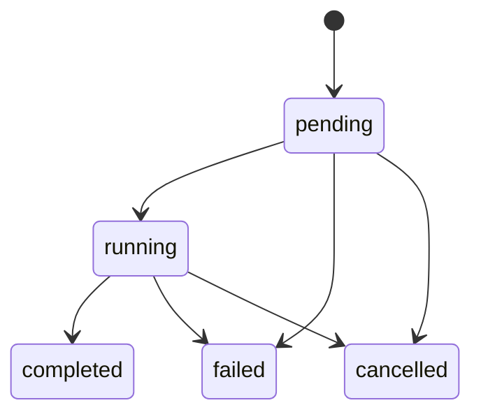

# Automation Run Channel

<StabilityIndex level="1.0" />

The automation-run channel represents one task-level execution of an
automation. A local run commonly links one session; hosted authorities may link
multiple attempts or workers.

## URI

```text
ahp-automation-run:/<id>
```

## State

`AutomationRunState` contains an immutable `origin` describing manual or
trigger provenance, a discriminated lifecycle, an ordered session catalogue,
and an optional primary session.

Linked `ahp-session:` and `ahp-chat:` channels remain authoritative for
conversation, tool-call, input-request, changeset, and per-session state.

## Lifecycle



The run remains `running` while linked sessions await interaction. Their
`SessionSummary.status` and `SessionState.inputNeeded` fields remain
authoritative for attention state and response routing.

When `InitializeResult.automations.runCancellation` is present, clients may
dispatch `automationRun/cancelRequested` for `pending` or `running` runs.
Terminal runs cannot be cancelled, and the host revalidates lifecycle when it
receives the request.

## Actions

- `automationRun/lifecycleChanged`
- `automationRun/sessionSet`
- `automationRun/sessionRemoved`
- `automationRun/primarySessionChanged`
- `automationRun/cancelRequested`

Only `cancelRequested` is client-dispatchable. It is a side-effect request; the
durable result arrives through `lifecycleChanged`.

## Reconciliation

The host persists a run before external side effects and records each session
URI before sending its first message. Retrying `runAutomation` with the same
request ID returns the existing run URI.
