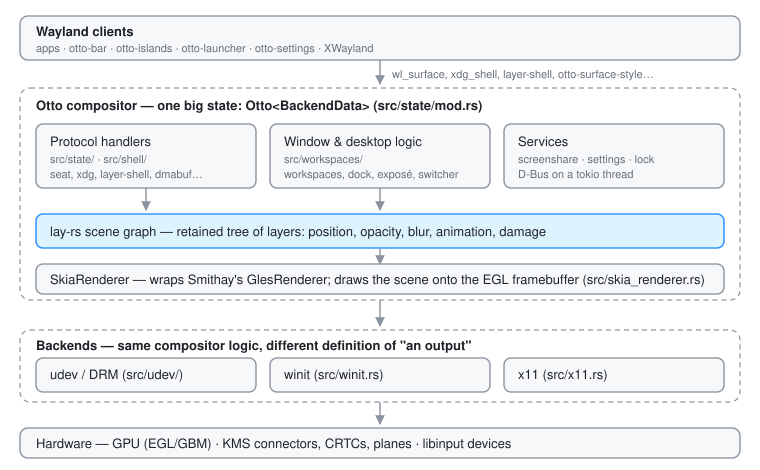

# Otto Developer Guide

Otto is a Wayland compositor built on [Smithay](https://smithay.github.io/smithay/),
rendered with Skia, and driven by a retained scene graph
([lay-rs](https://github.com/nongio/layers)).

If you have written a compositor before, the one structural surprise is that
Otto does not draw windows imperatively each frame. It maintains a **scene
graph**, a tree of layers with positions, opacity, blur and animations, and
hands the whole tree to the renderer as a single render element. Most of
`src/workspaces/` is code that mutates that tree; almost none of it draws.

For what Otto does rather than how, see the
[User Guide](../user/README.md). Contributions of every size are welcome, from
a bug report to a feature: the [issue tracker](https://github.com/nongio/otto/issues)
is the place to start.

## Read these first

| Page | What it covers |
|------|----------------|
| [Project Structure](project-structure.md) | Where everything lives, feature flags, how to build |
| [Rendering](rendering.md) | Scene graph → render elements → Skia → screen |
| [Render Loop](render_loop.md) | When Otto wakes up, when it renders, damage tracking |
| [Wayland Protocols](wayland.md) | The one-big-state pattern and how to find any protocol handler |
| [XDG Specifications](xdg-specifications.md) | Every freedesktop/XDG standard Otto implements, and where |
| [The Scene Graph](scene-graph.md) | The layer tree: how it is shaped, how surfaces enter it, how subtrees become KMS planes |
| [Layers](layers.md) | The unit the tree is made of: properties, content closures, transactions, caching, damage |

## Subsystems

| Page | What it covers |
|------|----------------|
| [otto-kit](otto-kit.md) | The toolkit the apps and the compositor's own chrome are built on |
| [Scroll Panes](scroll-pane.md) | Scrolling an otto-kit app at display rate by moving subsurfaces, not repainting |
| [Dock](dock-design.md) | The compositor-drawn dock: data flow, layers, magnification |
| [Exposé](expose.md) | The all-windows overview: layout, mirrors, drag-and-drop, multi-output |
| [Window Move](window-move.md) | How interactive window drags are implemented |
| [DRM Planes](drm_plane.md) | Handing parts of the scene to display hardware instead of the GPU |
| [Foreign Toplevel](foreign-toplevel.md) | Exposing the window list to taskbars and launchers |
| [Surface Style Protocol](surface-style-protocol.md) | `otto-surface-style-unstable-v1`: letting a client style and animate its own surface |
| [Screen Sharing](screenshare.md) | Portal, PipeWire, wlr-screencopy, window capture |
| [File Previews](file-previews.md) | Thumbnails, the preview column, Peek, the sandboxed decode worker, video |
| [otto-media-kit](otto-media-kit.md) | Video playback: the embeddable player and its GStreamer worker |
| [File Icons](file-icons.md) | What goes in the icon box: file types, the icon-name chain, themes, animated previews |
| [Text in Pictures](peek-ocr.md) | Reading the words in a picture: the recogniser, the word cache, selection and copy |
| [File Search](file-search.md) | Find and Recent in otto-files, and the one index both of them ask |
| [Agents](agents.md) | Running coding agents behind the launcher: `otto-agents`, AHP and ACP, permission prompts |
| [Accessibility](accessibility.md) | Key grabs for screen readers, and the shell and kit apps on AT-SPI |
| [Color Scheme](color-scheme-setting.md) | How apps learn whether Otto is in light or dark mode, and the accent colour |
| [Settings D-Bus API](settings-dbus-api.md) | The `org.otto.Settings` wire contract |
| [Shell D-Bus API](shell-dbus-api.md) | The `org.otto.Shell1` wire contract: i3-syntax commands, the tree as JSON, `otto-msg` |
| [RDP Bridge](rdp-virtual-output.md) | Serving a virtual output over RDP (`otto-rdp`) |
| [Debug Action Hook](debug-action-hook.md) | Driving builtin shortcut actions from a script (`$OTTO_ACTION_FILE`) |
| [Versioning & Releases](versioning.md) | One workspace version for the compositor and every component, and how to bump it |
| [Remote-Desktop Indicator](remote-desktop-indicator.md) | The sharing indicator `otto-rdp` publishes while a client is watching |

## Design docs and plans

These describe work that is exploratory, partial, or superseded. Each says so
at the top — check that before trusting the details.

| Page | Status |
|------|--------|
| [otto-kit Roadmap](otto-kit-roadmap.md) | Partially built: gap analysis for the UI toolkit |
| [Tiling Plan](tiling-plan.md) | Mostly built: the tree, the commands and the settings; tabbed/stacked and XWayland are not |
| [Screenshot Portal Plan](screenshot-plan.md) | Partly built: the portal exists and shells out to `grim`; capture inside the compositor is still the plan |
| [AirPlay Screenshare](airplay-screenshare.md) | Exploration only |

## Specs

`docs/developer/` explains **how things work today**. [`specs/`](../../specs/)
holds the behavioural contracts: what a feature must do, written to be
verified against. Where a subsystem has both, the spec is authoritative for
behaviour and the doc is authoritative for structure. See
[`specs/README.md`](../../specs/README.md).

## Conventions

**Two coordinate spaces, and mixing them causes scale-dependent bugs.**

- *Physical pixels*: raw hardware pixels. Used for layer positions
  (`set_position`, `change_position`) and `output.current_mode().size`.
- *Logical pixels (points)*: physical ÷ scale.
  `output_geometry(output).size` returns these, so it must **not** be used for
  layer positions.

Always take the scale from the output itself —
`output.current_scale().fractional_scale() as f32`. `WorkspacesModel.scale` is
a global fallback and does not belong in geometry code.

Suffix physical-pixel variables with `_px` (`width_px`, `offset_px`) so the
space is visible at the call site.
