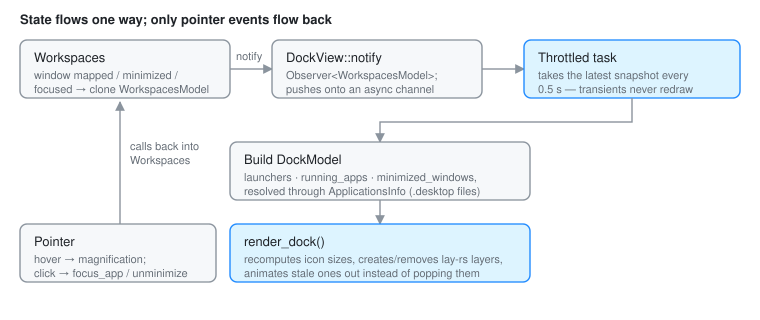

# Dock

The dock is Otto's task manager: running applications, bookmarked launchers,
and minimized windows, on one screen edge.

It is drawn **by the compositor**, not by a client. That is unusual, since the
top bar, the launcher and the islands are all separate Wayland clients, and it
is a deliberate trade. The dock is the target of the genie minimize animation,
so it and the window being minimized have to be nodes in the same scene graph.
A client-side dock would mean animating a window into a surface the compositor
cannot see inside.

The consequence to keep in mind while working on it: the dock has no window,
no surface, and no event loop of its own. It is a set of `lay-rs` layers plus
an observer, living inside the compositor's state.

## Data flow



`Workspaces` is the observable owner of global window state. When the layout
changes, or a window is minimized or restored, it clones `WorkspacesModel` and
notifies its observers (`src/workspaces/mod.rs`). `DockView` registers as one
at startup.

`DockView::notify` does **not** rebuild the dock. It pushes the snapshot onto
an async channel, and a throttled task in `notification_handler` takes the
latest snapshot every 0.5 s and turns it into dock state
(`src/workspaces/dock/view.rs`). Window state churns constantly (focus,
geometry, title) and rebuilding icon layout on every event would be pure
waste.

When a snapshot is taken, the dock resolves `Application` metadata via
`ApplicationsInfo::get_app_info_by_id`, builds a `DockModel`, and calls
`update_state`, which calls `render_dock()`.

`DockModel` (`src/workspaces/dock/model.rs`) is small on purpose:

```rust
pub struct DockModel {
    pub launchers: Vec<Application>,               // bookmarks
    pub places: Vec<Application>,                  // the strip past the divider
    pub running_apps: Vec<Application>,
    pub minimized_windows: Vec<(ObjectId, String)>,
    pub width: i32,
    pub focus: f32,                                // magnification focus
}
```

## Application metadata

Icons and names come from `.desktop` files in the standard locations, per the
[Desktop Entry Specification](https://specifications.freedesktop.org/desktop-entry-spec/desktop-entry-spec-latest.html).

That lookup touches the filesystem and an icon theme, so it happens **off the
main thread**: `ApplicationsInfo` (`src/workspaces/apps_info.rs`) resolves
asynchronously and the dock renders with a placeholder until the result
arrives. Blocking the compositor's loop on icon lookup would stall every client
on the system.

The lookup is built on `xdgkit`, `freedesktop-icons` and
`freedesktop-desktop-entry`.

## Layers and layout

The hierarchy is created in `DockView::new` (`src/workspaces/dock/view.rs`):

- `wrap_layer` pins the dock to its screen edge
- `view_layer` holds the children
- `bar_layer` is the frosted background
- `dock_apps_container` holds running apps and bookmarks
- `resize_handle`: drag to resize; right-click for the dock's context menu
- `dock_places_container` is the strip past the divider (the Trash)
- `dock_windows_container` holds minimized window thumbnails

`render_elements_layers` computes the available icon width from the current
dock width, applies size changes, and installs pointer callbacks on the
per-app layers. Layers for apps that went away fade and scale out before being
removed, so the remaining icons slide rather than jump.

`magnify_elements` is the hover magnification: it reads the current
pointer focus position, computes a Gaussian falloff (`magnify_function`), and
schedules the resulting size changes through `Engine::schedule_changes`.

## Interactions

Pointer handling lives in the `ViewInteractions` impl for `DockView`
(`src/workspaces/dock/interactions.rs`):

- **Motion** updates the magnification focus. Leaving the dock resets it to a
  sentinel value so the icons shrink back.
- **Button release** looks up the layer under the pointer. An app layer calls
  `Otto::focus_app` (`src/state/app_management.rs`), which raises the window and
  hands it keyboard focus, or launches the bookmark when nothing is running; a
  minimized-window layer calls `Workspaces::unminimize_window`.
- **Right-click on the handle** opens the dock's context menu (position,
  autohide, magnification), which writes back through `set_dock_setting`.

Hit-testing is routed ahead of windows: `Otto::surface_under` defers to
`Workspaces::is_cursor_over_dock` (`src/input/pointer.rs`,
`src/workspaces/mod.rs`), so the dock claims pointer focus before any window
underneath it.

## Minimize and restore

- `Workspaces::minimize_window` appends `(ObjectId, title)` to
  `WorkspacesModel.minimized_windows`, updates dock state, and animates the
  `WindowView` into the dock's window drawer.
- `Workspaces::unminimize_window` removes the entry, runs the genie animation
  back into the workspace, and collapses the drawer.
- `DockView::add_window_element` / `remove_window_element` are the bridge
  between dock layers and window views during those animations.

## Rendering

`src/workspaces/dock/render.rs` holds the Skia drawing:

- `draw_app_icon` paints the cached freedesktop icon with a drop shadow. Without
  an icon it falls back to a stroked rounded rect. It does **not** draw the
  running-app indicator dot — that is a separate layer.
- Labels are balloons with blurred shadows, hidden until hover. The
  balloon body is `theme_colors().materials_controls_tooltip` and the text
  `text_primary`, so both follow the light/dark palette.
- The bar uses background blur and colours from `theme_colors()`, and resizes
  with the icon height.

The dock draws on its output's overlay plane, with the rest of the chrome,
rather than on a plane of its own; see [DRM Planes](drm_plane.md). A KMS
plane costs the full pixel rate whatever its size, and on i915 at
2880x1920@120 that admits four planes, so a dock plane would take a client's
(`Workspaces::new_output_workspaces`). The blur backdrop behind the bar tracks
the bar's own frosted shapes, not the whole plane: a window repainting
elsewhere on the overlay plane does not rebuild it.

## Configuration

Under `[dock]` in `otto_config.toml`:

```toml
[dock]
size = 1.0              # multiplier, 0.5 – 2.0
position = "bottom"     # "bottom", "left", "right"
autohide = false
magnification = true
genie_scale = 0.5       # magnification amount
genie_span = 10.0       # magnification falloff (larger = tighter)
colorize_icons = false  # tint icons to colorize_color

bookmarks = [
  { desktop_id = "org.gnome.Nautilus.desktop" },
  { desktop_id = "org.mozilla.firefox.desktop", label = "Web", exec_args = ["--private-window"] },
]
```

Bookmarks are preloaded into the dock and behave like running apps on hover.
Clicking one focuses an existing instance, or launches the desktop entry if
nothing is running.

`size`, `position`, `autohide` and `magnification` are **live** settings.
Changing them through `org.otto.Settings` reconfigures the dock in place, no
restart. See [settings-dbus-api.md](settings-dbus-api.md).

## Open question: dock submenus

Per-app submenus (recent documents, app-provided actions) would need
information the compositor does not have. Two directions were considered:

- A Wayland protocol for an app to publish its dock items. This is what
  `otto-dock-v1` (`src/otto_dock/`, `protocols/otto-dock-v1.xml`) is for. It
  carries badges and progress bars today, not submenus.
- A separate application that owns the submenu UI and talks to the dock.

Related: a protocol for icon and name would also be more efficient than reading
`.desktop` files, and would work for apps that ship no desktop entry at all.
