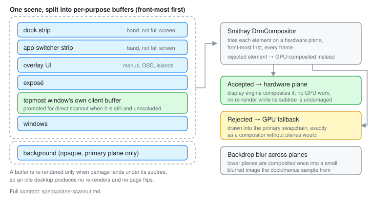

# DRM Planes and Direct Scanout

> Structure and rationale live here. The full behavioural contract —
> per-buffer damage rules, blur-composite invalidation, promotion hysteresis —
> is [`specs/plane-scanout.md`](../../specs/plane-scanout.md).

## What a plane is, and why you would want one

A display controller can read from more than one buffer and blend the results
itself, on the way to the cable. Each of those inputs is a **plane**: one
primary plane (always present), zero or more overlay planes, and usually a
dedicated cursor plane.

The analogy is a physical animation cel stack. Instead of repainting one sheet
every frame, you draw the background once, the characters on a second sheet,
and the caption on a third — then let the camera stack them. Moving the caption
means moving one sheet, not repainting the picture.

Concretely: if the dock is on its own plane and only the dock is animating,
the GPU renders a small strip and the display engine composites it over
untouched buffers. The background, the windows and everything else are not
touched at all, and often no GPU work happens for that frame whatsoever.

## What Otto actually does

Most compositors use planes opportunistically — "if a fullscreen window
happens to be scanout-compatible, promote it". Otto goes further and
**deliberately splits its own scene into per-purpose buffers** so there is
something for the planes to take.



Per output, front to back: the dock strip, the app-switcher strip, overlay UI,
exposé, the promoted client window, the windows buffer, and the background.
(When the session is locked, only the lock plane is composited — nothing that
could hold a window is even consulted.)

Two details are load-bearing:

- **The dock and switcher buffers are strips, not full screens.** A bottom dock
  gets a band of `min(height/4, 480)` px; a side dock gets a column. Small
  buffers mean a dock animation redraws a band rather than a screen, and KMS
  bandwidth ("watermark") cost scales with plane size.
- **The background is `XRGB8888` and opaque, and is pinned to the primary
  plane** (`Kind::Unspecified`). A full-output opaque buffer that floated up to
  an overlay would hide every element that had fallen back to GPU compositing
  in the primary swapchain.

The rest are `ARGB8888` and non-opaque, since they have to blend.

A buffer is re-rendered only when damage lands under its subtree. An idle
desktop produces no re-renders and no page flips.

## When decomposition is enabled

`SurfaceData::planes_enabled` (`src/udev/device.rs`) requires all three:

- **An atomic driver.** Legacy KMS cannot do per-frame plane assignment.
- **At least 3 overlay planes.** Fewer than that and the buffers cost GPU
  memory for nothing.
- **The primary GPU.** Plane dmabufs are rendered with the primary GPU's EGL
  context; a cross-device import per plane per frame is not reliable.

When any fails, the output renders as a single scene element — the ordinary
path — and Otto logs why under the `otto::planes` target.

**NVIDIA**: overlay planes are cleared entirely at surface creation, because
overlay usage on those drivers is broken. That also disables decomposition, by
way of the overlay count check.

## How assignment actually happens

Otto does not assign planes. It hands Smithay's `DrmCompositor` a list of
render elements, and `render_frame()` tries each one on a plane, front-most
first, **every frame**. For each element it:

1. Calls `element.underlying_storage(renderer)`. `None` means the element has
   no importable buffer and must be GPU-composited.
2. Exports a dmabuf and adds a framebuffer via the framebuffer exporter.
3. Tests plane compatibility — format, transform, z-order, size — with
   `try_assign_plane()`.
4. Assigns it if compatible; otherwise the element is rendered by the GPU into
   the primary swapchain, exactly as a plane-less compositor would.

So plane usage is best-effort and re-decided per frame. There is no probing
step and no cached tier: acceptance is delegated to the kernel, and rejection
is a normal, silent fallback.

For an element to be *eligible* it must provide `underlying_storage()`, report
`Kind::ScanoutCandidate`, be backed by a dmabuf (not CPU memory or an anonymous
GPU texture), and use a format and transform the plane supports.

## Direct scanout of a client window

The topmost window can be **promoted**: its own client buffer goes straight to
a plane, so its pixels never pass through Otto's renderer at all. This is the
big win for video players and games.

Promotion has hysteresis: the candidate set must stay unchanged for 500 ms
(`PROMOTE_STABLE`) before anything new is promoted, because flapping between
promoted and composited is visible as a flicker. Its shadow is drawn separately by the
windows buffer.

Otto also publishes **dmabuf feedback** to clients, with a scanout tranche
alongside the render tranche, so a client can allocate buffers in formats that
are promotable in the first place (`get_surface_dmabuf_feedback` in
`src/udev/feedback.rs`).

## The blur problem

Planes composite in the display engine, which means a translucent plane cannot
*see* the planes below it — but Otto's dock, menus and OSD are frosted glass
and must show what is behind them.

Otto solves this by compositing the lower planes into a separate, downscaled
image, blurring it once as a whole, and letting each blur-bearing layer seed
itself from that pre-blurred image (`src/udev/backdrop.rs`). Blurring once per
frame rather than once per consumer is both cheaper and *more correct*:
blurring inside a layer's rounded clip samples transparent pixels at the shape
edge and leaves a faded rim, while a whole-image blur has no edge to sample
across.

Promoted client windows are folded into that composite by blitting their
dmabuf — the same buffer KMS scans out — so a shared window does not vanish
from the blur behind the dock.

## Debugging

```sh
# What Otto decided, per output
RUST_LOG=otto::planes=info cargo run -- --tty-udev

# What Smithay decided, per element per frame
RUST_LOG=smithay::backend::drm::compositor=trace cargo run -- --tty-udev
```

Useful trace lines:

- `assigned element … to overlay plane …` — success
- `skipping element … element kind not scanout-candidate` — wrong `Kind`
- `skipping direct scan-out … format … not supported` — format mismatch
- `failed to claim plane` — the plane is already in use

Build with `--features debug-kms` for extra KMS logging.

## Related

- [`specs/plane-scanout.md`](../../specs/plane-scanout.md) — the contract
- [Rendering](rendering.md) — the pipeline these buffers feed
- [Render Loop](render_loop.md) — the damage rules that decide what re-renders
- `src/udev/planes.rs`, `src/udev/backdrop.rs`, `src/udev/render.rs`
