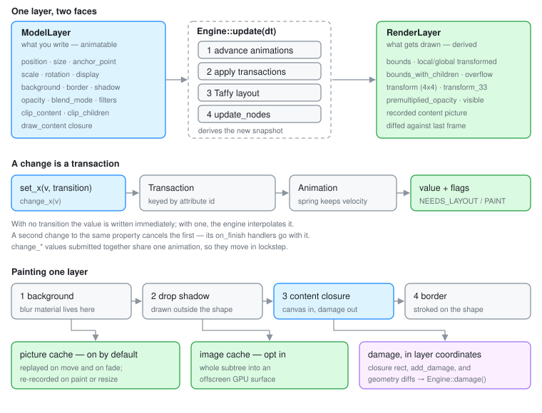

# Layers

A layer is the unit Otto draws with — every window, shadow, menu, dock icon and
wallpaper is one or more of them in the
[lay-rs](https://github.com/nongio/layers) scene. This page is about that unit:
what it holds, what happens to it on a frame, and the few ideas that make the
rest of the code read as obvious. For the shape of the tree the layers form,
see [The Scene Graph](scene-graph.md).

## Anatomy



A layer is the unit; [The Scene Graph](scene-graph.md) is the tree they form,
and [its overview diagram](scene-graph.md#the-whole-chain-at-a-glance) shows how
whole subtrees of them become hardware planes.

A `Layer` value is a handle, not the thing itself: an `Arc<Engine>`, a
`NodeRef` into the scene arena, a Taffy node id, and an `Arc<ModelLayer>`.
Cloning one is free and clones nothing — two `Layer`s with the same id *are*
the same layer. That is why Otto passes them into `'static` closures and
stores them in half a dozen structs without a second thought, and also why a
stale handle to a removed layer is a real hazard (`Engine::is_layer_alive`
exists for exactly that).

The `ModelLayer` behind the handle is a flat bag of properties
(`lay-rs/src/layers/layer/model.rs`):

| Group | Properties |
|-------|------------|
| Geometry | `position`, `size`, `anchor_point`, `scale`, `rotation`, `display` |
| Paint | `background_color`, `border_color`, `border_width`, `border_corner_radius`, `shadow_offset`, `shadow_radius`, `shadow_spread`, `shadow_color`, `shape` |
| Composition | `opacity`, `blend_mode`, `image_filter`, `color_filter`, `clip_content`, `clip_children` |
| Content | `draw_content` — a closure that paints into a Skia canvas |
| Identity | `key`, `pointer_events` |

The right mental model is Core Animation's `CALayer`. A layer does not know
what it represents. It has no concept of "window" or "button"; it knows where
it is, how it looks, and how to paint itself. All the meaning lives in Otto —
in `WindowView`, `DockView`, `WindowSelectorView` — and those types are just
code that *edits layers*.

One consequence is worth stating early, because it explains a lot of Otto's
structure: **a layer with no drawables is free.** No background, no border, no
shadow, no content closure, normal blend mode, no clipping — lay-rs calls that
a *layout-only passthrough* and skips both repaint and its own geometry damage
(`RenderLayer::is_layout_only_passthrough`). Container layers such as
`workspaces_layer` or a window's `content_layer` cost a transform and nothing
else, so Otto uses them freely to give subtrees something to move as a unit.

## Two faces: the model and the render layer

Every layer exists twice, and keeping the two apart is the single most useful
distinction on this page.

**`ModelLayer` is what you write.** It is the declared intent: "position is
(120, 40)", "opacity is 0.4". Its values are `Attribute<V>` cells — thread-safe,
cheap to read, each with a process-unique id.

**`RenderLayer` is what gets drawn.** It is derived, once per frame, by the
engine from the model plus Taffy's layout result plus the parent's state
(`update_with_model_and_layout`). It holds resolved things the model never
mentions: `bounds`, `local_transformed_bounds`,
`global_transformed_bounds_with_children`, a 4×4 `transform` relative to the
root, `premultiplied_opacity` (this layer's opacity times every ancestor's), and
`visible`.

The seam between them is where several recurring confusions live:

- **Position is layout plus offset.** `RenderLayer` position is
  `taffy_layout.location + model.position`. Almost every layer Otto creates
  sets `position: taffy::Position::Absolute`, which pins the layout location
  at the parent's origin and leaves `set_position` in full control. Layers
  that *do* use flexbox — inside otto-kit views, the dock's icon row — get
  their location from Taffy and treat `position` as a nudge.
- **Reading back a property is not reading the screen.** `layer.position()`
  returns the model value, which mid-animation is the *target*, not the
  current one. `layer.render_position()`, `render_bounds_transformed()` and
  friends read the render layer, which is what the user can see.
- **Opacity composes, size does not.** A parent at 0.5 opacity halves its
  children through `premultiplied_opacity`; a parent's size does not constrain
  a child unless `clip_children` is set.

## Retained, not immediate

Otto never draws a window. It sets a property on a layer, and the layer
remembers. That is the retained-mode bargain, and it is chosen deliberately:

- **The engine knows what changed, so the compositor does not have to.** In an
  immediate-mode design the caller must track dirty regions, because only the
  caller knows what it is about to draw differently. Here, `update_nodes`
  compares each node's previous `RenderLayer` snapshot against the fresh one
  and derives the damage itself. That is what makes "an idle desktop renders
  nothing" a property of the architecture rather than a discipline every call
  site has to observe.
- **State survives the frame, so animation is cheap.** A move is a change to
  one number over time. Nothing re-describes the window each frame; the tree
  is already correct apart from that number.
- **The scene outlives the client's paint.** A window's layer keeps its
  geometry, shadow and decoration while the client is between buffers, mid
  resize, or not painting at all.

The price is real and shows up throughout Otto: there is now a *second* copy
of the truth, and it has to be kept in sync with the Wayland state without
inventing work. Writers into the scene are unconditional — `set_position`
schedules a change without comparing the old value — so every path that
mirrors surface state into layers has to be idempotent by hand. See the damage
section of [Render Loop](render_loop.md) for how `configure_surface_layer`
hashes its inputs to avoid exactly that.

## A change is a transaction

Setting a property does not mutate it in place. It builds a `ModelChange` —
old value, new value, the `RenderableFlags` the change implies
(`NEEDS_LAYOUT`, `NEEDS_PAINT`) — and schedules it on the engine:

```rust
layer.set_position(Point { x, y }, None);                       // applies now
layer.set_position(Point { x, y }, Some(Transition::ease_out(0.3)));  // animates
```

With no transition the model value is written immediately and the change is
still scheduled, so the flags reach the node. With a transition, the model
keeps its old value and an `Animation` interpolates from `from` to `to` across
subsequent `Engine::update(dt)` calls. **Animation is therefore a property of
the change, not of a loop.** Nothing in Otto ticks a counter to move a window;
it states the destination and the feel.

Three details follow from how transactions are stored, and all three have bitten
this codebase:

**One in-flight transaction per property.** `schedule_change` keys transactions
by the *attribute's* id and cancels any existing one for that value. A second
`set_position` replaces the first — along with its `on_finish` handler, which
is simply dropped. `src/shell/xdg.rs` carries a comment explaining that the
fullscreen un-park deliberately hangs off the size *animation* rather than the
position transaction, because a client commit repositioning the window
mid-flight would otherwise strand it in the overlay plane forever.

**Springs inherit velocity.** When a spring change lands on a property that
already has a running spring, the macro in `lay-rs/src/engine/command.rs`
samples the current velocity and seeds the new spring with it. Interrupting a
workspace swipe or a dock magnification feels continuous for free — no
special-casing at the call site.

**Changes can be grouped.** `layer.change_position(p)` returns an unscheduled
`AnimatedNodeChange`; a batch of them submitted through
`Engine::add_animated_changes(&changes, animation)` shares one animation and
therefore moves in lockstep. That is the mechanism behind
`otto-surface-style-unstable-v1`'s transactions: the handlers in
`src/surface_style/handlers/` accumulate `change_*` values while a client
transaction is open and submit them together on commit
([Surface Style Protocol](sc-layer-protocol-design.md)).

Callbacks hang off either end: `on_start` / `on_update` / `on_finish` on a
transaction, `on_animation_*` on an animation. Otto drives the xdg-shell
configure sequence of a fullscreen transition from an `on_animation_update`
handler — the client is being resized by the same curve that moves the layer.

## How a layer gets its content

A layer paints itself in a fixed order (`lay-rs/src/drawing/layer.rs`):

1. **Background** — the shape filled with `background_color`. Under
   `BlendMode::BackgroundBlur` this is drawn with Skia's `Luminosity` blend
   over the blurred backdrop, plus a faint noise image; that is the whole
   "frosted glass" material.
2. **Drop shadow** — drawn *outside* the shape (`ClipOp::Difference`), which is
   why a leaked clip anywhere above erases it.
3. **Content** — the draw closure, or the picture recorded from it.
4. **Border** — stroked on the shape.

The closure is the interesting part:

```rust
Fn(&skia_safe::Canvas, f32, f32) -> skia_safe::Rect
```

Width and height come in; **a damage rect in the layer's own coordinates goes
out**. That return value is not decoration — it is how content that the engine
cannot reason about reports what changed. A closure is also free to paint
outside the layer's bounds, and the engine records where it actually painted in
`RenderLayer::content_overflow` so the ink outside the box still gets
repainted.

Otto uses this in two distinct ways.

**Compositor-drawn content** — dock icons, the titlebar, the window shadow —
is Skia drawing straight into the canvas, usually produced by a view (below).

**Wayland surfaces** get a closure too, and notably *not* an image. On commit,
`configure_surface_layer` (`src/workspaces/utils/mod.rs`) installs a closure
that looks the client's texture up by id at paint time:

```rust
layer.set_draw_content(move |canvas, w, h| {
    let tex = crate::textures_storage::get(&draw_wvs.id)?;
    // …place per contents-gravity, convert buffer damage to layer coords…
    canvas.draw_image(…);
    damage
});
```

The indirection buys two things. The renderer imports buffers into
`textures_storage` on its own schedule while the scene holds only an id, so
re-installing the closure every commit does not invalidate the layer's cached
picture. And the closure is the one place that knows the mapping from buffer
pixels to layer coordinates — buffer scale, the viewport crop, the contents
gravity — so it is the only place that can convert the client's buffer damage
into a rect the engine can use.

When the damage source is outside the closure entirely, `Layer::add_damage(rect)`
and `set_damage(rect)` hand the engine a layer-local rect directly. They are
also what mark a layer's *followers* for repaint.

## Composition: what a parent does

Children are painted in child order — z-order is tree order, and
`add_sublayer` / `prepend_sublayer` are how Otto restacks. Beyond order, a
parent contributes exactly four things to its descendants:

- **Transform.** Position, scale and rotation compose down the tree, around
  each layer's own `anchor_point` (expressed in unit coordinates, so `(0.5,
  0.5)` is the centre regardless of size).
- **Opacity.** Multiplied into `premultiplied_opacity`.
- **Clipping.** `clip_children` bounds descendants to the parent's shape;
  `clip_content` bounds only the layer's own draw closure.
- **Layout.** Taffy runs over the same tree; a flex parent positions children
  that have not opted out with `Position::Absolute`.

`set_hidden(true)` is the blunt instrument, and it is not just a visibility
flag: it sets Taffy `display: none` so the subtree stops participating in
layout, and it invalidates the engine's hit-test and traversal caches. A
subtree parked hidden costs nothing — which is how Otto keeps every workspace's
windows in the tree at once.

## Caching: the picture and the image

Two caches sit on every node, and they are not alternatives to each other.

**Picture cache** (`picture_cached`, **on by default**) records the layer's
drawing into a Skia `Picture` — a display list — and replays it. `do_repaint`
re-records only when the node is flagged `NEEDS_PAINT`, when its *size*
changed, or when there is no cache yet. Deliberately **not** on a move, a
parent transform change, or an opacity change: the picture is recorded in the
layer's local space and opacity is applied by the replay paint, so a translate
or a fade costs a replay rather than a re-rasterisation. Sliding a workspace
full of windows re-runs no draw closure at all.

`set_picture_cached(false)` is therefore an *opt-out*, and Otto reaches for it
where a layer's content is a live re-render of something else — exposé mirrors,
the workspace-selector background, the XWayland mirror — because there the
cache would freeze a moving image.

**Image cache** (`image_cached`, off by default) rasterises a whole subtree
into an offscreen GPU surface and composites the result. It is the right answer
for expensive but static drawing: the window shadow and dock app icons use it.
It is the wrong answer for anything that should show a live backdrop blur from
below, because the subtree is composited from its own buffer.

**`content_opaque`** is a third, unrelated flag: a promise that the draw
closure fills the layer's bounds with opaque pixels. Occlusion culling only
treats a layer as an occluder when opacity is 1, the blend mode is `Normal`,
the shape is a rectangle with square corners, *and* this flag is set — which is
why client surface layers and the wallpaper set it explicitly.

Getting these wrong is the usual reason something is stale or slow, and all
three are visible per-node in the scene debugger.

## Damage is something a layer reports

Damage in lay-rs is derived, not declared. For each node, `update_node_single`
compares the previous `RenderLayer` snapshot with the fresh one and unions
rectangles for what moved, resized, faded, appeared or disappeared; content
damage comes from the draw closure's return value (or a pending
`add_damage` rect) mapped into global coordinates by the node's transform. If
nothing changed, the node returns an empty rect and the engine short-circuits.

Two behaviours are worth internalising:

- **A content-only repaint stays small.** When a draw cache already exists and
  the closure returned a non-empty rect, the engine damages just that rect
  instead of the whole layer. A closure that returns full bounds out of caution
  throws that away.
- **Translucency inverts the usual reasoning.** A `BackgroundBlur` layer's
  damage is outset by the blur sigma, and its backdrop has to be re-rendered
  when what is *behind* it changes. That coupling is what
  [Render Loop](render_loop.md) calls backdrop regions.

The per-frame union is `Engine::damage()`; `Engine::subtree_damage(root)`
answers the same question for one subtree, which is how the KMS plane path
decides whether a plane needs re-rendering at all
([DRM Planes](drm_plane.md)).

## Followers: one layer's content, elsewhere

`layer.as_content()` turns a layer into a draw closure that re-renders that
layer's whole subtree wherever it is installed, and
`leader.add_follower_node(&follower)` records the link so the leader's repaints
mark the follower. Together they are lay-rs's mirroring primitive: exposé
previews, the XWayland mirror, and the wallpaper reused as the exposé backdrop
are all follower layers pointing at a live subtree.

The mirror is a *rendering* of the source, not a reference to it, so it can sit
anywhere in the tree at any size with its own transform — and the source keeps
being the only real copy. Two sharp edges come with that: `as_content` guards
against recursion with a thread-local set (a follower may be a descendant of
its leader), and repaint marking propagates from the leader node itself, never
from its descendants — so a client commit deep inside a window's surface tree
does not mark the mirror. [Exposé](expose.md) documents how Otto works around
the second.

## Views: state in, layer tree out

For anything more structured than a single node, Otto uses a lay-rs `View`: a
hashable model plus a render function returning a `LayerTree`, mounted on a
layer.

```rust
let view = View::new("window_shadow", model, Box::new(view_window_shadow));
view.mount_layer(shadow_layer.clone());
view.update_state(&new_model);   // hashes the model; no-op when unchanged
```

`update_state` hashes the state and returns without touching the tree when the
hash matches. That is load-bearing, not an optimisation: `update_decoration`
runs on every commit of a decorated window, and re-rendering unconditionally
would rebuild the titlebar's layers at the client's frame rate. The dock,
workspace selector, window selector, background and context menus are all
views.

## Pitfalls

- **`set_*` returns a `TransactionRef` and cancels the previous one for that
  property.** Anything hanging off the old transaction's callbacks is gone.
- **A property getter is the model value, not the rendered one.** Mid-animation
  they differ; use the `render_*` accessors when you mean the screen.
- **Re-installing a draw closure does not invalidate the picture cache**, and
  neither does changing something the closure closes over. If content changed
  without a property changing, say so — `add_damage`, `set_damage` or
  `redraw()`.
- **An empty recording is not a cache hit.** lay-rs deliberately falls back to
  the closure when a recorded picture has zero ops, because a picture recorded
  while a layer had nothing to give would otherwise lock it blank forever.
- **Layer positions are physical pixels.** `output_geometry()` is logical; see
  the conventions in the [developer guide index](README.md).

## Where to look

| Concern | File |
|---------|------|
| The layer handle and its API | `lay-rs/src/layers/layer/mod.rs` |
| Property bag | `lay-rs/src/layers/layer/model.rs` |
| Resolved per-frame state | `lay-rs/src/layers/layer/render_layer.rs` |
| Changes, transactions, the `change_model!` macro | `lay-rs/src/engine/command.rs` |
| Per-node update, repaint and damage | `lay-rs/src/engine/stages/update_node.rs` |
| Paint order for one layer | `lay-rs/src/drawing/layer.rs` |
| Tree traversal, caches, blur | `lay-rs/src/drawing/scene.rs` |
| Surface layer configuration and the draw closure | `src/workspaces/utils/mod.rs` |
| Per-window layers | `src/workspaces/window_view/view.rs` |
| Client-facing layer properties | `src/surface_style/` |

Related: [The Scene Graph](scene-graph.md) · [Rendering](rendering.md) ·
[Render Loop](render_loop.md) · [DRM Planes](drm_plane.md) ·
[Exposé](expose.md)
