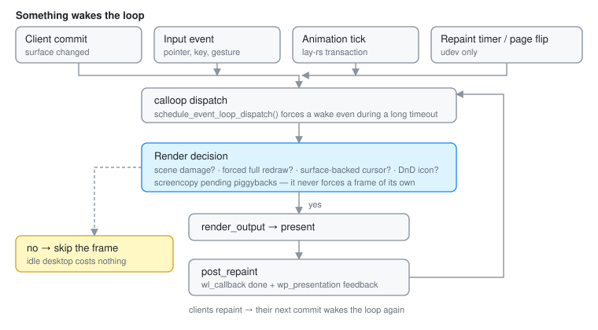

# Render Loop

Otto's render loop is built around one goal: **keep input-to-pixels latency
low without burning power when nothing is changing.** Those two pull in
opposite directions, and most of the machinery below is the compromise.

## Why "quiet until needed"

If nothing damaged the scene, no cursor or drag surface moved, and no redraw
was forced, then rendering again would produce identical pixels. Skipping that
frame costs nothing and saves a GPU pass. An idle Otto desktop does no work.

## Why timing matters

Most clients only repaint after they receive a frame callback (`wl_callback`)
or presentation feedback. So the compositor's schedule dictates theirs.

The naive schedule — repaint immediately after VBlank, then send frame
callbacks — is the worst one. The client wakes up just after the compositor
has already composed, so its new buffer misses the frame currently being
prepared and lands one VBlank later than it could: roughly two frames of
latency for no reason.

The fix is to render *late*: wait most of the frame period, let clients paint
first, and compose as close to the next VBlank as the GPU allows.

## Shared building blocks

**Calloop dispatch.** `Otto` owns a `calloop::LoopHandle`. When surface state
changes (a commit in `src/shell/mod.rs`, say), `Otto::schedule_event_loop_dispatch()`
sends a message on a calloop channel, waking the loop even if it is currently
blocked on a long timeout.

**Frame bookkeeping.** After a successful render, `post_repaint` /
`take_presentation_feedback` emit `wl_callback` done events and
`wp_presentation` feedback, with timestamps from the shared `Clock<Monotonic>`
so they line up with input event timestamps.

**Damage tracking.** Each backend feeds `render_output` a damage tracker, and
the heavy path is short-circuited when there is no new scene damage, no
requested redraw, and no auxiliary surface needing a repaint.

**Cursor and drag-and-drop surfaces** bypass the no-damage fast path, so
interactive feedback stays responsive over a static scene.

## Damage tracking: why it is the hard part

Damage tracking is what lets Otto stay responsive without redrawing whole
outputs. It is also the single easiest thing to get subtly wrong:

- Damage is expressed in output space, but surfaces move, scale and transform.
- Things change without the *scene* changing — cursor surfaces, drag icons,
  popups — and must still trigger a redraw.
- Buffer age and partial updates mean reusing old pixels is only safe under
  specific conditions; getting it wrong shows up as stale rectangles.
- **The scene sync can invent damage.** Mirroring a Wayland surface into its
  `lay-rs` layer is write-only: `set_position`, `set_size` and
  `set_draw_content` schedule `NEEDS_LAYOUT`/`NEEDS_PAINT` without comparing
  the value first. The sync runs per WINDOW — a commit on any surface of a
  window walks that window's whole surface tree *and every popup hanging off
  it* — so writing back identical values made a client repainting at frame
  rate dirty its own tooltip at frame rate, and popup damage drove a
  full-screen backdrop rebuild per commit. Two guards keep it honest:
  `configure_surface_layer` reduces each surface's configuration to a hash
  (including the surface's `CommitCounter`) and skips the whole body when it
  matches (`crate::surface_config_cache`), and
  `PopupOverlayView::needs_sync` skips a popup entirely unless the commit is
  its own or it moved. **Any new writer into the scene must be idempotent the
  same way** — an unguarded setter is indistinguishable from real damage
  downstream.

**Translucent UI makes it worse.** The dock and the app switcher do not cover
what is behind them, they *blend* with it. So a change in the background can
require re-rendering the overlay region (the blended result changed), and an
animation in the overlay can require re-rendering the background beneath it.
Otto handles this with **backdrop regions** from the `lay-rs` scene: when a
translucent layer is present, effective damage usually has to include both the
element's own bounds and the backdrop area behind it.

Two layers of tracking cooperate:

- Smithay's `OutputDamageTracker` decides which parts of an output need
  repainting and orchestrates the partial redraw.
- `lay-rs` tracks what changed in the UI tree; `SceneElement` reports that as
  the scene's damage.

## Client frame pacing

Sending frame callbacks at full rate to windows the user cannot see wastes
power on the client side. `WindowThrottleState` (`src/state/window_throttle.rs`)
classifies each window and paces its callbacks accordingly:

| State | Rate | Meaning |
|-------|------|---------|
| `Focused` | output refresh | the primary interaction target |
| `Captured` | output refresh | being screencast — outranks occlusion and minimize |
| `Secondary` | ~30 Hz | visible but not focused |
| `Occluded` / `Minimized` / `HiddenWorkspace` | ~2 Hz | not visible |

The hidden rate is deliberately not zero: Chromium 115+ treats a window that
receives no callbacks at all as discardable and evicts its render process. A
2 Hz trickle satisfies that heuristic while saving essentially all the work.

## Udev (DRM/GBM) backend — `src/udev/`

This is the production loop, and the only one with real VBlank timing.

1. **Device events.** The DRM backend registers session pause/resume hooks and
   per-output frame timers. On VT resume it resets buffer state and schedules
   an idle render so outputs are guaranteed to redraw.

2. **Two-phase frame pipeline.** When a page flip completes (`frame_finish` in
   `src/udev/render.rs`), the GPU is still scanning out the frame that was just
   acknowledged, so the CPU is free. Otto uses that window:

   - *Phase 1, at VBlank*: tick the scene graph (`scene_element.update()`) and
     cache whether it produced damage.
   - *Phase 2, at a deadline*: schedule the actual draw for
     `frame_period − 2 × average_render_time`, clamped to at least 1 ms. The
     doubled render time is the safety margin for variance; the clamp prevents
     busy-spinning. Multi-GPU paths need a buffer copy after rendering with no
     reliable duration estimate, so they fire immediately instead.

   The effect is that clients get most of the frame period to paint, and Otto
   composes as late as it safely can.

3. **Repaint timers.** When the timer fires, `render(node, Some(crtc))`
   re-renders that CRTC (or every one, if none is given).

4. **Presentation integration.** Metadata from the DRM page-flip event fills
   `wp_presentation` feedback with hardware clock bits when available.
   Temporary DRM errors either pause scheduling (device inactive) or trigger a
   retry, depending on the error class.

## Winit backend — `src/winit.rs`

There is no real VBlank to target, so this path biases for responsiveness with
short timeouts rather than deadline scheduling.

1. **Event intake** — `winit.dispatch_new_events` pumps windowing and input
   events, updating workspace geometry on resize.
2. **Scene update** — `state.scene_element.update()` once per iteration; its
   return value feeds the render decision.
3. **Render decision** — render if *any* of: the scene reported damage; a
   forced redraw is pending (`full_redraw > 0`); the pointer is backed by a
   Wayland surface; a drag-and-drop icon is active.
4. **Submit** — when `render_output` produces damage, submit through the winit
   window's swapchain.
5. **Wait** — `event_loop.dispatch(wait_timeout, …)` with **1 ms** when
   follow-up work is expected (`needs_redraw_soon`, active pointer surface or
   DnD, or the scene just reported damage), and **16 ms** otherwise.
6. **Housekeeping** — refresh workspace layouts, clean up popups, flush clients.

Buffer age from the backend enables partial damage; a requested full redraw
resets that path so stale contents cannot be reused.

## X11 backend — `src/x11.rs`

Basic and not actively maintained.

1. A Smithay X11 source pushes resize, present-complete, refresh and input
   events into calloop. Resizes rebuild the `Output` mode, reflow workspaces,
   and set `render = true`.
2. If `state.backend_data.render` is false the loop goes straight to dispatch.
3. Otherwise it binds the X11 surface buffer, gathers elements (the scene, plus
   an optional FPS overlay), and calls `render_output`. Cursor surface
   rendering is still a TODO here — the placeholders exist but add no elements.
4. Frame callbacks, presentation feedback and RenderDoc captures follow the
   winit path.
5. Dispatch always uses a 16 ms timeout, relying on event sources and the
   wakeup channel to interrupt sooner.
