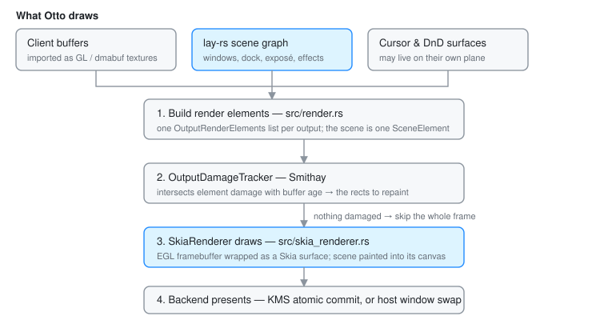

# Rendering pipeline

This document explains how Otto gets from "some state changed" to "pixels on a
display", and where you would hook into that.

Files to follow along with:

- `src/render.rs` — builds the element list for each output
- `src/skia_renderer.rs` — the Skia wrapper over Smithay's GL renderer
- `src/render_elements/scene_element.rs` — the element that draws the scene graph
- `src/udev/render.rs` — the DRM frame path (the real one)
- `src/winit.rs` — the windowed dev path

## The mental model

Otto is a **retained-mode** compositor wearing an immediate-mode compositor's
clothes.

Smithay expects a list of *render elements* per frame: "draw this texture at
this rect, it damaged these regions". That is an immediate-mode API. Otto
satisfies it, but almost all of Otto's UI — windows, the dock, exposé, the app
switcher, shadows, blur, every animation — lives in a single retained tree
managed by `lay-rs`, and is handed to Smithay as **one element**, the
`SceneElement`.

The analogy: think of the scene graph as a document, and the frame as printing
it. `src/workspaces/` spends its time editing the document — moving a layer,
changing an opacity, starting an animation. It never prints. Once a frame, the
printer asks the document what changed, and re-inks only those parts of the
page.

That is why so little of Otto looks like drawing code, and why "why is this not
updating?" is nearly always a damage question rather than a drawing question.

## The layers underneath

1. **Smithay owns the plumbing** — a `GlesRenderer`, the output abstraction,
   swapchains, and the damage tracker. Conceptually it renders into a buffer
   that someone will later present.

2. **The backend decides what a buffer is.**
   - *winit*: the output is a window inside another compositor; the buffer is
     presented into that host window.
   - *udev/DRM*: the output is a real connector/CRTC/plane pipeline; buffers
     are submitted to KMS.

3. **Otto wraps Smithay's GL with Skia.** `SkiaRenderer` takes the current EGL
   framebuffer, wraps it as a Skia surface, and draws into that canvas. So
   everything Otto paints is Skia, but the buffer management is Smithay's.

4. **Otto draws through the scene graph.** `lay-rs` owns the tree and its
   Taffy-based layout; `SceneElement` is the bridge into Smithay's element
   list. The tree's shape, and how subtrees of it become hardware planes, is
   [The Scene Graph](scene-graph.md).

## Frame flow

1. **Build elements** (`src/render.rs`) — one `OutputRenderElements` list per
   output: the `SceneElement`, plus cursor and drag-and-drop surfaces, plus any
   debug overlays.
2. **Hand them to `OutputDamageTracker`** — Smithay intersects each element's
   damage with the age of the buffer about to be drawn into, and produces the
   set of rects that actually need repainting. If that set is empty, the frame
   is skipped entirely.
3. **Render the damaged regions** — Smithay drives the pass; `SkiaRenderer`
   wraps the framebuffer and the `SceneElement` paints the scene into it.
4. **Present** — the backend submits the buffer (a KMS atomic commit, or a host
   window swap).

On udev this is not the whole story: Otto also splits the scene into several
scanout-capable buffers so the display hardware can composite them without the
GPU. See [DRM Planes](drm_plane.md).

## Backends in practice

**winit** — best for day-to-day development. The output is a regular window.
There is no hardware cursor plane, so the cursor is composited normally. It
does *not* offer real outputs, dmabuf import, hardware planes, or the
screenshare frame path, so anything touching those has to be tested on udev.
Touch gestures are unsupported.

**udev/DRM** — the production path. Smithay manages connectors, CRTCs, planes,
swapchains and submission. The cursor can be promoted to its own DRM plane;
parts of the scene can be promoted to overlay planes.

**x11** — Otto as an X11 client. Basic and not actively maintained.

## Sampling a client's texture

A client's buffer is drawn through a Skia shader in
`workspaces::utils::configure_surface_layer`, and which filter that shader uses
is chosen per surface by `surface_filter`. Bicubic (Catmull-Rom) is the
general-purpose answer but costs ~12-16x nearest in the fragment shader, so a
buffer that needs no resampling is copied instead.

Whether it needs resampling is a question about **physical pixels**, not about
the layer. The scale and translation the gate looks at describe the texture's
mapping onto its layer; that only says what reaches the framebuffer if the
layer itself starts on a whole physical pixel. Surface origins are logical
values multiplied by the output scale, so on a fractional scale they land
mid-pixel (logical 101 x 1.65 = 166.65) unless something rounds them.

Two rules keep that honest, and they only work together:

- `configure_surface_layer` **rounds every surface origin it sets** to a whole
  physical pixel. Half a pixel of placement accuracy is worth less than the
  identity mapping it buys back, which is both the crisp result and the cheap
  one.
- `surface_filter` takes `pixel_grid_aligned` and falls back to bicubic without
  it — for `client_owns_size` surfaces, whose position comes from the client.

Dropping either one puts a 1:1 buffer through a point sample half a pixel off,
which shows up as doubled and dropped rows of pixels across every window on a
fractionally scaled output.

Clients that are not fractional-scale aware hand over an integer-scaled buffer
(a 2x buffer on a 1.65x output, `scale = 0.825`) and take the bicubic path.
That is a real resample and there is nothing to snap away.

## Getting frames out

Two independent capture paths exist, and they share one GPU blit:

- **PipeWire screenshare**, used by the portal — after a successful render on
  udev, Otto blits the framebuffer into a PipeWire-provided DMA-BUF and queues
  it. Window streams take a different route and re-render the window's own
  surface tree.
- **`zwlr_screencopy_v1`**, used by `grim`, `wf-recorder` and `wl-mirror` —
  dmabuf clients ride the same blit; SHM clients pay a CPU readback.

Both are described in [Screen Sharing](screenshare.md).
