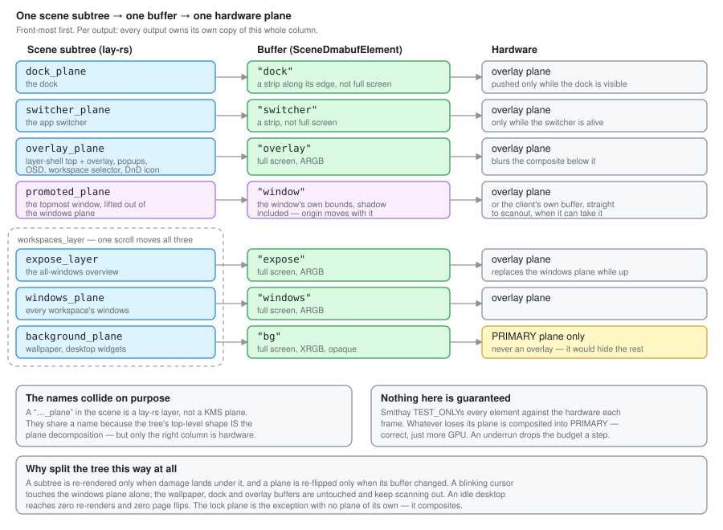
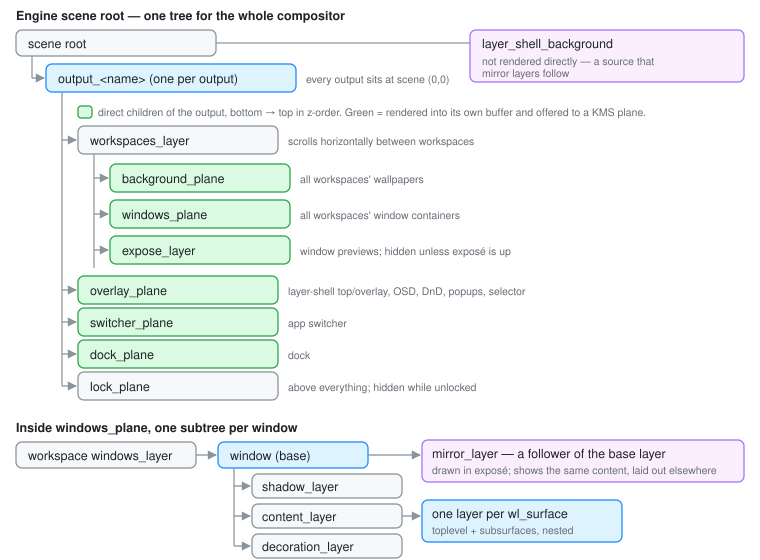

# The Scene Graph

Almost everything Otto puts on screen — windows, their shadows and titlebars,
the dock, exposé, the app switcher, the wallpaper, popups, the lock screen —
lives in **one retained tree of layers**, managed by
[lay-rs](https://github.com/nongio/layers).

This page is the map of that tree: what a layer is, how the tree is laid out,
how a Wayland surface gets into it, how clients can style their own layers over
a protocol, and how subtrees of it end up as separate buffers on separate KMS
planes.

If you only read one thing: **`src/workspaces/` does not draw. It edits this
tree.** Drawing happens later, once per frame, and only for the parts that
changed.

## The whole chain at a glance

The tree's top-level shape is not a drawing convenience — it *is* how Otto
decomposes the screen for the display hardware. Each of the output's direct
children is rendered into its own buffer, and each buffer is offered to the KMS
plane it was cut out for:



The rest of this page unpacks the left column; [Layers](layers.md) is the unit
those subtrees are built from, and [DRM Planes](drm_plane.md) is the right one.

## What a layer is

A layer is a node with visual properties — position, size, opacity, transform,
corner radius, border, shadow, blend mode, clipping — plus optional *content*:
a closure that paints into a Skia canvas.

The right mental model is **Core Animation's `CALayer`**, not a widget. A layer
does not know what it represents. It knows where it is, how it looks, and how
to paint itself. Otto sets a property, and the engine works out what changed,
what needs repainting, and how to animate between the old and new value.

Three consequences shape the whole codebase:

**Animation is a property of the change, not of a loop.** `set_position(p,
Some(transition))` is a spring or bezier animation. Nothing in Otto ticks a
frame counter to move a window; it states the destination and the feel.

**Damage comes from the tree, not from the caller.** The engine knows which
nodes changed and what they cover. That is what `SceneElement` reports to
Smithay's damage tracker, and why an idle desktop renders nothing.

**Layout is Taffy.** Layers can use flexbox, or opt out with
`position: Absolute` — which most of Otto does, since it positions things
itself.

The layer itself — its full property set, how a change becomes an animated
transaction, how content closures and picture caching work — is
[Layers](layers.md). The rest of this page is the tree.

## The engine and the root

One `Engine` is created in `Otto::init` (`src/state/mod.rs`) and shared as
`Arc<Engine>` by everything that touches the scene. Its root is the scene root,
and each output gets its own container beneath it.

```rust
let layers_engine = Engine::create(500.0, 500.0);
#[cfg(feature = "debugger")]
layers_engine.start_debugger();
```

With `--features debugger`, the engine serves the live tree at
`http://localhost:8000/client/index.html` (`LAYERS_DEBUGGER_PORT` overrides the
port) — the fastest way to answer "where actually is this layer".

## The tree



### Per output

`OutputWorkspaces` (`src/workspaces/mod.rs`) owns one output's branch. The
container is `output_<name>`, and every output's container sits at scene
**(0, 0)**.

That is deliberate and it surprises people. Outputs do *not* get laid out
side by side in the scene. Each output renders only its own subtree, so scene
coordinates are output-local by construction, and an output's position in the
global layout is a property of Smithay's `Space` (used for input and window
placement), not of the scene. The consequence is that pointer coordinates must
be rebased to the focused output's origin before being fed to
`layers_engine.pointer_move` — otherwise hit-testing lands on whichever
output's subtree happens to be topmost. See
[`specs/multi-output.md`](../../specs/multi-output.md).

The output's direct children, bottom to top:

| Layer | Holds |
|-------|-------|
| `workspaces_layer` | `background_plane`, `windows_plane`, `expose_layer` — scrolls horizontally on workspace switch, so all three move in sync for free |
| `overlay_plane` | layer-shell top and overlay, workspace selector, OSD, drag-and-drop icon, popups |
| `switcher_plane` | the app switcher |
| `dock_plane` | the dock |
| `lock_plane` | the lock screen; hidden whenever the session is unlocked |

`background_plane` and `windows_plane` each hold **every** workspace's content,
not just the current one. Workspace switching is one horizontal translation of
`workspaces_layer` rather than a show/hide of per-workspace containers — which
is why the transition is a continuous scroll and why a gesture can be
interrupted mid-flight.

### Per window

`WindowView` (`src/workspaces/window_view/view.rs`) builds four layers per
window:

- **base** (`window`) — the positioned node; everything else hangs off it
- **`shadow_layer`** — drop shadow, painted by a `View`, `image_cached`
- **`content_layer`** — parent of the client's own surface layers
- **`decoration_layer`** — the server-side titlebar, hidden until the window
  negotiates SSD, drawn with `BlendMode::BackgroundBlur`

Plus a **`mirror_layer`**, registered with `add_follower_node` on the base
layer. A follower shows the same content at a different place in the tree —
that is how exposé shows live previews without moving the real windows. The
catch is documented in [exposé](expose.md): lay-rs propagates `NEEDS_PAINT`
from a leader node itself, never from its descendants, so a client commit deep
in the surface tree does not mark the mirror.

## How a Wayland surface becomes a layer

On commit, Otto walks the window's surface tree and, for each surface, gets or
creates a layer (`Otto::surface_layers`, keyed by `ObjectId`), then calls
`configure_surface_layer` (`src/workspaces/utils/mod.rs`). Subsurfaces are
appended to their parent's layer, so the layer hierarchy mirrors the surface
hierarchy.

The client's buffer is **not** assigned to the layer as an image. Instead the
layer gets a draw closure that looks the texture up at paint time:

```rust
layer.set_draw_content(move |canvas, w, h| {
    let tex = crate::textures_storage::get(&draw_wvs.id)?;
    // …place it per contents-gravity, convert buffer damage to layer coords…
    canvas.draw_image(…);
    damage   // the closure returns its damage rect
});
```

Two things fall out of that indirection:

- The renderer imports the buffer into `textures_storage` on its own schedule;
  the scene only holds an id. Re-installing the closure on every commit does
  not invalidate the layer's cached picture.
- **The closure returns its damage rect**, converted from buffer pixels into
  layer-local coordinates using the same scale and offset the texture is drawn
  with. It is not the only source: `Layer::add_damage` / `set_damage` write
  `pending_damage` on the node, which the next paint unions with the returned
  rect on equal footing — and unlike the return value, those also mark
  followers as needing paint.

Buffer pixels are not physical pixels — a client painting at buffer scale 2 on
a 1.5× output hands over a 60 px buffer for 45 physical px — so the closure
also bridges that ratio, and honours the viewport crop (`phy_src`) rather than
the raw texture size. Chrome, among others, reuses oversized GPU allocations.

## Views: state in, layer tree out

For anything more structured than a single node, Otto uses lay-rs `View`s: a
model plus a render function returning a `LayerTree`, mounted onto a layer.

```rust
let view = View::new("window_shadow", model, Box::new(view_window_shadow));
view.mount_layer(shadow_layer.clone());
view.update_state(&new_model);          // diffed; no-op when nothing changed
```

`update_state` diffs against the current state, so pushing an unchanged model
costs nothing. That matters: `update_decoration` runs on every commit of a
decorated window, and re-rendering unconditionally would repaint the titlebar
at the client's frame rate.

The dock, workspace selector, window selector, background and context menus are
all views.

## Caching and opacity hints

Three per-layer flags do most of the performance work:

| Flag | Effect |
|------|--------|
| `picture_cached` | Records the draw closure into a Skia picture (a display list, not a bitmap) and replays it. Opacity and transform animations then cost a replay, not a re-rasterisation. **On by default for every node** — the calls that matter are the ones turning it *off*, for layers that mirror another subtree. |
| `image_cached` | Rasterises to a bitmap. Right for expensive, static content — the window shadow uses it. |
| `content_opaque` | Tells the engine the layer fully covers its bounds, so what is underneath can be skipped. |

Getting these wrong is usually why something is slow or stale, and
`picture_cached` / `image_cached` are both visible in the scene debugger.

## From tree to pixels

The scene reaches Smithay through **`SceneElement`**
(`src/render_elements/scene_element.rs`), a render element that draws a node
and its descendants. It has three modes:

- **Whole scene** — the default; used where there is one output.
- **`for_output_layer(layer)`** — render from one output's container, so scene
  coordinates are that output's local coordinates.
- **`for_plane_subtree(layer, origin)`** — render *one subtree in isolation*.

The third is the interesting one. It gets a fresh element `Id` so several can
coexist in one `render_output` call, it **ignores ancestor visibility**, and it
re-applies the dynamic part of the root's scene position (the workspace scroll)
minus the output's static origin.

Ignoring ancestor visibility is not a quirk — it is required. While exposé is
open, `workspaces_layer` is hidden; but the exposé subtree lives *under* that
hidden node. Honouring the ancestor would render exposé black. Any code path
that composites the scene by stacking subtrees — the virtual-output path in
`src/udev/render.rs` does exactly this — must stack them the same way the KMS
path does, or it diverges from what is on screen.

### And onto KMS planes

`SceneDmabufElement` (`src/render_elements/scene_dmabuf_element.rs`) is the
same idea with a buffer attached: it renders a subtree, identified by a
`NodeRef`, into a GBM swapchain (2–3 slots, to avoid KMS scanning out a buffer
the GPU is still writing). Each slot is exported as a `Dmabuf` and handed to
Smithay as `UnderlyingStorage::Dmabuf` — which is what makes the element
eligible for direct plane assignment.

`ensure_plane_elements` allocates one per purpose, and `wire_plane_nodes`
points each at its scene node every frame (`src/udev/planes.rs`):

```rust
el.set_node_ref(ows.background_plane.id);
el.set_scene_origin(origin);
```

So the mapping is direct: **one scene subtree → one buffer → one hardware
plane.** The layer tree is not just a drawing structure; its top-level shape
*is* the plane decomposition. The dock has its own subtree because it wants its
own plane, and the dock's buffer is a strip rather than a full screen because
its subtree only ever paints there.

A subtree is re-rendered only when damage lands under it, which is how an idle
desktop reaches zero re-renders and zero page flips. Details in
[DRM Planes](drm_plane.md) and
[`specs/plane-scanout.md`](../../specs/plane-scanout.md).

## Exposing layers to clients

`otto-surface-style-unstable-v1` (`src/surface_style/`,
[XML](../../protocols/otto-surface-style-unstable-v1.xml)) hands a slice of
this machinery to Wayland clients. `get_surface_style(wl_surface)` creates a
lay-rs layer bound to that surface, and the client can then set position,
scale, rotation, anchor point, opacity, corner radius, border, shadow, blend
mode, clipping and contents gravity on it.

Property changes made inside a transaction accumulate and animate together;
outside one they apply immediately:

```rust
if let Some(txn_id) = active_transaction {
    let change = sstyle.layer.change_position(Point { x, y });
    accumulate_change(state, txn_id, change);   // animates on commit
} else {
    sstyle.layer.set_position((x, y), None);    // immediate
}
```

`change_*` produces a change the engine can animate; `set_*` applies now —
with the caveat that "now" means *when no transition is attached*. Given one,
`set_*` leaves the model value alone and lets an animation interpolate it, and
a `change_*` on its own animates nothing until it is scheduled through
`add_animated_changes`. That distinction is the whole protocol in miniature — and it is the same one Otto's
own UI code uses, because clients and the compositor are driving the same
engine.

Two flags on the compositor side are worth knowing when debugging this:
`client_owns_size` (set when the client calls `set_size`, after which the
compositor stops overriding the layer's bounds from the buffer) and
`shared_gravity`, an atomic the draw closure reads live so a gravity change
takes effect without rebuilding the closure.

Design background and what was deliberately left out:
[Surface Style Protocol](surface-style-protocol.md).

## Where to look

| Concern | File |
|---------|------|
| Engine creation, surface → layer mapping | `src/state/mod.rs` |
| Per-output tree construction | `src/workspaces/mod.rs` (`map_output`) |
| Per-window layers | `src/workspaces/window_view/view.rs` |
| Surface layer configuration and the draw closure | `src/workspaces/utils/mod.rs` |
| Scene → Smithay render element | `src/render_elements/scene_element.rs` |
| Scene subtree → dmabuf → KMS plane | `src/render_elements/scene_dmabuf_element.rs`, `src/udev/planes.rs` |
| Client-facing protocol | `src/surface_style/` |

## Debugging

Build with `--features debugger` and open
`http://localhost:8000/client/index.html` for the live tree: node keys,
positions, sizes, and the cache flags. Every container Otto creates
sets a `key` (`output_<name>`, `workspaces_<name>`, `background_plane_<name>`,
`window`, …) so the tree is readable rather than a wall of ids.

Two runtime levers on the plane path, polled about once a second:

- `touch /tmp/otto-tint` — washes the GPU-composite fallback red, so anything
  that did *not* get a hardware plane is immediately visible.
- `touch /tmp/otto-no-scanout` — disables window promotion, for A/B comparison.
- `touch /tmp/otto-dump-planes` — dumps every plane buffer to PNG once.

Related: [Rendering](rendering.md) · [Render Loop](render_loop.md) ·
[DRM Planes](drm_plane.md) · [Exposé](expose.md)
