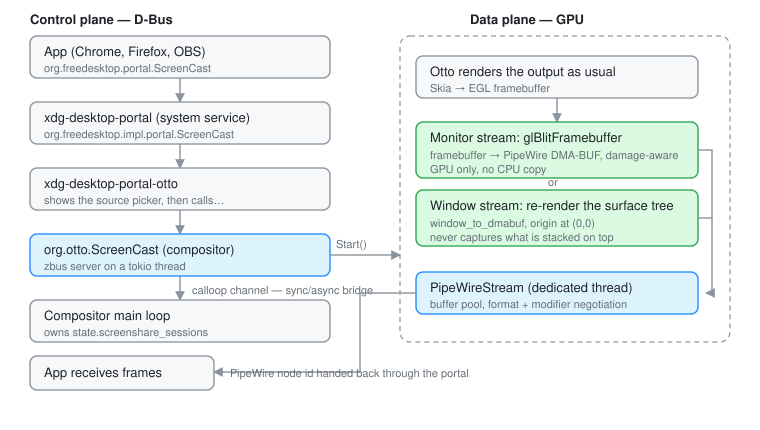

# Screen Sharing

How frames get out of Otto and into Chrome, OBS, `grim` or `wf-recorder`.

## The shape of it

There are **two halves that never touch each other**, and most confusion about
this subsystem comes from conflating them:

- **Control plane** — D-Bus. Who is allowed to capture what. Creating sessions,
  picking a source, starting and stopping streams.
- **Data plane** — GPU. Once a stream exists, frames are blitted from the
  compositor's framebuffer into a PipeWire buffer with no CPU involvement at all.

The control plane is four processes deep, because that is what the portal
standard requires: an app must not be able to start capturing without a
trusted intermediary asking the user first. The data plane is one `glBlit`.



Two independent capture APIs exist on top of this:

| API | Used by | Path |
|-----|---------|------|
| `org.freedesktop.portal.ScreenCast` | Chrome, Firefox, OBS, GNOME recorder | portal → `org.otto.ScreenCast` → PipeWire |
| `zwlr_screencopy_manager_v1` | `grim`, `wf-recorder`, `wl-mirror`, wlrobs | Wayland protocol, direct to the compositor |

They share the same GPU blit. See [wlr-screencopy](#wlr-screencopy-v1) below.

**Only the udev backend delivers frames.** winit starts the D-Bus service but
implements no per-frame delivery, so screenshare cannot be developed in
windowed mode.

---

## Control plane

### 1. The D-Bus service — `src/screenshare/dbus_service.rs`

The compositor runs a zbus server on a dedicated tokio thread:

| Interface | Path |
|-----------|------|
| `org.otto.ScreenCast` | `/org/otto/ScreenCast` |
| `org.otto.ScreenCast.Session` | `/org/otto/ScreenCast/session/<id>` |
| `org.otto.ScreenCast.Stream` | `<session>/stream/<id>` |

```
org.otto.ScreenCast
  CreateSession(properties: a{sv}) -> session_path: o
  ListOutputs()                    -> connectors: as
  ListWindows()                    -> windows: a(sss)     # (identifier, app_id, title)

org.otto.ScreenCast.Session
  RecordMonitor(connector: s, properties: a{sv}) -> stream_path: o
  RecordWindow(properties: a{sv})                -> stream_path: o
  Start()
  Stop()
  OpenPipeWireRemote(options: a{sv})             -> fd: h

org.otto.ScreenCast.Stream
  Start()
  Stop()
  PipeWireNode() -> info: a{sv}
  Metadata()     -> info: a{sv}    # connector|window-id, source-type, size, cursor-mode
```

`Start()` is where the compositor actually creates the PipeWire stream; the
node id comes back through `PipeWireNode()`.

`RecordWindow`'s `window-id` is an `ext-foreign-toplevel-list-v1` identifier,
exactly as returned by `ListWindows` — see
[foreign-toplevel.md](foreign-toplevel.md).

`OpenPipeWireRemote` is wired end to end but the compositor side
(`GetPipeWireFd`) still returns an error — it is a TODO in
`src/screenshare/mod.rs`. In practice apps connect to the PipeWire daemon
themselves and use the node id, so this has not blocked anything.

### 2. The sync/async bridge — `src/screenshare/mod.rs`

The compositor loop is synchronous (calloop); zbus is async. The bridge is a
`calloop::channel`: the D-Bus thread sends a `CompositorCommand`, and the main
loop handles it and mutates `state.screenshare_sessions`.

**This is the first place to look when a D-Bus call appears to hang or do
nothing** — nearly always the calloop side never received or handled the
command.

`CompositorCommand` also carries non-screenshare traffic (`FocusApp`,
`SetSetting`, `ResetSetting`), because it is the compositor's general
"something off-thread wants the main loop" channel.

A stream targets one of two things:

```rust
pub enum StreamTarget {
    Output(String),   // connector name, e.g. "HDMI-A-1"
    Window(String),   // ext-foreign-toplevel-list-v1 identifier
}
```

which is also the key into `ScreencastSession::streams`, as
`output:<connector>` or `window:<identifier>`.

### 3. PipeWire — `src/screenshare/pipewire_stream.rs`

`PipeWireStream` owns the stream and its buffer pool, running a PipeWire main
loop on its own thread. It negotiates a video format, asks for **DMA-BUF**
buffers, configures single-buffer mode (`min=1,max=1`), and advertises
`SPA_META_VideoDamage` so consumers can use damage metadata.

```rust
pub struct StreamConfig {
    pub width: u32,
    pub height: u32,
    pub framerate_num: u32,
    pub framerate_denom: u32,
    pub gbm_device: Option<Arc<GbmDevice<DrmDeviceFd>>>,
    pub capabilities: BackendCapabilities,
}
```

---

## Data plane

### Monitor capture: blit the framebuffer

1. Otto renders the output as usual (Skia → GL framebuffer).
2. If a stream exists for that output, it dequeues an available PipeWire buffer.
3. It blits the framebuffer into that DMA-BUF with `Blit<Dmabuf>` — a plain
   `glBlitFramebuffer`.
4. It tells PipeWire to queue the buffer.

No CPU copy, no second render. Damage is forwarded where possible; the first
frame, or a buffer change, forces a full-frame blit. This lives in
`render_surface(...)` in `src/udev/render.rs`, gated on
`outcome.rendered && !screenshare_sessions.is_empty()`.

### Window capture: re-render the window

Window streams do **not** blit the composited framebuffer. They re-render the
window's own surface tree — toplevel, subsurfaces and popups — into the
PipeWire dmabuf via `window_to_dmabuf`, with the window's geometry origin at
(0, 0).

That choice has consequences worth knowing:

- Nothing stacked above the shared window can leak into the capture.
- The window keeps streaming while occluded, on another workspace, or minimized.
- `lay-rs` scene decoration — shadows, rounded corners, blur — is **not** in the
  capture. This is the client's raw content.
- The size is fixed at `RecordWindow` time (even-rounded physical pixels) and
  then tracks the window: `PipeWireStream::request_size` is called every frame
  with the current size, and the PipeWire thread renegotiates the format after
  a 250 ms debounce. The window is cropped or letterboxed only for the few
  frames until new buffers arrive.

Two supporting mechanisms make this work:

- **Frame pacing.** `WindowThrottleState::Captured`
  (`src/state/window_throttle.rs`) pins a captured window to full-rate frame
  callbacks, outranking minimize and occlusion, *without* marking it
  `activated`. Without this a shared background window would tick at 2 Hz. See
  [render_loop.md](render_loop.md#client-frame-pacing).
- **Render triggers.** `screencast_active` and `kick_screencast_outputs` in
  `src/udev/render.rs` resolve a window target to the output currently hosting
  it, so that output forces a composite and keeps painting while idle.

Both call `crate::screenshare::window_for_identifier`, which takes
`&Workspaces` and `&foreign_toplevels` **separately** rather than `&Otto` — the
render loop already holds a mutable borrow of `backend_data`, so only
field-disjoint borrows compile there.

---

## wlr-screencopy-v1

The portal is not the only way out. `grim`, `wf-recorder`, `wl-mirror` and OBS
via wlrobs speak `zwlr_screencopy_manager_v1` directly, implemented in
`src/state/screencopy.rs`.

To avoid two parallel readback paths, it reuses the same `BlitCurrentFrame`
infrastructure:

- Otto advertises **`linux_dmabuf`** alongside the SHM `buffer` event for v3+
  clients, so capable consumers negotiate a GPU dmabuf and skip CPU readback.
- **Dmabuf clients** ride `BlitCurrentFrame::blit_current_frame` — the very
  same `glBlitFramebuffer` PipeWire screenshare uses. Zero CPU copy.
- **SHM clients** (legacy `grim`, `wf-recorder` by default) fall back to
  `skia_surface.read_pixels`: synchronous and expensive, but paid only by the
  tools that need it. Replacing it with a blit-into-temp-dmabuf plus async PBO
  readback would bring it to parity.
- The post-render hook is **gated on `!pending_screencopy_frames.is_empty()`**,
  so it costs nothing when nobody is asking. It does **not** force renders —
  pending frames piggyback on the next frame that happens for some other reason
  (scene damage, cursor, DnD).

Measured on Iris Xe, 2880×1920 @ 120 Hz, idle desktop at ~7% Otto CPU:

| Capture | Otto CPU |
|---------|----------|
| none | 7% |
| `wf-recorder -c h264_vaapi` (dmabuf) | ~9% |
| `wf-recorder` default (SHM, libx264) | ~30% |

---

## DMA-BUF modifier negotiation

This is the subtlest part of the subsystem, and the source of the
"corrupted/mangled frames" class of bug.

`build_format_params` (`src/screenshare/pipewire_stream.rs`) advertises
`Argb8888` as **one `EnumFormat` pod per modifier** — LINEAR first, then every
EGL-reported modifier that survives a real GBM allocation test and comes back
single-plane (Intel CCS aux-plane modifiers are excluded). Each pod fixes its
modifier as a `MANDATORY` `Long`, rather than offering a single `DONT_FIXATE`
choice pod.

That shape is required because `gst-plugin-pipewire` ≥ 1.2 only negotiates
dmabuf through explicit DMA_DRM caps, and Intel's `vapostproc` importer only
lists Y-tiled RGB formats — a LINEAR-only offer fails with "no more input
formats".

On the consuming side, `parse_negotiated_format` reads a fixed `Long` modifier
directly, or the default (first) value of a `Choice` pod. **An unreadable
modifier is a hard error, never a silent fallback to LINEAR** — that fallback
previously caused tiled buffers to be read as linear, i.e. visibly scrambled
frames.

No SHM fallback pods are offered alongside DMA-BUF today, so non-DMA_DRM
GStreamer pipelines cannot currently negotiate at all.

Full rationale: [`specs/screenshare.md`](../../specs/screenshare.md).

---

## Source selection and restore

`SelectSources` in
`components/xdg-desktop-portal-otto/src/portal/interface.rs` presents a single
radio list combining every output and every window, rendered by otto-islands
through the `org.otto.Dialog1` service — the same dialog the portal's Access
implementation uses. Option ids are `monitor:<connector>` and
`window:<identifier>`.

If no dialog renderer answers on the bus, monitor capture falls back to the
pre-picker behaviour: a one-line connector-name override in
`$XDG_CONFIG_HOME/otto/screencast-output` (or `~/.config/otto/screencast-output`),
re-read on every call, otherwise the first output. A window is never
auto-selected on that path.

**Restore.** An approved source survives into a new session through the spec's
`restore_data` handshake
(`components/xdg-desktop-portal-otto/src/portal/restore.rs`): `Start` returns
`("otto", 1, {source-type, id})`, the frontend hands the app a token, and a
`SelectSources` that replays the tuple skips the picker as long as the source
still exists and still matches the requested `types`.

Chrome depends on this. Its window picker builds the preview in one session and
then re-creates the session for the real capture — without a restorable token,
the dialog opened a second time on top of a live share.

Two things gate this and are easy to break:

- The impl interface must export `version` under exactly that **lowercase**
  name (`#[zbus(property, name = "version")]`). zbus would otherwise derive
  `Version`, xdg-desktop-portal reads 0, and everything added after interface
  version 1 is silently gated off — including `AvailableCursorModes` and the
  `restore_data` round-trip.
- `AvailableSourceTypes` must include the `WINDOW` bit.

### Testing a portal build

The backend's bus name is **user-wide**, and the session bus outlives the
graphical session. A backend from an earlier login keeps
`org.freedesktop.impl.portal.desktop.otto` until it is killed.

The current backend claims the name with `ReplaceExisting | AllowReplacement`
and exits when a newer instance takes over, so starting the new build is
enough. A *pre-fix* backend refuses replacement and must be killed by hand —
the new one then exits with a message saying so.

---

## Running it

### Starting the compositor

**Production (TTY):**

```sh
./scripts/start_session.sh
```

which creates or reuses a D-Bus session, saves it to
`$XDG_RUNTIME_DIR/dbus-session` for other terminals, starts/verifies PipeWire
via systemctl, launches `xdg-desktop-portal-otto`, and starts the compositor
with the right environment.

You need PipeWire and a session manager (usually WirePlumber) running.

### Running apps

From another terminal on the same TTY:

```sh
source "$XDG_RUNTIME_DIR/dbus-session"
export WAYLAND_DISPLAY=wayland-0
google-chrome   # or firefox, obs, …
```

If an app cannot see screensharing, it is almost always a **D-Bus session
mismatch**.

Expect ~60 FPS: the stream framerate is capped at 60 regardless of the
display's refresh rate. Chrome and most WebRTC implementations refuse PipeWire
streams above that and fail format negotiation with "no more input formats", so
a 120 Hz display would otherwise break screensharing entirely. The cap should
become configurable (`config.screenshare.max_fps`) for clients that can go
higher.

### Sanity checks

```sh
busctl --user list | grep org.otto.ScreenCast
busctl --user introspect org.otto.ScreenCast /org/otto/ScreenCast
pw-dump   # then find the node id the portal returned
```

### Troubleshooting

**No outputs in the share dialog** — the app is in a different D-Bus session.
Check `echo $DBUS_SESSION_BUS_ADDRESS`, verify the portal is registered
(`busctl --user list | grep otto`), and `source "$XDG_RUNTIME_DIR/dbus-session"`
before launching.

**Video freezes after a few seconds** — check PipeWire is alive
(`pgrep -x pipewire`), read `otto.log`, and make sure the user services are
enabled:

```sh
systemctl --user enable --now pipewire.service pipewire-pulse.service wireplumber.service
```

**Portal backend not found** — check the binary exists
(`ls target/release/xdg-desktop-portal-otto`), read
`components/xdg-desktop-portal-otto/portal.log`, and rebuild with
`cargo build -p xdg-desktop-portal-otto --release`. Also check the stale bus
name case above.

**Cursor modes rejected** — the portal *frontend* caches the backend's property
values. Restart it after restarting the backend.

---

## Testing

The two ends of the pipeline are not reachable from a test: the D-Bus service
needs a session bus, and a stream needs a PipeWire daemon and a GPU. Everything
between them is, and `tests/screenshare.rs` covers it against a headless
compositor and real Wayland clients — source enumeration, window identity,
stream sizing, the rejection paths of `RecordMonitor`/`RecordWindow`, and the
`Captured` frame pacing a live capture forces.

```sh
cargo test --features headless --test screenshare
```

`HeadlessHandle` exposes the control plane as `screencast_*` helpers, which post
the same `CompositorCommand`s the D-Bus thread posts. `screencast_attach_stream`
is the one piece of scaffolding: it records a target with the PipeWire
connection left out, so throttling, forced repaint and teardown are testable
without a daemon.

## File map

| File | Purpose |
|------|---------|
| `src/screenshare/mod.rs` | Session state, command handling, the blit utility, `window_for_identifier` |
| `src/screenshare/dbus_service.rs` | `org.otto.ScreenCast` implementation |
| `src/screenshare/pipewire_stream.rs` | PipeWire stream, buffer pool, format/modifier negotiation |
| `src/state/screencopy.rs` | `zwlr_screencopy_manager_v1` |
| `src/state/window_throttle.rs` | Frame pacing, including the `Captured` state |
| `src/skia_renderer.rs` | `Blit<Dmabuf>` — the shared GPU blit |
| `src/udev/render.rs` | Per-frame delivery, render triggers |
| `tests/screenshare.rs` | Headless end-to-end tests for the control plane |
| `src/winit.rs` | Starts the D-Bus service only; no frame delivery |
| `components/xdg-desktop-portal-otto/` | Portal backend: picker, restore, session bookkeeping |

Behavioural contract: [`specs/screenshare.md`](../../specs/screenshare.md).
