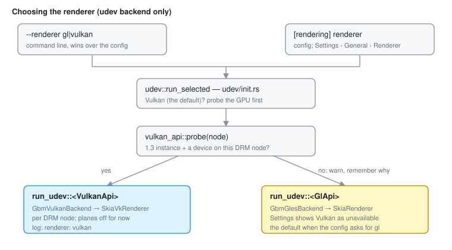
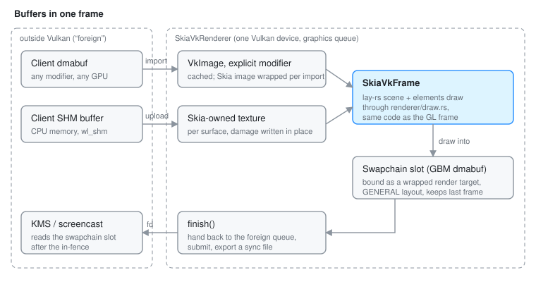
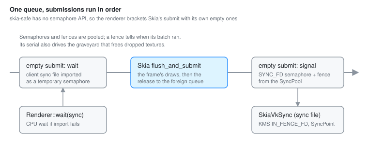

# The Vulkan Renderer

Otto draws with Skia. On the udev backend (a real session on a TTY) Skia can
run on either of two GPU APIs:

- **OpenGL ES**, through EGL. This is `SkiaRenderer` in
  `src/skia_renderer.rs`, the default, and the only choice on winit and x11.
- **Vulkan**. This is `SkiaVkRenderer` in `src/renderer/vulkan/`,
  experimental, picked at startup.

Everything above the renderer is shared: the lay-rs scene graph, the render
elements, damage tracking, Smithay's `DrmCompositor`. The Vulkan renderer only
changes how client buffers get into Skia, where Skia draws, and how the rest of
the system learns that a frame is done. If you know [Rendering](rendering.md),
this page is the part below "Skia draws".

For the reasoning behind the port, the phase plan and what the probe found,
see [Vulkan Renderer Plan](vulkan-renderer-plan.md).

## Why Vulkan at all

- **Explicit sync.** A finished frame is a sync file that goes straight to
  KMS. The GL path needs an EGL fence, a `glFlush`, and in places a CPU wait,
  because Mesa attaches no implicit fence to EGLImage render targets.
- **One import path.** A client dmabuf becomes a `VkImage` with its exact DRM
  format modifier. No EGLImage, no external-texture fallback, no `wl_drm`.
- **Formats.** 10-bit and fp16 render targets are ordinary Vulkan formats;
  the HDR work needs them.

## Turning it on

```sh
otto --tty-udev --renderer vulkan      # one session
```

or, to keep it:

```toml
[rendering]
renderer = "vulkan"   # "gl" is the default
```

Settings › General › Renderer writes the same key. The command line wins over
the config. The `vulkan` Cargo feature is in the default feature set; a build
without it refuses `--renderer vulkan` and exits with an error naming the
feature.



Before committing to Vulkan, `udev::run_selected` (`src/udev/init.rs`) probes
the primary GPU with `udev::vulkan_api::probe`: it needs a Vulkan 1.3 instance
and a physical device whose render or primary node is that GPU. When the probe
fails (no loader, no ICD, an old driver, a VM GPU) the session logs why on
`otto::udev` and runs on GL instead, and Settings shows Vulkan as unavailable.
This matters because a stored `renderer = "vulkan"` that simply exited would
leave the user stuck at the greeter.

Startup logs one line naming the device, driver, render node, Vulkan version,
format counts and whether sync files can be exported and imported:

```
Rendering with Skia on Vulkan: <device> (<driver>), render node <path>, Vulkan <version>, ...
```

## How the udev backend holds two renderers

The udev backend is generic over a `RendererApi` (`src/renderer/active.rs`).
`UdevData<A>` and every `impl Otto<UdevData<A>>` are compiled once per
renderer, and `main` picks which one runs. There is no runtime dispatch in the
render loop and no mixed mode: one session, one renderer.

| | `GlApi` | `VulkanApi` |
|---|---|---|
| Smithay multi-GPU api | `GbmGlesBackend` | `GbmVulkanBackend` (`src/udev/vulkan_api.rs`) |
| Device renderer | `SkiaRenderer` | `SkiaVkRenderer` |
| `PLANES_SUPPORTED` | `true` | `false` (see [What is missing](#what-is-missing)) |
| `wl_drm` | offered | not offered; clients use `linux-dmabuf` |

What the backend needs beyond Smithay's traits (plane surfaces, render
formats, the Skia context, flushing planes) goes through the small
`SkiaDeviceRenderer` trait, which both renderers implement.

The drawing code exists once. Render elements draw into whatever frame they
get through `FrameSurface`, and both `SkiaFrame` and `SkiaVkFrame` call the
same helpers in `src/renderer/draw.rs`. A visual change to an element never
needs a Vulkan-specific twin.

`GbmVulkanBackend` plays the part `GbmGlesBackend` plays for GL: one
`SkiaVkRenderer` per DRM node, next to a GBM allocator for that node. The
renderer is created when the node is added, so a GPU Vulkan cannot drive fails
there with a named error rather than on the first frame.

## Inside `SkiaVkRenderer`

| File | What it holds |
|---|---|
| `mod.rs` | The renderer, its Smithay trait impls, imports, targets, blits |
| `frame.rs` | `SkiaVkFrame`, the per-frame drawing handle |
| `sync.rs` | Sync files around Skia's submits, the semaphore pool |
| `texture.rs` | `SkiaVkTexture`, `SkiaVkTarget`, read-back mappings |
| `retire.rs` | Deferred destruction of GPU memory Skia may still read |
| `format.rs` | The DRM fourcc ↔ Vulkan ↔ Skia colour-type table |
| `tests.rs` | GPU tests, ignored unless asked for |

### Setting up

`SkiaVkRenderer::new` checks the physical device for six extensions (external
memory fd, dma-buf, DRM format modifiers, external semaphore fd, foreign queue
family, image format list), creates a Smithay Vulkan `Device` on the
**graphics** queue, and builds a Skia Ganesh `DirectContext` on that device and
queue.

Skia is told the API version explicitly, capped at 1.3. A driver may report
1.4 while the instance is 1.3; without the cap Skia asks for 1.4 entry points
the loader never hands out, and context creation fails without saying why.

The renderer then works out which formats it can sample (`dmabuf_formats`)
and which it can render into (`render_formats`), keeping only fourccs that
`format.rs` can map to Skia. Each alpha format also offers its `X` twin
(`XRGB8888` for `ARGB8888`), since Vulkan lists only the alpha one and
XWayland's depth-24 windows need the opaque one.

### Buffers in a frame



**Client dmabufs** import with `VulkanImage::new_from_dmabuf`, using the
buffer's explicit modifier. The `VkImage` is cached per buffer (keyed weakly,
so the cache never keeps a dead buffer alive), but the Skia image around it is
made fresh on every import. A re-import follows a client commit, after which
the buffer belongs to the client again and Skia must not trust the layout it
saw last time.

**SHM buffers** (and `import_memory`, used for the cursor) upload into a
Skia-owned GPU texture. Each surface keeps its texture, so later commits only
write their damaged rectangles.

**Render targets** are dmabufs too: the swapchain slots Smithay's
`DrmCompositor` allocates with GBM. `Bind<Dmabuf>` wraps one as a Skia render
target in `GENERAL` layout and caches the wrapper. `GENERAL` rather than
`UNDEFINED` matters: a slot has to keep its last frame's pixels, or partial
damage would repaint on top of garbage.

**Offscreen targets** (`Offscreen::create_buffer`) are plain Skia render
targets that Skia allocates itself.

### Handing a buffer back

Vulkan tracks who owns an image. The renderer uses `QUEUE_FAMILY_FOREIGN_EXT`
for "someone outside this Vulkan device": KMS, a client, another GPU. Before
Skia can touch a dmabuf it has to *acquire* it from the foreign family; when
it is done it has to *release* it back.

Skia does the acquire itself, because every wrapped image is described to it
as foreign-owned in `GENERAL` layout. The release happens in
`flush_target`: dmabuf targets are flushed with
`flush_surface_with_texture_state(GENERAL, QUEUE_FAMILY_FOREIGN_EXT)`, so
after every frame, read-back or blit the buffer is back where KMS and other
devices expect it. Forgetting this step shows up as garbage or stale content
on screen, because Skia's layout transitions and the scanout engine disagree.

### Sync

skia-safe exposes no semaphore API: there is no way to hand Skia a semaphore
to wait on or signal. The renderer works around Skia instead of inside it.
Vulkan runs submissions to one queue in order, so an empty submit placed
right before or right after Skia's does the job.



- **Finishing a frame.** `SkiaVkFrame::finish` calls `submit_target`: flush
  and release the target, `flush_and_submit`, then `SyncPool::signal` submits
  an empty batch that signals a semaphore exportable as a `SYNC_FD`. The
  exported file is a `SkiaVkSync`, which is a Smithay `Fence`; it goes to KMS
  as the plane's `IN_FENCE_FD` and anywhere else that takes a `SyncPoint`.
- **Waiting for a client.** `Renderer::wait` exports the client's sync point
  as a sync file, imports it as a *temporary* semaphore payload, and submits
  an empty batch that waits on it. Skia's next submit lands after it. If the
  import or submit fails, the wait falls back to the CPU.
- **Drivers without `SYNC_FD` export.** `signal` blocks on
  `vkQueueWaitIdle` and returns an already-signalled point. Slow, but correct.
- **Screenshare copies.** `blit_current_frame` attaches the copy's sync file
  to the destination dmabuf as an implicit write fence
  (`DMA_BUF_IOCTL_IMPORT_SYNC_FILE`), so a PipeWire consumer that relies on
  implicit sync waits for the GPU. On kernels without the ioctl it waits on
  the CPU instead.

Semaphores and fences are pooled in `SyncPool`. A semaphore can only be reused
once its batch has run, which the fence submitted alongside it tells. Every
signal also gets a serial number, and `completed()` reports the last serial
the GPU has finished; the next section uses that.

### Freeing memory safely

Skia wraps dmabuf images it does not own, so it cannot keep them alive, and
the Skia image of a texture escapes the renderer: lay-rs holds it to draw the
window, and recorded pictures reference it. A texture can be dropped by
Smithay while a picture still points at it, or while the GPU has not yet run
the frame that samples it.

So memory is never freed on drop. `TextureBacking` and dead render targets
hand their memory to the renderer's **graveyard** (`retire.rs`) together with
the Skia handle that reads it. On each submit, `Graveyard::reap`:

1. marks an entry once nothing but the graveyard holds its Skia handle,
   stamping it with the serial of the frame just submitted;
2. destroys the entry once the GPU has completed that serial.

Plane slot images go through a similar queue (`PlaneTextureRelease`), drained
in `flush_planes_for_scanout` after a CPU sync.

### Copies and read-back

| Smithay trait | How |
|---|---|
| `ExportMem` (screencopy, screenshots) | `Surface::read_pixels`, then release the target again |
| `Blit` | snapshot of the source, drawn into the destination with `BlendMode::Src` |
| `BlitCurrentFrame` (screenshare) | the same copy from the last bound target, fenced into the destination dmabuf |

## Testing

The GPU tests in `src/renderer/vulkan/tests.rs` need a real Vulkan device, so
they are `#[ignore]`d and CI skips them:

```sh
cargo test --features vulkan --lib -- --ignored vulkan
```

They cover offscreen draw and read-back, a GBM dmabuf rendered and imported
back, the `X` formats drawing opaque, an image-cached lay-rs mirror of a
texture, a whole layer tree over an `XRGB` dmabuf, and plane surfaces sampling
dmabuf textures.

On a live session, check the startup line on `otto::udev` (`renderer:
vulkan`) and the device line above. If the log instead says Vulkan was
requested but unavailable, the probe failed and the session is on GL.

## What is missing

- **Plane scanout.** `VulkanApi::PLANES_SUPPORTED` is `false`, so every
  output composites into the primary plane: no dock, popup or fullscreen
  window on its own KMS plane yet. The plane code builds for Vulkan
  (`create_surface_from_dmabuf`, `flush_planes_for_scanout`) but has not been
  run on hardware. See [DRM Planes](drm_plane.md).
- **Multi-plane dmabufs.** Disjoint NV12 video buffers are refused at import;
  `format.rs` has no YUV formats.
- **Release after sampling.** Sampled client dmabufs stay in Skia's queue
  family after use; the next import acquires them again.
- **Queue ordering.** The wait semaphore relies on submissions on one queue
  executing in order. ANV and RADV do this; the spec does not promise it.
- **Texture filters and debug flags** are stored and ignored, as on GL.
- **Driver coverage.** Tested on Intel (ANV). NVK and the proprietary NVIDIA
  driver still need checking for `SYNC_FD` export and modifier imports.
- **winit and x11** stay on GL in every build.

## Where to look

| Question | File |
|---|---|
| How is the renderer picked, and when does it fall back? | `src/udev/init.rs` (`run_selected`), `src/main.rs` |
| What does the backend require of a renderer? | `src/renderer/active.rs` |
| How are renderers created per GPU? | `src/udev/vulkan_api.rs` |
| Why is my buffer refused? | `src/renderer/vulkan/format.rs`, then the `cannot render into dmabuf` warning in `mod.rs` |
| Why is a frame not fenced? | `src/renderer/vulkan/sync.rs` |
| Why is a texture still alive? | `src/renderer/vulkan/retire.rs` |
