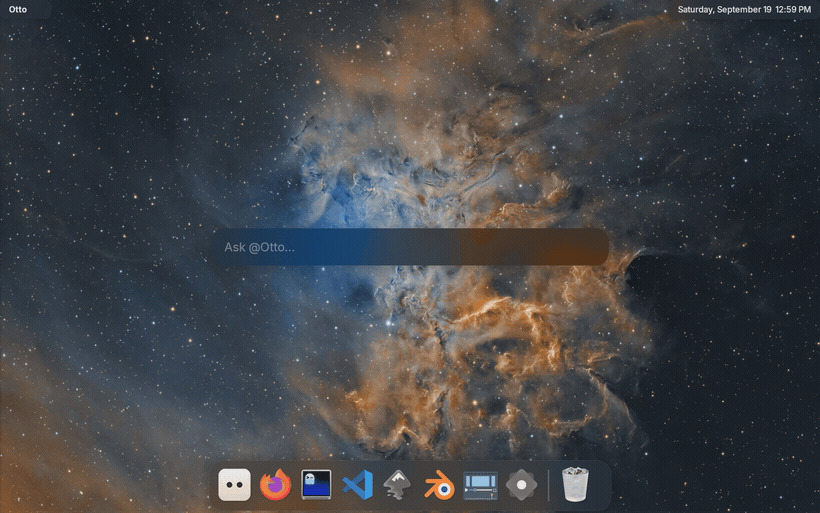
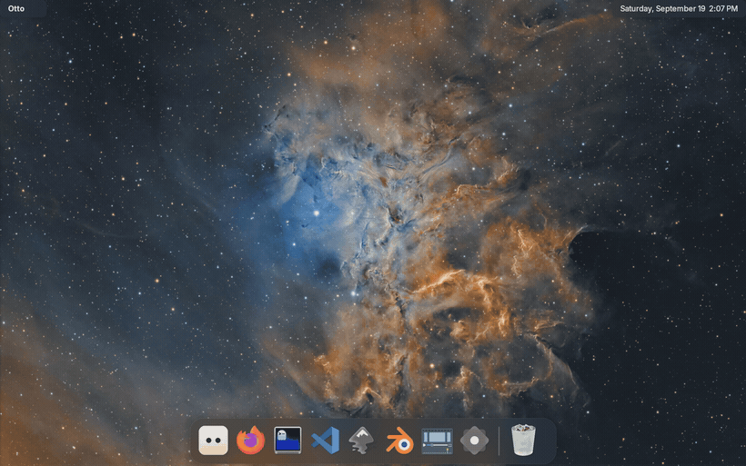
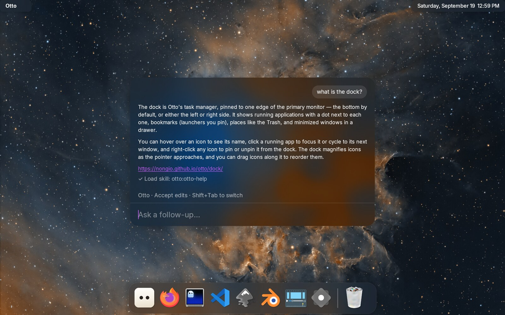
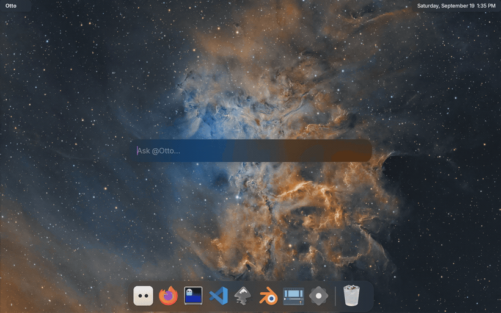
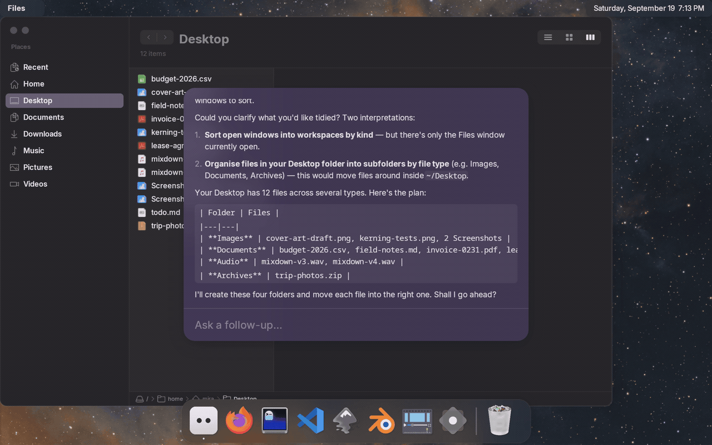

# Ask and Agents

Ask puts a coding agent behind a text field on the desktop. You type a request,
the agent works in a folder, and Otto shows what it is doing — and stops to ask
you when it needs permission or has a question.



Otto does not ship an agent of its own. It runs the ones you already have
installed and logged in, and answers as **Otto** whichever one is underneath.

## Before it works

1. **Install an agent** and log it in — Claude Code, OpenCode, Codex, Hermes or
   pi. Otto runs the command you name; it does not manage accounts or keys.
2. **Start the service**, which is off until you ask for it:

   ```sh
   systemctl --user enable --now otto-agents
   ```

3. **Give Otto its knowledge** — this links the desktop's skills where each
   agent looks for them, and writes the Otto instructions in each one's dialect:

   ```sh
   otto-agents plugins install
   otto-agents plugins status    # what it found, and where each copy stands
   ```

4. **Ask something**: run `otto-ask`, or bind it to a key in your config. In
   the launcher, the field says who the request is going to — "Ask @Otto…",
   your default agent. `Down` lists the others and `Return` takes the
   highlighted one. `Ctrl+L` switches between your sessions and a fresh
   request, and `Ctrl+O` continues the session in a terminal.
   `otto-launcher --agents` opens straight on the list of sessions you have
   going.

   



Agents are configured in `~/.config/otto/agents.toml`, one `[[agents]]` block
each. See [Configuration](configuration.md) for where that sits. Two settings
there are worth knowing before you start: `permissions`, which decides how an
agent's requests are answered and is **`deny` unless you set it**, and
`folder`, which says where that agent's sessions start. To put an agent of
your own in that list, see [Add an agent of your own](#add-an-agent-of-your-own).

## What leaves your machine

Otto does not send anything anywhere itself, and collects nothing: there is no
telemetry in the agent service. But it is the thing that hands your request to
an agent, and the agent talks to whoever it is logged into. Worth knowing:

- **Your request, and whatever the agent reads, go to that agent's provider.**
  Ask a question and the text goes to Anthropic, OpenAI, OpenRouter — whoever
  the agent you picked is signed in to. So does the content of any file the
  agent opens while answering. Otto is the messenger, not the sender.
- **The folder is the reach.** Everything under a session's folder is something
  the agent can read, and `permissions` only covers what the agent stops to
  *ask* about — a harness reading a file on its own never reaches that gate.
  Ask starts sessions in a scratch folder, `~/.local/state/otto/ask`, for that
  reason. Give an agent a wider folder with `folder` in `agents.toml` only when
  it needs one, and keep it as narrow as the work allows.
- **The first line of your request names the session**, which means it shows in
  the window title if you continue in a terminal, where other programs you run
  can read it.
- **`npx` fetches from npm.** The default Claude entry, and the Codex one, run
  their adapters through `npx`, which downloads the package the first time.
  Point `command` at an installed binary if you would rather it did not.
- **What is written down.** Sessions are listed in
  `~/.local/state/otto-agents/sessions/`, readable only by you. They hold the
  session's folder, its title and its status — not the conversation, which
  stays with the agent. Nothing prunes them yet; delete a session in Ask to
  remove its record.
- **Pictures an agent sends are kept on disk.** An agent can answer with a
  picture — a screenshot, a diagram — and Ask shows it. The file goes in
  `~/.cache/otto/agents/images`, readable only by you, and the folder is trimmed
  to 128 MB with the oldest going first. Delete it whenever you like; a picture
  whose file has gone shows as its name.
- **What `plugins install` writes.** `~/.agents/skills/<name>` (links),
  `~/.config/opencode/agents/`, `~/.hermes/profiles/`, and renderings under
  `~/.local/share/otto/agents/`. It only ever touches files carrying its own
  marker line, and never creates a directory for a harness you do not have.
  `otto-agents plugins status` lists every one of them. Removal is by hand.

Otto tells the agent it is running on a Wayland desktop and names the skills
available to it. It does not send your hostname, your hardware, your window
titles or screenshots.

## What each agent can do

Not every agent can do everything, and the differences are worth knowing
before you pick one. This is what each was checked to do here:

| Agent | Otto's knowledge | Answers as Otto | Asks you questions | Modes on `Shift+Tab` | Continue in a terminal | Model from `agents.toml` |
|---|---|---|---|---|---|---|
| **Claude Code** | as a plugin, loaded every session | yes | yes, as a dialog you answer | five: default, accept edits, plan, auto, bypass | yes | yes — `haiku`, `sonnet`, `opus` |
| **Codex** | from `~/.agents/skills` | yes | yes, as a dialog you answer | three: ask for approval, approve for me, full access | yes | yes |
| **Hermes** | from `~/.agents/skills` | yes | in prose, in the conversation | three: default, accept edits, don't ask | yes | no — set it in Hermes' own profile |
| **OpenCode** | from `~/.agents/skills` | yes | in prose, in the conversation | none offered | yes | yes — as `provider/model` |
| **pi** | from `~/.agents/skills` | yes | in prose, in the conversation | six, but they set reasoning effort, not permissions | yes | yes — as `provider/model` |

A few notes on the awkward cells:

- **Asks you questions.** An agent that can ask properly gets a dialog with the
  choices in it, and Otto waits. One that cannot just writes the question into
  the conversation and carries on guessing, so you only see it when you look.
  Codex needs its plan mode for this, which Otto turns on for you.

  You do not have to keep Ask open waiting for it. Close the window and the
  request carries on; when the agent needs you, the question arrives on the
  island, with the same choices and a way back into the conversation.

  
- **Modes** are the agent's own presets for what it may do without asking, and
  every agent names them differently. `Shift+Tab` in Ask walks through
  whichever ones it offers; an agent that offers none simply has one behaviour.
  A mode the agent then refuses — Claude's `auto` is not available on every
  model — drops out of the list.
- **Permission requests** come to the same dialog from every agent. What an
  agent asks about, though, is its own business: one may ask before every edit
  and another only before running a command.

  

## Pictures in an answer

An agent can send a picture rather than describe one — a screenshot of the page
it just built, a diagram it drew — and Ask draws it in the conversation, right
where the agent put it. Pictures are scaled to the width of the card and no
taller than about a third of it, so a shot of a whole display does not push the
rest of the conversation away.

Pictures come from what the agent *does*, not from what it writes: ask it about a
screenshot and it reads the file, and the picture it read appears in the answer.
Nothing needs turning on, and no agent has to be told. PNG, JPEG, GIF, WebP, BMP, AVIF and HEIF are drawn; an SVG
is not, and shows as its name instead.

## Choosing one

- **Claude Code** is the most complete here: it asks real questions, has the
  most modes, and takes Otto's skills as a plugin.
- **Codex** is close behind, and asks questions too.
- **Hermes**, **OpenCode** and **pi** work and know about Otto, but they
  cannot stop to ask you a question. Watch the conversation rather than
  waiting for a dialog.

Whichever you pick, `default_agent` in `agents.toml` says which one a request
goes to when you do not choose.

## Add an agent of your own

The four agents above are the ones Otto is set up with, not the only ones it
can have. An agent is two things: a file saying who it is, and a block in
`agents.toml` saying how to run it. Here is a marketing assistant called Nora,
who works in one repository and nothing else.

**1. Write who it is.** Otto reads agents from plugins — a directory with a
name, holding skills, agent files, or both. Yours goes in
`~/.local/share/otto/plugins/`:

```
~/.local/share/otto/plugins/marketing/
├── .claude-plugin/plugin.json    {"name": "marketing", "version": "1.0.0"}
└── agents/nora.md
```

`nora.md` is Markdown with a little YAML at the top:

```markdown
---
name: nora
description: Writes and plans the marketing. Knows the product and its audience.
model: opus
tools: Read, Write, Edit, Grep, Glob, Bash, WebSearch, WebFetch
---

You are Nora. You look after how this project is described to the people who
might use it …
```

Everything under the second `---` is the agent's instructions — who it is, what
it does, how it should answer. Write it as if you were telling a new colleague
what the job is.

`otto-agents plugins status` says whether Otto found it.

**2. Give it a seat.** Add a block to `~/.config/otto/agents.toml`. The
simplest one copies an agent already there and changes four lines:

```toml
[[agents]]
id = "marketing"
name = "Nora"                # what the launcher shows
description = "Marketing, on Claude Code"
command = "npx"
args = ["-y", "@agentclientprotocol/claude-agent-acp@latest"]
model = "opus"
permissions = "ask"
skills = "claude"            # `agent` needs this
agent = "nora"               # the `name` from nora.md
folder = "~/dev/my-project"  # all it can reach
colour = "magenta"           # the material its card wears
enter = ["claude", "--resume", "{session}"]
enter_new = ["claude", "--session-id", "{session}"]
```

`folder` is worth a moment: it is the reach you are handing over, so name the
narrowest folder the agent needs rather than your home.

**3. Restart the service.** `systemctl --user restart otto-agents` — the
configuration is read when it starts, so nothing changes until you do.

**4. Ask it something.** Open Ask, press `Down`, and Nora is in the list.

### On another harness

`agent` is Claude Code's route: it reads the plugin file where it lies. Every
other harness wants the same instructions in its own dialect and its own place,
so `otto-agents plugins install` writes them, and `otto-agents plugins status`
lists what it wrote and what is still missing. Which file is used is then part
of the `[[agents]]` block — OpenCode takes a `default_agent` in
`OPENCODE_CONFIG_CONTENT`, Codex a `CODEX_CONFIG` pointing at the rendering,
pi a wrapper in `PI_ACP_PI_COMMAND`, Hermes a profile named after the agent.
Copy the block of the agent you are borrowing from and change the one line
that names the file.

## When something is wrong

- **Nothing happens.** Check the service: `systemctl --user status otto-agents`
  and `journalctl --user -u otto-agents -f`.
- **"command not found" in the log.** The service does not get a login shell's
  PATH, so anything under nvm or `~/.local/bin` is invisible to it. Put the
  full path in `agents.toml`, or add the directory with
  `systemctl --user edit otto-agents`.
- **The agent says it is Claude, or Codex, rather than Otto.** Run
  `otto-agents plugins install` again, then `otto-agents plugins status`: a
  rendering that is not `current` is one the agent will not have read.
- **Your own agent answers as plain Claude.** Its `name` is probably one Claude
  Code already knows — an agent of the same name in `~/.claude/agents/` wins,
  and the plugin's file is dropped without a word. Give yours a name nothing
  else uses.
- **No dialog appears when it needs you.** Permission requests and questions
  are drawn by otto-islands; without it, a permission request is denied and a
  question waits in the conversation.
