# Customization

Otto's appearance is set from the config file: colour scheme, accent, wallpaper,
fonts, icon theme, corner radius, window control side, and dock position and
tint. This page shows what each of those does, on six configurations.

For each setting on its own, see [Theming](theming.md), [Dock](dock.md) and
[Window Management](window-management.md).

## A dark scheme with squared corners

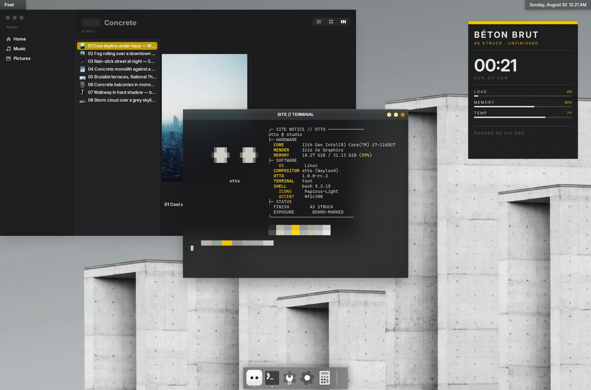

```toml
accent_color = "#f2c300"
rounded_corners = false
window_controls_side = "right"

[dock]
colorize_icons = true
colorize_color = "#ffffff"
colorize_intensity = 1.0
```

The dock icons are tinted white. The tint is *luminance × colour*, so white is
exactly a greyscale conversion: it preserves each icon's internal shading
instead of flattening it to a silhouette.

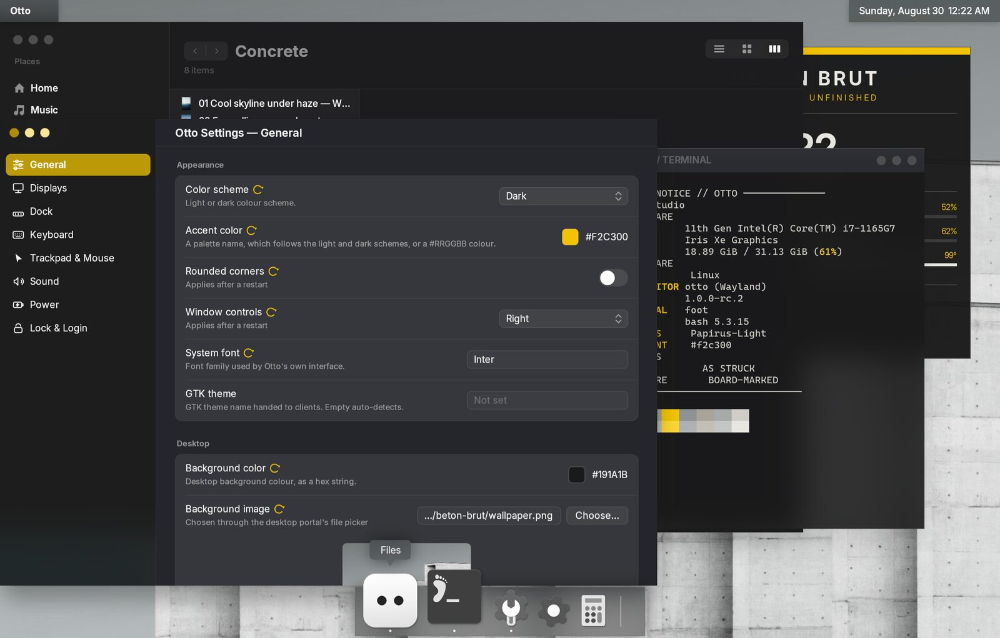

All of these are in [Settings](settings.md) as well. `rounded_corners` and
`window_controls_side` need a restart; the accent and the dock tint apply
immediately.

## A dock down the side

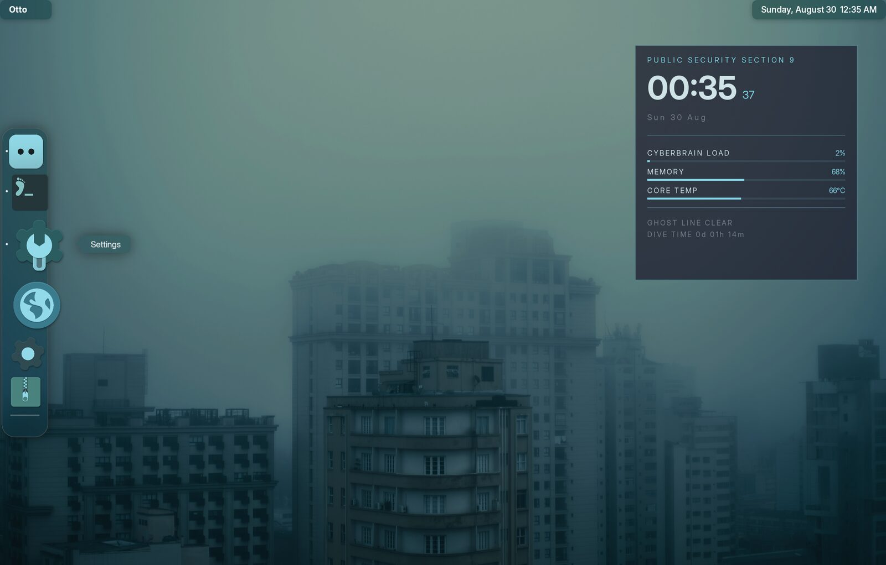

```toml
accent_color = "#7fd4e6"
window_controls_side = "left"
font_family = "Inter Display"

[dock]
position = "left"
colorize_color = "#7fd4e6"
colorize_intensity = 0.85
```

A side dock stacks its icons vertically, reserves screen width instead of
height, magnifies along the pointer's vertical travel, and minimizes windows
sideways into itself.

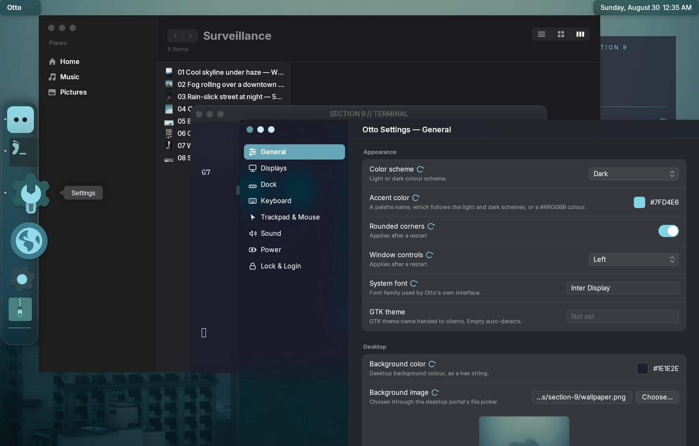

## The compositor's own surfaces

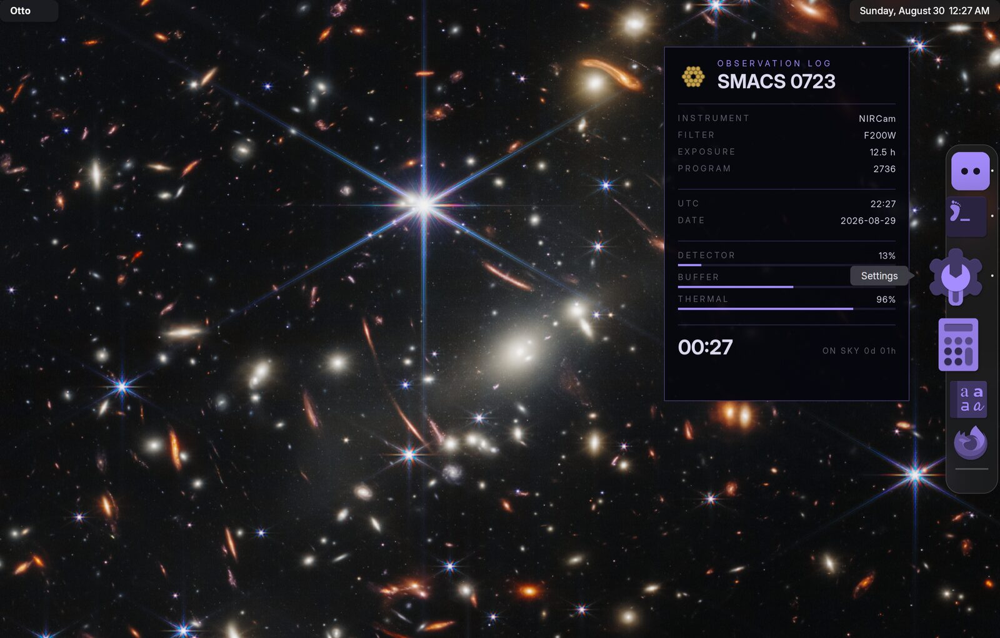

`accent_color` and `theme_scheme` apply to the compositor's own surfaces as
well: exposé, the workspace strip, the app switcher, and the brightness and
volume indicators.

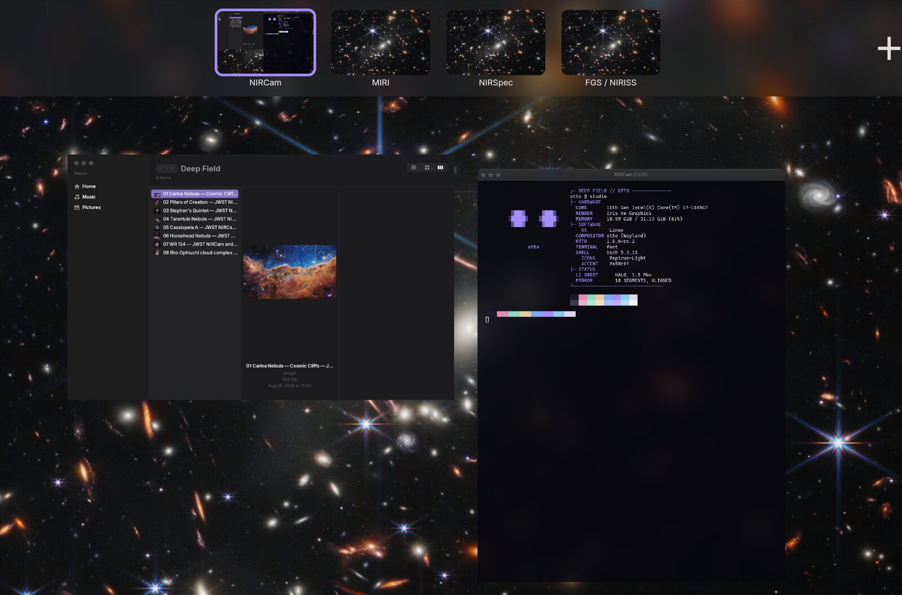

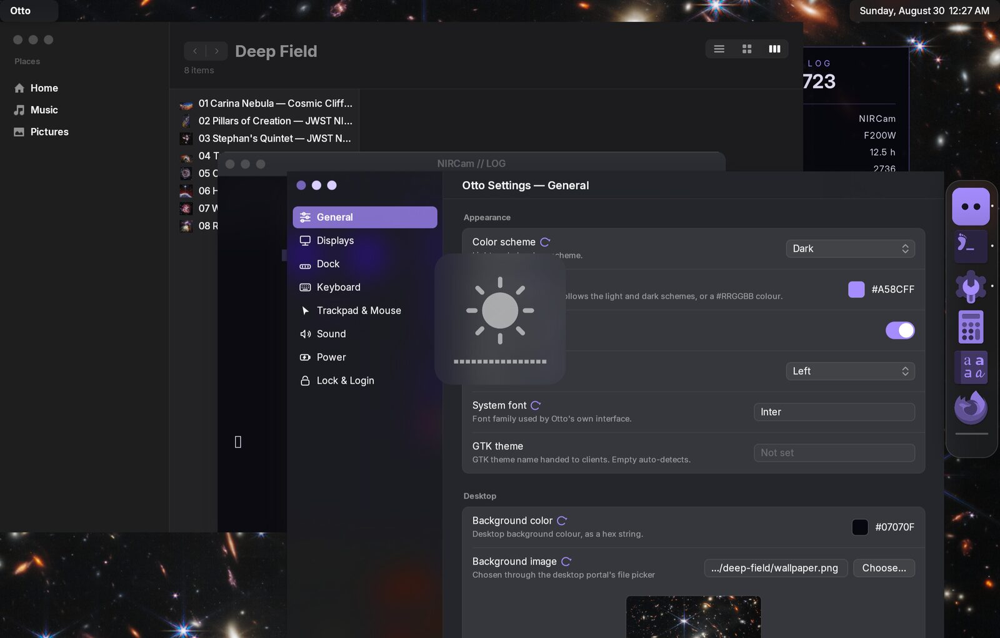

## Desktop widgets and the app switcher

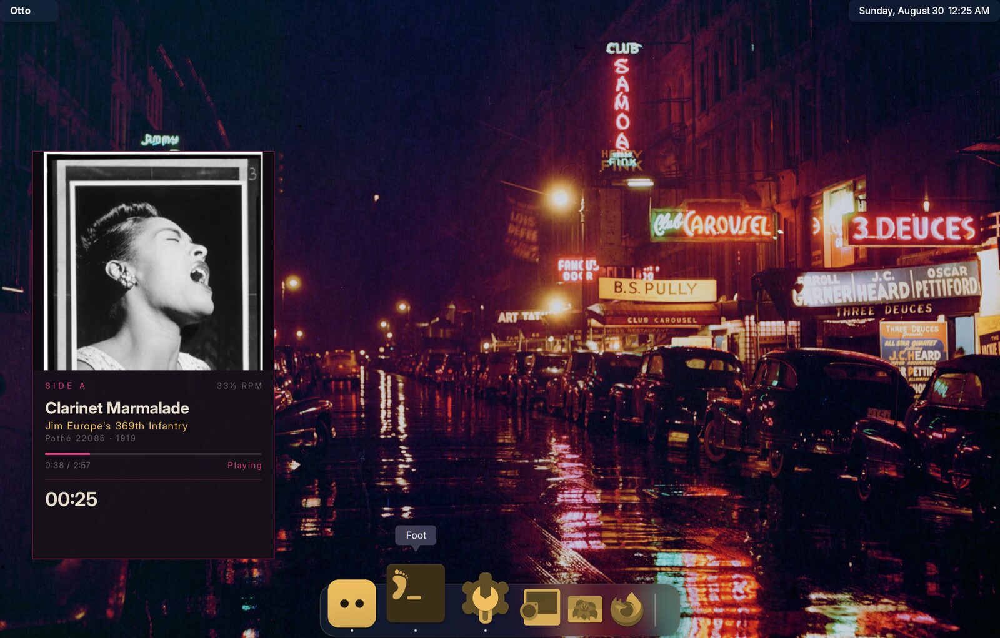

The panel on the left is an [eww](desktop-widgets.md) widget on the desktop
layer: a `wlr-layer-shell` client, not an Otto feature.

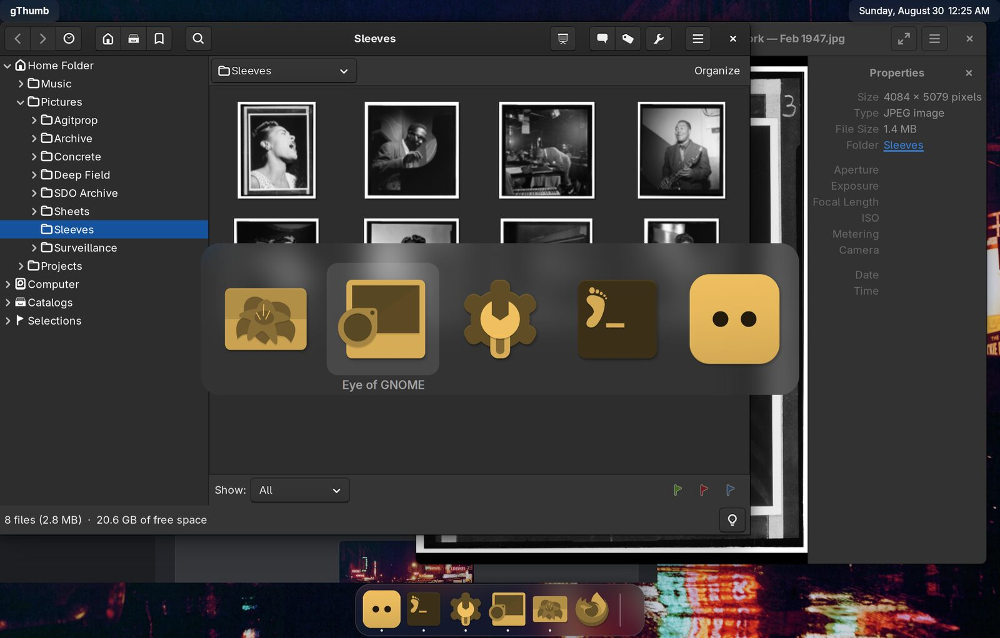

The app switcher draws the same tinted icons as the dock, so a colourised dock
does not leave the switcher looking like a different desktop. The colour and
strength always come from `[dock]` — one desktop, one icon tint — and
`appswitcher.colorize_icons = false` opts the switcher out.

## A saturated tint

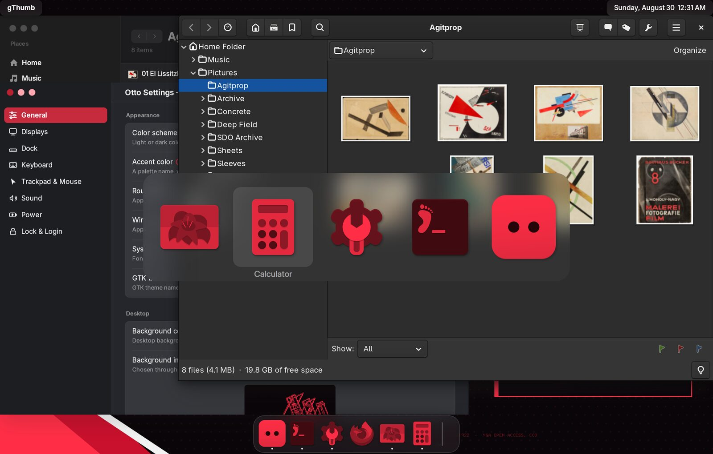

A saturated `colorize_color` sets a ceiling on each icon's luminance, so it
needs light source icons. Applied to icons that are already dark it flattens
them to silhouettes.

## A light scheme

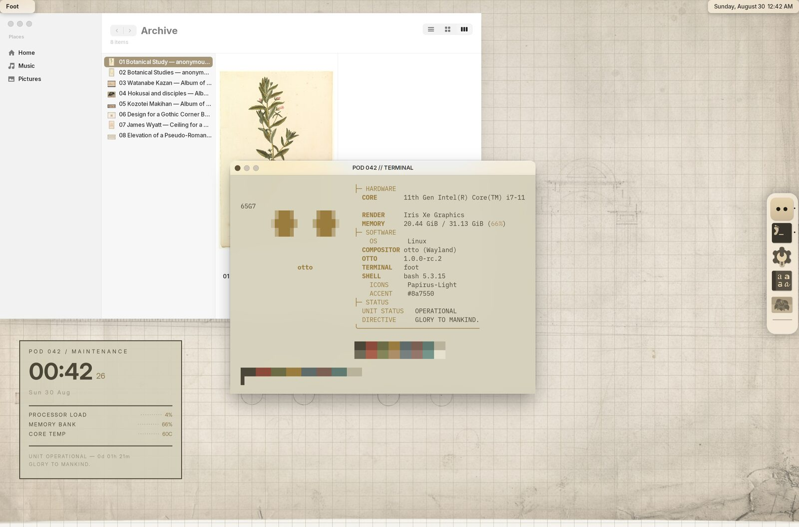

This uses the named `brown` accent rather than a hex literal, so it resolves to
the light or dark palette's shade as the scheme changes.

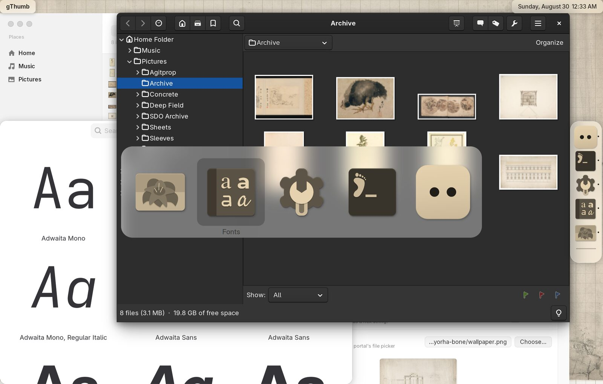

The tint source is `Papirus-Light` here, even though the result is darker than
the icons started. The filter maps each icon to its luminance re-coloured in
`colorize_color`, then blends back toward the original by `colorize_intensity`,
so what a light tint has to work with is the source icon's luminance.

## What changes the look

| Setting | Where | Effect |
|---------|-------|--------|
| `background_image`, `background_color` | [Theming](theming.md#wallpaper) | The wallpaper, and what shows if it fails to load |
| `theme_scheme` | [Theming](theming.md#light-and-dark) | Light or dark, for Otto's chrome *and* for GTK/Qt apps through the portal. Needs a restart |
| `accent_color` | [Theming](theming.md#accent-colour) | Selection, highlights and controls. A palette name or a hex literal |
| `font_family` | [Theming](theming.md#fonts) | Otto's own interface type. Needs a restart |
| `icon_theme` | [Theming](theming.md#icon-theme) | The source icons, before any tint. Needs a restart |
| `rounded_corners` | [Theming](theming.md#rounded-corners) | Rounded or squared window corners. Needs a restart |
| `window_controls_side` | [Window Management](window-management.md#decorations) | Close/minimize/maximize on the left or right. Needs a restart |
| `dock.position` | [Dock](dock.md#position) | Bottom, left or right |
| `dock.size`, `dock.magnification` | [Dock](dock.md#size) | How big, and whether icons grow under the pointer |
| `dock.colorize_*` | [Dock](dock.md#icon-colorization) | Tints every dock and switcher icon to one colour |
| `workspaces.names` | [Workspaces](workspaces.md) | What the workspace strip is labelled with |
| `workspaces.switch_duration`, `workspaces.switch_bounce` | [Workspaces](workspaces.md#configuring) | How fast, and how springy, the scroll between workspaces is |

The wallpaper, the accent colour and every `dock.*` setting apply live. The
rest — colour scheme, fonts, icon and cursor themes, corners, controls side and
the interface scale — need a restart, and the settings app says so next to the
control.

## What Otto does not draw

Otto draws the dock, the top bar chrome, exposé and server-side window frames.
Terminals, editors and status panels are separate clients and are themed on
their own:

- **Terminal** — [foot](https://codeberg.org/dnkl/foot) reads a palette from
  `foot.ini`. Otto implements `ext-background-effect-v1`, so `blur=yes` next to
  an `alpha` gets the blur from the compositor.
- **Panels and widgets** — [eww](https://github.com/elkowar/eww) and anything
  else speaking `wlr-layer-shell` sit on the desktop layer, behind windows and
  above the wallpaper. See [Desktop Widgets](desktop-widgets.md).
- **GTK applications** — follow `theme_scheme` and the accent through the XDG
  Settings portal automatically. `gtk_theme` in Otto's config is recorded but
  not applied; set your GTK theme the usual way.
