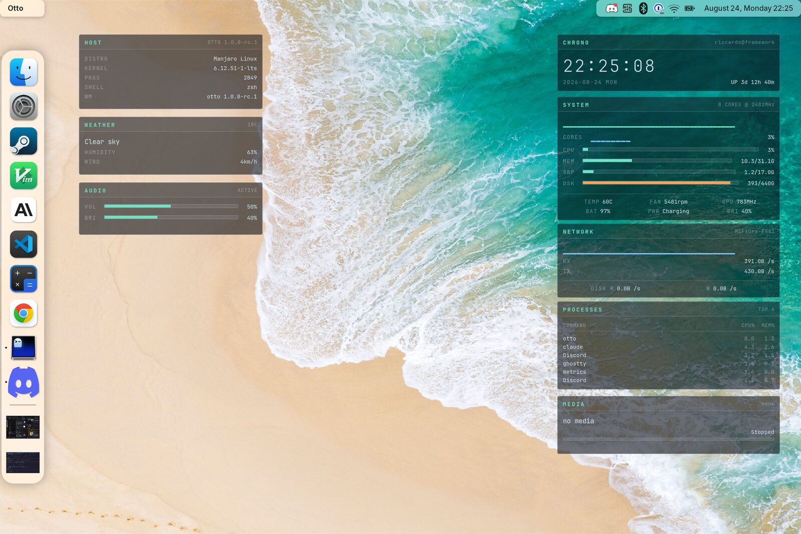

# Desktop Widgets

Clocks, system monitors and dashboards that sit on the desktop behind your
windows, using the `wlr-layer-shell` protocol Otto implements. This page walks
through setting up [eww](https://github.com/elkowar/eww) on Otto, from
installing it to a complete working configuration you can copy.



## The layers

Layer-shell clients ask to sit on one of four layers. Otto stacks them like
this, bottom to top:

| Layer | What belongs there | Above the wallpaper | Below windows |
|-------|--------------------|---------------------|---------------|
| `background` | Wallpaper daemons (`wpaperd`, `swaybg`) | — | Yes |
| `bottom` | **Desktop widgets** | Yes | Yes |
| `top` | Panels and bars | Yes | No |
| `overlay` | Notifications, lock screens, OSDs | Yes | No |

Desktop widgets belong on `bottom`. They are drawn over the wallpaper and
covered by ordinary windows, so they behave like part of the desktop rather
than like a floating panel.

Two details are specific to Otto:

- **Bottom-layer widgets are shared by every workspace.** Otto mirrors that
  layer into each workspace's background, so a widget is part of the desktop
  itself rather than something you can put on one workspace only.
- **Background-layer surfaces get no pointer input at all.** Otto deliberately
  drops pointer events there so clicks fall through the wallpaper. A widget with
  buttons must be on `bottom` or higher.

Two more options matter for widgets:

- **Exclusive zone** — leave it off. An exclusive zone reserves screen space and
  pushes maximized windows aside, which is what a panel wants and a widget does
  not.
- **Focusable** — leave it off. A non-focusable surface never takes keyboard
  focus from your windows. It can still receive pointer clicks, so widgets with
  buttons keep working.

## A quick check: wlr-sunclock

Before configuring anything, confirm the layer works on your machine:

```sh
sudo pacman -S wlr-sunclock
wlr-sunclock -l bottom -s -a tr -m 40,40,60,40 -w 480
```

`-l bottom` picks the layer, `-a tr` anchors it top-right, `-s` draws the sun at
the subsolar point. Drag a window over it and away again — the widget should
still be there. It only repaints every few minutes, so it proves the layer works
and little else.

## Setting up eww

[eww](https://github.com/elkowar/eww) (ElKowar's Wacky Widgets) is the usual
choice: a standalone GTK3 widget system with its own layout language and no
dependency on any particular compositor. Most desktop-widget configurations you
find online are written for it.

### Installing eww

eww is not in the Arch repositories, so it comes from the AUR:

```sh
yay -S eww           # or: paru -S eww
```

It pulls in `gtk3` and `gtk-layer-shell` and builds from source, which takes a
few minutes. Verify it landed:

```sh
eww --version
```

For the block-character graphs used below, install a Nerd Font as well
(`ttf-jetbrains-mono-nerd` is a good default).

### The config directory

A config directory holds three things:

| File | Purpose |
|------|---------|
| `eww.yuck` | Widget tree and window definitions |
| `eww.scss` | Styling, compiled to GTK CSS |
| `scripts/` | Whatever produces the data |

Keep each set of widgets in its own directory and pass `--config`, so several
configurations can coexist without fighting over one daemon:

```sh
mkdir -p ~/.config/eww-hud/scripts
```

### Your first widget

Two files are enough for something on screen. `~/.config/eww-hud/eww.yuck`:

```lisp
(defpoll time :interval "1s" `date +"%H:%M:%S"`)

(defwidget clock []
  (box :class "panel"
    (label :show-truncated false :class "time" :text time)))

(defwindow hud_clock
  :monitor 0
  :stacking "bottom"        ; behind windows, above the wallpaper
  :focusable false          ; never steals keyboard focus
  :exclusive false          ; reserves no screen space
  :geometry (geometry :anchor "top left" :x "1050px" :y "70px"
                      :width "320px" :height "78px")
  (clock))
```

`~/.config/eww-hud/eww.scss`:

```scss
* { all: unset; font-family: monospace; color: #d3e2f2; }

window { background-color: transparent; }

.panel {
  background-color: rgba(9, 13, 20, 0.58);
  border: 1px solid rgba(211, 226, 242, 0.16);
  border-radius: 3px;
  padding: 9px;
}
.time { font-size: 30px; font-weight: 200; letter-spacing: 3px; }
```

Then:

```sh
eww --config ~/.config/eww-hud daemon
eww --config ~/.config/eww-hud open hud_clock
```

The commands you will use constantly:

| Command | What it does |
|---------|--------------|
| `eww --config <dir> daemon` | Start the daemon (nothing appears yet) |
| `eww --config <dir> open <window>` | Show one window |
| `eww --config <dir> open-many a b c` | Show several at once |
| `eww --config <dir> reload` | Re-read config after an edit |
| `eww --config <dir> active-windows` | List what is currently open |
| `eww --config <dir> kill` | Stop the daemon and close everything |

### Anchors, or why your widget is in the middle of the screen

Without `:anchor`, eww centres the geometry and reads `:x`/`:y` as offsets from
the centre. Set it explicitly whenever you place panels by absolute position:

```lisp
:geometry (geometry :anchor "top left" :x "1050px" :y "70px" ...)
```

### Geometry is in logical pixels

Otto scales the desktop by `screen_scale`. Layer-shell clients are laid out in
**logical** pixels — physical pixels divided by that scale — so a 2880x1920
panel at `screen_scale = 2.0` gives you a 1440x960 canvas to place widgets on.
Check your value with:

```sh
grep screen_scale ~/.config/otto/config.toml
```

This is the most common reason a configuration copied from someone else's setup
looks wrong. A dashboard drawn for a 1920x1080 desktop occupies a third more of
the screen on a 1440-logical one, so its text and panels look oversized even
though nothing is scaled incorrectly. Multiply positions and font sizes by
`your_logical_width / 1920`, or lay it out again for your own canvas.

Otto exports the same scale to GTK, and `gtk-xft-dpi` should stay at the
standard 96 DPI (`98304`). If you have also raised GTK's text scaling, fonts get
scaled twice and every GTK app looks huge:

```sh
gsettings get org.gnome.desktop.interface text-scaling-factor   # want 1.0
```

## A worked example: a system HUD

A clock, a CPU sparkline, and live memory, temperature and network readouts.
Three files, roughly 100 lines, no dependencies beyond eww itself. The
screenshot at the top of this page is an extended version of exactly this —
same structure and styling, with more panels hung off the same data source.

### One data source, not twenty pollers

The obvious way to feed a dashboard is a `defpoll` per value. Twenty pollers is
twenty shell pipelines a second. A single script emitting one JSON line per
second, read by a single `deflisten`, is dramatically cheaper — and every panel
stays consistent because they all read the same sample.

`~/.config/eww-hud/scripts/metrics` (`chmod +x` it):

```bash
#!/bin/bash
# One JSON line per second: everything the HUD needs, from one process.
BLOCKS=(▁ ▂ ▃ ▄ ▅ ▆ ▇ █)
HIST=(); HIST_N=44
NET_IF=$(ip route show default | awk '{print $5; exit}')
PREV_TOTAL=0; PREV_BUSY=0; PREV_RX=0

blk() { echo -n "${BLOCKS[$(( $1 * 8 / 101 ))]}"; }

while :; do
  # CPU: busy fraction since the previous sample
  read -r _ u n s idle iow irq sirq st _ < /proc/stat
  total=$((u+n+s+idle+iow+irq+sirq+st)); busy=$((total-idle-iow))
  dt=$((total-PREV_TOTAL)); db=$((busy-PREV_BUSY))
  cpu=0; (( dt > 0 )) && cpu=$(( 100*db/dt ))
  PREV_TOTAL=$total; PREV_BUSY=$busy

  HIST+=("$cpu"); (( ${#HIST[@]} > HIST_N )) && HIST=("${HIST[@]:1}")
  spark=""; for v in "${HIST[@]}"; do spark+=$(blk "$v"); done

  while read -r k v _; do
    case $k in MemTotal:) mt=$v ;; MemAvailable:) ma=$v ;; esac
  done < /proc/meminfo
  mem=$(( (mt-ma)*100/mt ))
  memtxt=$(awk -v u=$((mt-ma)) -v t=$mt 'BEGIN{printf "%.1f/%.1fG", u/1048576, t/1048576}')

  temp=$(awk '{printf "%d", $1/1000}' /sys/class/thermal/thermal_zone0/temp)

  rx=$(< /sys/class/net/$NET_IF/statistics/rx_bytes)
  rxr=$(awk -v b=$((rx-PREV_RX)) 'BEGIN{
    if (b<0) b=0
    if (b>1048576) printf "%.1fMB", b/1048576; else printf "%.1fKB", b/1024}')
  PREV_RX=$rx

  printf '{"time":"%s","cpu":%d,"spark":"%s","mem":%d,"memtxt":"%s","temp":%d,"rx":"%s"}\n' \
    "$(date +%H:%M:%S)" "$cpu" "$spark" "$mem" "$memtxt" "$temp" "$rxr"
  sleep 1
done
```

The block characters (`▁▂▃▄▅▆▇█`) are the whole trick behind the sparkline:
bucket a percentage into eight and print the matching glyph. No drawing code,
and it costs nothing to redraw.

### The widgets

`~/.config/eww-hud/eww.yuck`:

```lisp
;; One process feeds every widget, sampled once a second.
(deflisten M :initial `{"time":"--:--:--","cpu":0,"spark":"","mem":0,"memtxt":"","temp":0,"rx":""}`
  "scripts/metrics")

(defwidget panel [title]
  (box :class "panel" :orientation "v" :space-evenly false
    (box :class "panel-head"
      (label :show-truncated false :class "panel-title" :halign "start" :text title))
    (box :class "panel-body" :orientation "v" :space-evenly false
      (children))))

(defwidget row [k v]
  (box :orientation "h" :space-evenly false :spacing 8
    (label :show-truncated false :class "k" :text k)
    (box :hexpand true)
    (label :show-truncated false :class "v" :text v)))

(defwidget w_clock []
  (panel :title "CHRONO"
    (label :show-truncated false :class "clock" :halign "start" :text {M.time})))

(defwidget w_system []
  (panel :title "SYSTEM"
    (box :orientation "v" :space-evenly false :spacing 6
      (label :show-truncated false :class "graph" :halign "start" :text {M.spark})
      (box :class {M.cpu > 85 ? "gauge warn" : "gauge"} :valign "center"
        (scale :value {M.cpu} :min 0 :max 101 :active false))
      (row :k "CPU"  :v "${M.cpu}%")
      (row :k "MEM"  :v {M.memtxt})
      (row :k "TEMP" :v "${M.temp}C")
      (row :k "NET"  :v "${M.rx}/s"))))

;; Bottom layer, no exclusive zone, never takes focus.
(defwindow hud_clock
  :monitor 0 :stacking "bottom" :focusable false :exclusive false
  :geometry (geometry :anchor "top left" :x "1050px" :y "70px"
                      :width "320px" :height "78px")
  (w_clock))

(defwindow hud_system
  :monitor 0 :stacking "bottom" :focusable false :exclusive false
  :geometry (geometry :anchor "top left" :x "1050px" :y "162px"
                      :width "320px" :height "196px")
  (w_system))
```

`defwidget` takes parameters and `(children)`, so `panel` is a reusable frame —
add a third panel by writing four more lines, not by copying the styling.

### The stylesheet

`~/.config/eww-hud/eww.scss`. Note the warning in the first line; it is the
single most confusing failure mode in eww, and it is explained under
[Troubleshooting](#the-stylesheet-is-ignored-entirely) below.

```scss
/* ASCII only: a single non-ascii byte makes grass emit @charset,
   which GTK rejects, and the whole stylesheet is dropped. */
$ink:    #d3e2f2;
$dim:    rgba(211, 226, 242, 0.45);
$faint:  rgba(211, 226, 242, 0.16);
$accent: #6fe3c4;
$warn:   #f2a35e;

* {
  all: unset;
  font-family: "JetBrainsMono Nerd Font", monospace;
  font-size: 11px;
  color: $ink;
}

window { background-color: transparent; }

.panel {
  background-color: rgba(9, 13, 20, 0.58);
  border: 1px solid $faint;
  border-radius: 3px;
}
.panel-head {
  padding: 6px 9px 5px 9px;
  border-bottom: 1px solid $faint;
}
.panel-title { color: $accent; font-size: 10px; font-weight: bold; letter-spacing: 2px; }
.panel-body  { padding: 9px; }

.clock { font-size: 30px; font-weight: 200; letter-spacing: 3px; }
.graph { color: $accent; font-size: 14px; letter-spacing: -1px; }
.k { color: $dim; letter-spacing: 1px; }

.gauge scale trough {
  background-color: rgba(211, 226, 242, 0.10);
  border: 1px solid $faint;
  border-radius: 0;
  min-height: 5px;
  min-width: 80px;
}
.gauge scale trough highlight { background-color: $accent; border-radius: 0; min-height: 5px; }
.gauge scale slider { background-color: transparent; min-height: 0; min-width: 0; margin: 0; }
.gauge.warn scale trough highlight { background-color: $warn; }
```

Two rules are both required for transparency: GTK paints an opaque window
background from the active theme unless `window` clears it, and the panel then
supplies its own translucent fill. Otto composites the result over the
wallpaper, so the alpha you choose is what you get — around `0.5`–`0.6` stays
readable over a busy wallpaper while still reading as glass.

### Running it

```sh
chmod +x ~/.config/eww-hud/scripts/metrics
eww --config ~/.config/eww-hud daemon
eww --config ~/.config/eww-hud open-many hud_clock hud_system
```

The `:x` values above assume a 1440-logical-pixel-wide screen. If your panels
land off-screen or in the wrong place, that is the scaling section above, not a
bug.

## Autostarting widgets

Add them to your Otto config so they come back with the session:

```toml
# ~/.config/otto/config.toml

[[exec_once]]
cmd = "eww"
args = ["--config", "/home/you/.config/eww-hud", "daemon"]

[[exec_once]]
cmd = "eww"
args = ["--config", "/home/you/.config/eww-hud", "open-many", "hud_clock", "hud_system"]
```

`args` are passed straight to `exec` with no shell in between, so `~` is not
expanded — write the path out in full. See [Autostart](autostart.md) for the
ordering rules and the XDG alternative.

## Troubleshooting

### The stylesheet is ignored entirely

Symptoms: default theme colors, sans-serif font, opaque backgrounds, visible
slider knobs — as if `eww.scss` did not exist.

eww compiles SCSS with `grass`, which prepends `@charset "UTF-8";` as soon as
the file contains a single non-ASCII byte. GTK's CSS parser rejects `@charset`
and discards the whole sheet. An em dash or a degree sign in a comment is enough
to do it. Keep `eww.scss` strictly ASCII and put Unicode in `eww.yuck` or in
script output instead:

```sh
LC_ALL=C grep -nP '[^\x00-\x7F]' ~/.config/eww-hud/eww.scss
```

### Labels are cut short with an ellipsis

`CHRON…` instead of `CHRONO`. eww ellipsizes labels by default; pass
`:show-truncated false` on the label.

### Config errors do not appear in the log

`~/.cache/eww/eww_*.log` does not capture SCSS and parse errors — those go to
the daemon's stderr, which is discarded when it forks into the background. Run
it in the foreground to see them:

```sh
eww --config ~/.config/eww-hud daemon --no-daemonize 2>&1 | tee /tmp/eww.log
```

### The widget does not appear at all

Check whether it actually opened, and on which output:

```sh
eww --config ~/.config/eww-hud active-windows
```

`:monitor` indexes the outputs in the order Otto advertises them, which need not
match the order they appear in your config. On a multi-monitor setup a widget
placed on the wrong output is easy to mistake for one that failed to open. See
[Display](display.md).

### The widget hides behind the wallpaper

The wallpaper daemon is on `background` and the widget should be on `bottom` —
check `:stacking`. Two clients on the same layer stack in the order they
connected.

### Maximized windows leave a gap

Something has an exclusive zone; set `:exclusive false`.

## See also

- [Theming](theming.md) — wallpaper, accent color, fonts, light and dark
- [Display](display.md) — scaling and monitor arrangement
- [Autostart](autostart.md) — starting widgets with the session
- [Top Bar](topbar.md) — Otto's own panel, if that is what you actually want
