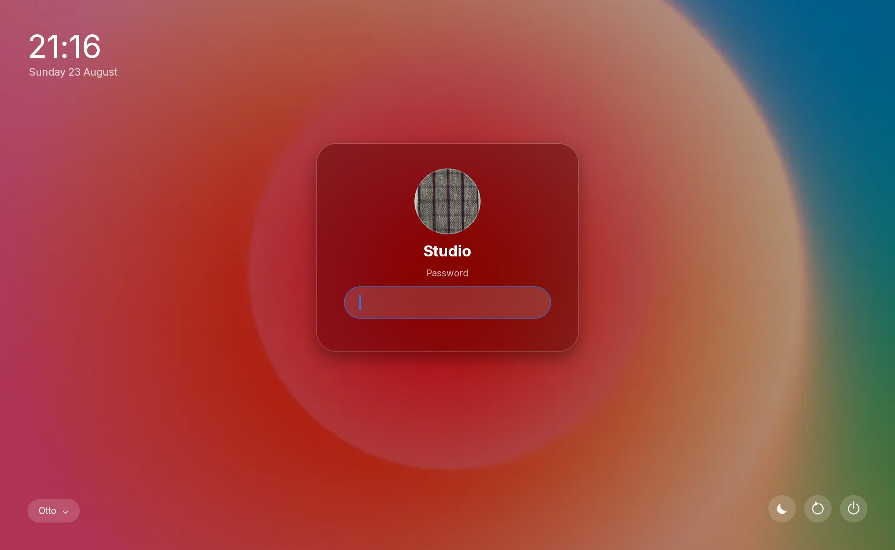

# Login Greeter

Otto can be your login screen. Started with `--login`, it runs as a host
compositor for a greeter client — the role `cage` plays for `gtkgreet` — and
`otto-greeter` provides the login panel.



The same panel [otto-lock](lock-screen.md) uses, plus the session picker bottom
left — click it to cycle through the installed sessions. The power controls
bottom right sleep, restart and shut down the machine without logging in.

## Authentication

Authentication is handled entirely by [greetd](https://sr.ht/~kennylevinsen/greetd/).
Otto links no PAM code and never touches your password.

## Setup

### 1. Install greetd

```sh
sudo pacman -S greetd        # Arch
sudo dnf install greetd      # Fedora
sudo apt install greetd      # Debian/Ubuntu
```

### 2. Point greetd at Otto

```toml
# /etc/greetd/config.toml
[terminal]
vt = 1

[default_session]
command = "otto --login"
user = "greeter"
```

`otto --login` is the greeter *session* as far as greetd is concerned. Otto in
turn launches `otto-greeter`, which speaks greetd's IPC over the `$GREETD_SOCK`
it inherits.

### 3. Enable it

```sh
sudo systemctl enable --now greetd
sudo systemctl disable gdm    # or sddm, lightdm — only one display manager
```

### 4. Optionally, choose a different greeter

```toml
# ~/.config/otto/config.toml — or /etc/otto/config.toml, see below
[login]
greeter_command = "otto-greeter"
greeter_args = []
```

## What login mode changes

`--login` is a distinct mode, fixed for the life of the process. In it:

- **One monitor.** The first desktop connector brought up becomes the primary
  output and is the only one driven. Every other connector — at startup or
  hotplugged — is ignored: no mode set, no `wl_output`. (VR headsets and other
  non-desktop connectors are still offered for DRM leasing, as usual.)
- **No desktop chrome.** The dock, app switcher, exposé and workspace selector
  never appear, by shortcut or by gesture.
- **No autostart.** `exec_once` and XDG autostart are skipped. Exactly one
  client is launched: the greeter.
- **No auto-lock.** The greeter *is* the screen; there is no session behind it
  to hide.

The greeter is tied to Otto's lifetime — if Otto dies, the greeter gets
`SIGTERM`.

`--login` is orthogonal to the backend flag and can be combined with
`--tty-udev` (production) or `--winit` (development).

### Which config it reads

Running as the `greeter` user, Otto can only read `/etc/otto/config.toml`. Put
anything you want the login screen to look like — theme, wallpaper, scale —
there rather than in your own `~/.config`.

## Using the greeter

The panel is a frosted card with an avatar, a username field, a password field
and, where a reader is configured, a Touch ID mark. Same panel as
[otto-lock](lock-screen.md), plus a session picker.

### The username is pre-filled

The field starts with the machine's primary user — the login account with the
lowest UID. greetd exposes no user list and there is no unprivileged record of
who logged in last, so this is the closest thing to "whoever this machine is
for". On a single-user machine it is the only candidate.

The greeter submits it as soon as the panel exists, so the first thing you see
is the password field or the fingerprint reader, not a name to confirm.

It is a **suggestion**, not a prefix:

- Typing any character replaces the whole name.
- Backspace clears it.
- `Escape` empties the field, which is how somebody else logs in.

Editing the field also clears the avatar — it belonged to the account being
offered.

### Fingerprint login

If your PAM stack includes `pam_fprintd`, the reader is offered alongside the
password.

A recognised finger draws the ridge mark in, in blue, over the grey resting
mark. This takes about a second, deliberately: greetd kills the greeter the
instant the session starts, so if the animation were quick you would never see
that the login worked.

A missed finger is reported as an error and the reader asks again — the mark and
the button stay up, because the reader is still what is being waited on.

**Reaching the password past the reader:** PAM is serialised, so a module
holding the stack cannot be hurried. Clicking "Enter Password" puts the field
back immediately and masks what you type, but holds the answer until the
password prompt actually arrives — which is what `pam_fprintd` produces when it
times out or runs out of tries, on a stack where it is `sufficient` rather than
`required`. The panel tells you what it is waiting for.

A held answer is only ever given to a password prompt. If a one-time-code prompt
arrives instead, it is discarded and you are asked again — handing a password to
the wrong prompt is worse than retyping it.

### Session picker

Sessions come from `.desktop` files in `/usr/share/wayland-sessions` and
`/usr/local/share/wayland-sessions`, sorted by name, skipping entries marked
`Hidden=true` or `NoDisplay=true`.

If nothing is installed, a single fallback session running `otto` is offered.

## Developing against it

You do not need root or a spare VT to work on the greeter. When `GREETD_SOCK` is
unset, `otto-greeter` uses a self-contained mock backend, so you can run it
inside a normal Otto session:

```sh
cargo run -- --winit --login
```

`$OTTO_GREETER_COMMAND` overrides `[login]` entirely (a whitespace-separated
argv), and `$OTTO_GREETER_SESSION` overrides session discovery with one argv —
both for testing uninstalled builds.

## Troubleshooting

**Black screen, no panel.** Otto started but the greeter did not. Check
`journalctl -u greetd`. A common cause is `otto-greeter` not being on the
`greeter` user's `PATH`.

**"Starting session…" forever.** `start_session` succeeded but greetd's exec did
not happen. The greeter gives up after a few seconds and returns to the username
field rather than hanging — check the session's `Exec` line in its `.desktop`
file.

**The login screen is unstyled or the wrong theme.** It reads
`/etc/otto/config.toml`, not your user config. The `greeter` user cannot see
your home directory.

**Only one monitor lights up.** That is by design in login mode. Every session
monitor comes back once you are logged in.

**The password is rejected.** That is greetd and PAM, not Otto. Check the PAM
stack greetd uses (`/etc/pam.d/greetd`).

## See also

- [Lock Screen](lock-screen.md) — the same panel, for locking an existing
  session. Different lifecycle: a lock screen sits over a session that outlives
  it; a greeter authenticates a user who has no session yet.
